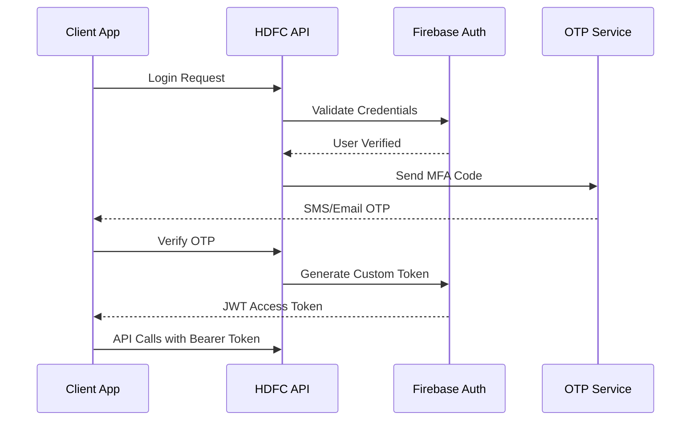

# HDFC Card Limit Increase System - API Documentation
# Complete Developer Guide

Welcome to the comprehensive API documentation for the HDFC Card Limit Increase System. This documentation provides everything developers need to integrate with our secure, scalable, and production-ready API.

## 📋 Table of Contents

### 🚀 Quick Start
- [Getting Started](#getting-started)
- [Authentication Overview](#authentication-overview)
- [API Endpoints Summary](#api-endpoints-summary)
- [SDKs and Libraries](#sdks-and-libraries)

### 📚 Core Documentation
- [Interactive API Explorer](#interactive-api-explorer)
- [Authentication Implementation Guide](#authentication-implementation-guide)
- [Client SDK Documentation](#client-sdk-documentation)
- [Error Codes Reference](#error-codes-reference)
- [Rate Limiting Guide](#rate-limiting-guide)

### 🔧 Technical Reference
- [API Schema Documentation](#api-schema-documentation)
- [OpenAPI Specification](#openapi-specification)
- [Security Best Practices](#security-best-practices)
- [Performance Guidelines](#performance-guidelines)

### 📊 Monitoring & Analytics
- [API Monitoring](#api-monitoring)
- [Error Tracking](#error-tracking)
- [Usage Analytics](#usage-analytics)

---

## 🚀 Getting Started

### Prerequisites

- **Development Environment**: Python 3.8+, Node.js 16+, or Flutter 3.0+
- **Authentication**: Firebase project setup required
- **API Access**: Valid HDFC developer credentials
- **SSL/TLS**: HTTPS required for all API communications

### Base URL

```
Production: https://api.hdfc.com/card-limit/v1/
Staging:    https://staging-api.hdfc.com/card-limit/v1/
```

### Quick Setup

1. **Get API Credentials**
   ```bash
   # Contact HDFC Developer Support for API credentials
   # You'll receive: client_id, client_secret, firebase_config
   ```

2. **Install SDK** (Choose your platform)
   ```bash
   # Python
   pip install hdfc-card-limit-sdk
   
   # JavaScript/Node.js
   npm install @hdfc/card-limit-sdk
   
   # Flutter
   flutter pub add hdfc_card_limit_sdk
   ```

3. **Initialize Client**
   ```python
   # Python
   from hdfc_card_limit import HDFCClient
   
   client = HDFCClient(
       base_url="https://api.hdfc.com/card-limit/v1/",
       firebase_config=your_firebase_config
   )
   ```

4. **Make Your First Request**
   ```python
   # Authenticate customer
   auth_result = client.auth.login(
       email="customer@example.com",
       password="secure_password"
   )
   
   # Get customer profile
   profile = client.customers.get_profile(auth_result.customer_id)
   print(f"Welcome, {profile.first_name}!")
   ```

### 30-Second Demo

```python
import asyncio
from hdfc_card_limit import HDFCAsyncClient

async def demo():
    async with HDFCAsyncClient() as client:
        # Login
        auth = await client.auth.login("demo@hdfc.com", "demo123")
        
        # Check current limit
        profile = await client.customers.get_profile()
        print(f"Current Credit Limit: ₹{profile.current_limit:,}")
        
        # Request limit increase
        request = await client.limit_requests.create({
            "requested_limit": profile.current_limit + 50000,
            "reason": "Salary increase - new job"
        })
        
        print(f"Request Status: {request.status}")
        print(f"Request ID: {request.id}")

# Run demo
asyncio.run(demo())
```

---

## 🔐 Authentication Overview

The HDFC Card Limit Increase System uses **Firebase JWT tokens** with **multi-factor authentication** for secure access.

### Authentication Flow



### Security Features

- ✅ **Firebase JWT Authentication** - Industry-standard token validation
- ✅ **Multi-Factor Authentication** - SMS, Email, Voice, WhatsApp OTP
- ✅ **Rate Limiting** - Comprehensive request throttling
- ✅ **IP Filtering** - Geographic and network-based restrictions
- ✅ **Session Management** - Secure session handling
- ✅ **Token Rotation** - Automatic token refresh
- ✅ **Audit Logging** - Complete activity tracking

📖 **[Read Full Authentication Guide →](authentication-implementation-guide.md)**

---

## 📡 API Endpoints Summary

### Customer Management
```http
POST   /api/v1/customers/register/     # Register new customer
POST   /api/v1/auth/login/             # Customer login
GET    /api/v1/customers/profile/      # Get customer profile
PUT    /api/v1/customers/profile/      # Update customer profile
POST   /api/v1/customers/verify/       # Verify customer documents
```

### Limit Requests
```http
POST   /api/v1/limit-requests/create/          # Create limit increase request
GET    /api/v1/limit-requests/                 # List customer's requests
GET    /api/v1/limit-requests/{id}/            # Get specific request
PUT    /api/v1/limit-requests/{id}/cancel/     # Cancel pending request
GET    /api/v1/limit-requests/{id}/status/     # Check request status
```

### OTP Services
```http
POST   /api/v1/otp/generate/           # Generate OTP
POST   /api/v1/otp/verify/             # Verify OTP code
POST   /api/v1/otp/resend/             # Resend OTP
```

### System
```http
GET    /api/v1/health/                 # System health check
GET    /api/docs/                      # Swagger UI documentation
GET    /api/redoc/                     # ReDoc documentation
```

---

## 📱 SDKs and Libraries

### Official SDKs

| Platform | Installation | Documentation | Examples |
|----------|--------------|---------------|-----------|
| **Python** | `pip install hdfc-card-limit-sdk` | [Python SDK Docs](client-sdk-documentation.md#python-sdk) | [Examples](client-sdk-documentation.md#python-examples) |
| **JavaScript** | `npm install @hdfc/card-limit-sdk` | [JS SDK Docs](client-sdk-documentation.md#javascript-sdk) | [Examples](client-sdk-documentation.md#javascript-examples) |
| **Flutter** | `flutter pub add hdfc_card_limit_sdk` | [Flutter SDK Docs](client-sdk-documentation.md#flutter-sdk) | [Examples](client-sdk-documentation.md#flutter-examples) |

### Community SDKs

| Platform | Status | Maintainer | Repository |
|----------|--------|------------|------------|
| **Go** | Beta | Community | [hdfc-go-sdk](https://github.com/hdfc-community/go-sdk) |
| **Ruby** | Beta | Community | [hdfc-ruby-sdk](https://github.com/hdfc-community/ruby-sdk) |
| **Java** | Planned | HDFC | Coming Soon |
| **C#/.NET** | Planned | HDFC | Coming Soon |

📖 **[Complete SDK Documentation →](client-sdk-documentation.md)**

---

## 🎮 Interactive API Explorer

### Swagger UI
**Live API Testing Interface**

🔗 **[Open Swagger UI →](/api/docs/)**

Features:
- 🧪 **Interactive Testing** - Test all endpoints directly in browser
- 🔐 **Authentication Helper** - Built-in authentication flow
- 📋 **Request/Response Examples** - Real data examples
- 📝 **Schema Validation** - Automatic request validation
- 🎨 **HDFC Branded** - Custom styling and branding

### ReDoc
**Comprehensive API Documentation**

🔗 **[Open ReDoc Documentation →](/api/redoc/)**

Features:
- 📚 **Complete Reference** - All endpoints, schemas, and examples
- 🔍 **Advanced Search** - Find endpoints and schemas quickly
- 📱 **Mobile Friendly** - Responsive design for all devices
- 🎯 **Deep Linking** - Direct links to specific endpoints
- 📥 **Download Options** - Export OpenAPI specification

### API Explorer Configuration

The interactive documentation is powered by:
- **drf-spectacular** - OpenAPI 3.0 specification generation
- **Custom Views** - Enhanced Swagger and ReDoc implementations
- **Authentication Integration** - Seamless auth testing
- **HDFC Branding** - Custom styling and user experience

📖 **[API Explorer Setup Guide →](api_explorer.py)**

---

## 🔒 Authentication Implementation Guide

### Complete Implementation Reference

Our authentication system provides enterprise-grade security with developer-friendly implementation:

#### 🔑 Core Components
- **Firebase JWT Tokens** - Secure, scalable authentication
- **Multi-Factor Authentication** - SMS, Email, Voice, WhatsApp
- **OTP Verification** - Time-based one-time passwords
- **Session Management** - Secure session handling
- **Token Rotation** - Automatic refresh mechanisms

#### 🛡️ Security Features
- **Rate Limiting** - Request throttling and abuse prevention
- **IP Filtering** - Geographic and network restrictions
- **Suspicious Activity Detection** - AI-powered fraud prevention
- **Audit Logging** - Comprehensive security monitoring
- **Compliance** - RBI and PCI DSS compliance

#### 🔧 Implementation Examples
- **Server-Side** - Python/Django with Firebase Admin SDK
- **Client-Side** - JavaScript with Firebase Auth
- **Mobile** - Flutter with Firebase Auth
- **Security Middleware** - Django rate limiting and validation

📖 **[Complete Authentication Guide →](authentication-implementation-guide.md)**

---

## 📖 Client SDK Documentation

### Comprehensive Multi-Platform SDKs

Our SDKs provide a unified interface across all major platforms with consistent APIs and advanced features:

#### 🐍 Python SDK
```python
# Synchronous client
from hdfc_card_limit import HDFCClient

client = HDFCClient(config)
profile = client.customers.get_profile()

# Asynchronous client
from hdfc_card_limit import HDFCAsyncClient

async with HDFCAsyncClient(config) as client:
    profile = await client.customers.get_profile()
```

#### 🌐 JavaScript/Node.js SDK
```javascript
// Browser/Node.js
import { HDFCClient } from '@hdfc/card-limit-sdk';

const client = new HDFCClient(config);
const profile = await client.customers.getProfile();

// TypeScript support included
const request: LimitRequest = await client.limitRequests.create({
    requestedLimit: 75000,
    reason: 'Business expansion'
});
```

#### 📱 Flutter SDK
```dart
// Flutter/Dart
import 'package:hdfc_card_limit_sdk/hdfc_card_limit_sdk.dart';

final client = HDFCClient(config);
final profile = await client.customers.getProfile();

// Built-in error handling
try {
  final request = await client.limitRequests.create(requestData);
} on HDFCApiException catch (e) {
  print('Error: ${e.message}');
}
```

#### ✨ SDK Features
- **Automatic Authentication** - Token management and refresh
- **Error Handling** - Comprehensive error types and recovery
- **Rate Limiting** - Built-in rate limit awareness
- **Retry Logic** - Exponential backoff and circuit breakers
- **Type Safety** - Full TypeScript and strong typing support
- **Documentation** - Inline documentation and examples

📖 **[Complete SDK Documentation →](client-sdk-documentation.md)**

---

## ❌ Error Codes Reference

### Comprehensive Error Handling

Our API provides detailed, actionable error messages with consistent formatting and recovery guidance:

#### 🔍 Error Categories

| Category | Code Range | Description | Examples |
|----------|------------|-------------|-----------|
| **Authentication** | AUTH_001-AUTH_399 | Authentication and authorization errors | Invalid token, MFA required |
| **Customer** | CUST_001-CUST_999 | Customer management errors | Profile not found, validation errors |
| **Limit Requests** | LIMIT_001-LIMIT_999 | Limit increase request errors | Insufficient income, recent request |
| **OTP Services** | OTP_001-OTP_999 | OTP generation and verification errors | Delivery failed, invalid code |
| **System** | SYS_001-SYS_999 | System and infrastructure errors | Database errors, service unavailable |
| **Validation** | VAL_001-VAL_999 | Input validation errors | Required field missing, invalid format |
| **Rate Limiting** | RATE_001-RATE_999 | Rate limiting and quota errors | Too many requests, quota exceeded |

#### 📋 Error Response Format
```json
{
  "success": false,
  "error": {
    "code": "AUTH_102",
    "message": "Invalid OTP code provided",
    "description": "The OTP code you entered is incorrect",
    "field": "otp_code",
    "action": "Please check the code and try again",
    "timestamp": "2024-01-15T10:30:00Z",
    "request_id": "req_abc123def456",
    "documentation_url": "https://docs.hdfc.com/errors/AUTH_102"
  }
}
```

#### 🔧 Error Handling Best Practices
- **Client-Side Recovery** - Automatic retry logic and user guidance
- **Server-Side Logging** - Comprehensive error tracking and monitoring
- **User Experience** - Clear, actionable error messages
- **Developer Tools** - Detailed debugging information

📖 **[Complete Error Codes Reference →](error-codes-reference.md)**

---

## ⚡ Rate Limiting Guide

### Fair Usage and Performance Protection

Our rate limiting system ensures fair usage while maintaining high performance and availability:

#### 📊 Rate Limiting Policies

| Endpoint Category | Requests | Time Window | Strategy |
|-------------------|----------|-------------|----------|
| **Authentication** | 5-20 | 5-60 minutes | Fixed Window |
| **Customer Profile** | 50 | 1 hour | Rolling Window |
| **Limit Requests** | 2 | 24 hours | Fixed Window |
| **OTP Services** | 3 | 10 minutes | Token Bucket |
| **General API** | 1,000 | 1 hour | Sliding Window |

#### 📈 Rate Limiting Headers
```http
X-RateLimit-Limit: 1000
X-RateLimit-Remaining: 999
X-RateLimit-Reset: 1642678800
X-RateLimit-Window: 3600
X-RateLimit-Retry-After: 0
```

#### 🔄 Client-Side Best Practices
- **Exponential Backoff** - Smart retry strategies
- **Request Batching** - Combine multiple operations
- **Caching** - Reduce unnecessary API calls
- **Monitoring** - Track usage patterns

#### 🛠️ Implementation Strategies
- **Token Bucket** - Burst traffic handling
- **Sliding Window** - Smooth rate distribution
- **Fixed Window** - Simple rate limiting
- **Adaptive Limits** - Dynamic rate adjustment

📖 **[Complete Rate Limiting Guide →](rate-limiting-guide.md)**

---

## 🔧 API Schema Documentation

### Detailed OpenAPI Specification

Our API schemas provide comprehensive documentation for all endpoints, request/response formats, and validation rules:

#### 📋 Schema Components

| Component | File | Description |
|-----------|------|-------------|
| **Customer Schemas** | `customer_schemas.py` | Customer registration, login, profile management |
| **Request Schemas** | `request_schemas.py` | Limit increase requests, status tracking |
| **OTP Schemas** | `otp_schemas.py` | OTP generation, verification, multi-channel delivery |
| **Common Schemas** | `api_docs.py` | Shared components, error responses, pagination |

#### 🔍 Schema Features
- **Complete Examples** - Real-world request/response examples
- **Validation Rules** - Field requirements and constraints
- **Business Logic** - Workflow descriptions and rules
- **Error Scenarios** - Common error cases and handling

#### 📝 OpenAPI Configuration
```python
SPECTACULAR_SETTINGS = {
    'TITLE': 'HDFC Card Limit Increase API',
    'DESCRIPTION': 'Secure, scalable API for credit limit management',
    'VERSION': '1.0.0',
    'SERVE_INCLUDE_SCHEMA': False,
    'COMPONENT_SPLIT_REQUEST': True,
    'SWAGGER_UI_SETTINGS': {
        'deepLinking': True,
        'persistAuthorization': True,
        'displayOperationId': True,
    }
}
```

📖 **[API Schema Documentation →](api_docs.py)**

---

## 🔒 Security Best Practices

### Enterprise-Grade Security

Our API implements comprehensive security measures following industry best practices:

#### 🛡️ Security Layers
1. **Transport Security** - HTTPS/TLS 1.3 encryption
2. **Authentication** - Firebase JWT with custom claims
3. **Authorization** - Role-based access control
4. **Input Validation** - Comprehensive data validation
5. **Rate Limiting** - Request throttling and abuse prevention
6. **Monitoring** - Real-time security monitoring

#### 🔐 Implementation Guidelines
- **Token Management** - Secure storage and rotation
- **API Keys** - Proper key management and rotation
- **CORS** - Correct cross-origin configuration
- **Headers** - Security headers implementation
- **Logging** - Audit trail and security events

#### 📋 Security Checklist
- [ ] HTTPS enforced for all endpoints
- [ ] JWT tokens properly validated
- [ ] Rate limiting configured
- [ ] Input validation implemented
- [ ] Error messages don't leak sensitive data
- [ ] Audit logging enabled
- [ ] Security headers configured

---

## 📊 Performance Guidelines

### Optimizing API Performance

Best practices for achieving optimal performance with our API:

#### ⚡ Performance Optimization
- **Caching Strategies** - Response caching and cache invalidation
- **Request Batching** - Combine multiple operations
- **Pagination** - Efficient data retrieval
- **Compression** - Gzip compression for responses
- **CDN Usage** - Global content delivery

#### 📈 Performance Metrics
- **Response Time** - < 200ms for most endpoints
- **Throughput** - 10,000+ requests per second
- **Availability** - 99.9% uptime SLA
- **Scalability** - Auto-scaling infrastructure

#### 🔧 Client Optimization
- **Connection Pooling** - Reuse HTTP connections
- **Request Queuing** - Manage concurrent requests
- **Error Handling** - Graceful degradation
- **Monitoring** - Track performance metrics

---

## 📊 API Monitoring

### Real-Time Monitoring and Analytics

Comprehensive monitoring and analytics for API usage and performance:

#### 📈 Monitoring Dashboard
- **Request Volume** - Real-time request metrics
- **Response Times** - Performance tracking
- **Error Rates** - Error monitoring and alerting
- **Rate Limiting** - Usage pattern analysis
- **Geographic Distribution** - Global usage patterns

#### 🚨 Alerting System
- **Error Rate Thresholds** - Automatic error rate alerts
- **Performance Degradation** - Response time monitoring
- **Security Events** - Suspicious activity detection
- **Capacity Planning** - Usage trend analysis

#### 📊 Analytics Features
- **Usage Patterns** - Endpoint popularity and trends
- **Customer Insights** - User behavior analysis
- **Performance Optimization** - Bottleneck identification
- **Capacity Planning** - Resource usage forecasting

---

## 🆘 Support and Resources

### Getting Help

#### 📞 Developer Support
- **Email**: developers@hdfc.com
- **Phone**: +91-1800-HDFC-DEV
- **Business Hours**: 9 AM - 6 PM IST (Monday-Friday)
- **Emergency**: 24/7 for production issues

#### 📚 Additional Resources
- **Developer Portal**: https://developers.hdfc.com
- **API Status Page**: https://status.hdfc.com
- **Community Forum**: https://community.hdfc.com
- **GitHub Repository**: https://github.com/hdfc/card-limit-api

#### 🐛 Issue Reporting
- **Bug Reports**: Use GitHub Issues
- **Feature Requests**: Developer Portal
- **Security Issues**: security@hdfc.com (GPG encrypted)

#### 📋 SLA and Commitments
- **Response Time**: 4 hours for critical issues
- **Resolution Time**: 24 hours for critical issues
- **Uptime**: 99.9% availability guarantee
- **Support**: Dedicated developer success team

---

## 🔄 API Versioning

### Version Management Strategy

#### 📌 Current Version
- **Latest**: v1.0.0
- **Support**: All v1.x versions supported
- **Deprecation**: 12-month notice for breaking changes

#### 🛣️ Roadmap
- **v1.1** - Enhanced limit calculation algorithms (Q2 2024)
- **v1.2** - Real-time notifications (Q3 2024)
- **v2.0** - GraphQL support (Q1 2025)

#### 📋 Changelog
- **v1.0.0** (Current) - Initial production release
- **v0.9.0** (Beta) - Pre-production testing
- **v0.8.0** (Alpha) - Internal testing

---

## 📄 License and Terms

### API Usage Terms

#### 📋 License
This API is provided under the HDFC Developer License Agreement. Usage is subject to:
- Rate limiting and fair usage policies
- Data protection and privacy requirements
- Security and compliance obligations

#### 🔒 Data Privacy
- Customer data protection per RBI guidelines
- GDPR compliance for international users
- Audit logging for regulatory compliance

#### ⚖️ Terms of Service
Full terms available at: https://developers.hdfc.com/terms

---

## 📚 Complete Documentation Index

### All Documentation Files

| Document | Description | Audience |
|----------|-------------|----------|
| **[api_docs.py](api_docs.py)** | OpenAPI configuration and settings | Backend Developers |
| **[customer_schemas.py](customer_schemas.py)** | Customer API endpoint schemas | All Developers |
| **[request_schemas.py](request_schemas.py)** | Limit request API schemas | All Developers |
| **[otp_schemas.py](otp_schemas.py)** | OTP service API schemas | All Developers |
| **[api_explorer.py](api_explorer.py)** | Interactive documentation setup | DevOps/Admins |
| **[authentication-implementation-guide.md](authentication-implementation-guide.md)** | Complete authentication guide | All Developers |
| **[client-sdk-documentation.md](client-sdk-documentation.md)** | Multi-platform SDK documentation | All Developers |
| **[error-codes-reference.md](error-codes-reference.md)** | Complete error codes reference | All Developers |
| **[rate-limiting-guide.md](rate-limiting-guide.md)** | Rate limiting implementation guide | All Developers |
| **README.md** (This file) | Complete API documentation index | All Users |

---

## 🎯 Quick Navigation

### By Use Case

| I want to... | Go to... |
|--------------|----------|
| **Get started quickly** | [Getting Started](#getting-started) |
| **Test the API** | [Interactive API Explorer](#interactive-api-explorer) |
| **Implement authentication** | [Authentication Guide](authentication-implementation-guide.md) |
| **Use an SDK** | [SDK Documentation](client-sdk-documentation.md) |
| **Handle errors** | [Error Codes Reference](error-codes-reference.md) |
| **Optimize performance** | [Rate Limiting Guide](rate-limiting-guide.md) |
| **Understand the schema** | [API Schema Documentation](#api-schema-documentation) |

### By Developer Type

| Developer Type | Recommended Reading |
|----------------|-------------------|
| **Frontend** | SDK Documentation, Authentication Guide, Error Handling |
| **Backend** | API Schemas, Authentication Guide, Rate Limiting |
| **Mobile** | Flutter SDK, Authentication Guide, Error Handling |
| **DevOps** | API Explorer Setup, Monitoring, Security |
| **QA/Testing** | Interactive Explorer, Error Codes, All Endpoints |

---

## 🔄 Updates and Maintenance

This documentation is actively maintained and updated. 

- **Last Updated**: January 15, 2024
- **Documentation Version**: 1.0.0
- **API Version**: 1.0.0
- **Next Review**: February 15, 2024

For the latest updates, always refer to the online documentation at https://docs.hdfc.com/card-limit-api/

---

**© 2024 HDFC Bank Ltd. All rights reserved.**

*This documentation is for authorized developers only. Unauthorized use is prohibited.*