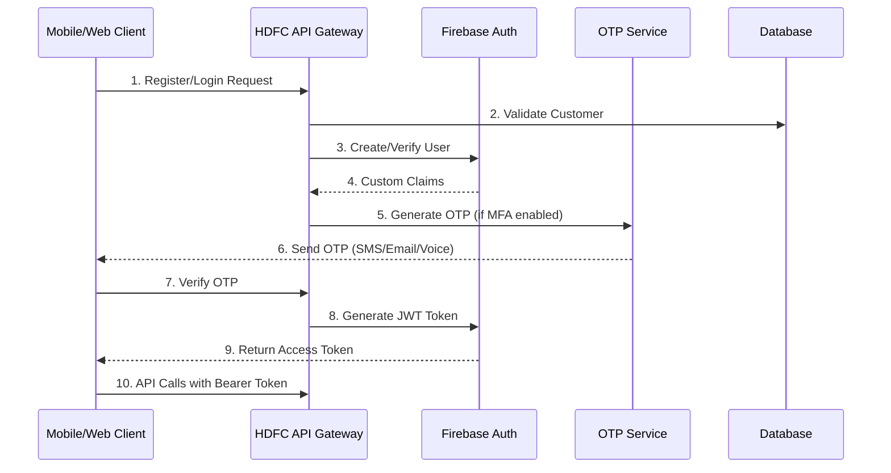

# Authentication Implementation Guide
# HDFC Card Limit Increase System

## Overview

This guide provides comprehensive documentation for implementing authentication with the HDFC Card Limit Increase System API, covering Firebase token validation, OTP flows, and security best practices.

## Table of Contents

1. [Authentication Architecture](#authentication-architecture)
2. [Firebase JWT Authentication](#firebase-jwt-authentication)
3. [Multi-Factor Authentication (MFA)](#multi-factor-authentication)
4. [OTP Verification Flows](#otp-verification-flows)
5. [Security Implementation](#security-implementation)
6. [Token Management](#token-management)
7. [Error Handling](#error-handling)
8. [Best Practices](#best-practices)
9. [Implementation Examples](#implementation-examples)

---

## Authentication Architecture

### Authentication Flow Overview



### Security Layers

1. **Primary Authentication**: Firebase JWT tokens
2. **Multi-Factor Authentication**: OTP verification
3. **Request Validation**: Rate limiting and IP filtering
4. **Data Protection**: Field-level encryption
5. **Audit Logging**: Comprehensive security monitoring

---

## Firebase JWT Authentication

### Firebase Configuration

#### Server-Side Setup (Python/Django)

```python
import firebase_admin
from firebase_admin import credentials, auth
from django.conf import settings
import json
from typing import Optional, Dict, Any

class FirebaseAuthService:
    """
    Firebase authentication service for HDFC Card Limit System
    """
    
    def __init__(self):
        if not firebase_admin._apps:
            # Initialize Firebase Admin SDK
            cred_dict = {
                "type": "service_account",
                "project_id": settings.FIREBASE_PROJECT_ID,
                "private_key_id": settings.FIREBASE_PRIVATE_KEY_ID,
                "private_key": settings.FIREBASE_PRIVATE_KEY.replace('\\n', '\n'),
                "client_email": settings.FIREBASE_CLIENT_EMAIL,
                "client_id": settings.FIREBASE_CLIENT_ID,
                "auth_uri": "https://accounts.google.com/o/oauth2/auth",
                "token_uri": "https://oauth2.googleapis.com/token",
                "auth_provider_x509_cert_url": "https://www.googleapis.com/oauth2/v1/certs",
                "client_x509_cert_url": f"https://www.googleapis.com/robot/v1/metadata/x509/{settings.FIREBASE_CLIENT_EMAIL}"
            }
            
            cred = credentials.Certificate(cred_dict)
            firebase_admin.initialize_app(cred)
    
    def create_custom_token(self, customer_id: str, additional_claims: Dict[str, Any] = None) -> str:
        """
        Create custom Firebase token with HDFC-specific claims
        """
        claims = {
            'customer_id': customer_id,
            'bank': 'hdfc',
            'system': 'card_limit',
            'role': 'customer',
            'permissions': ['view_profile', 'request_limit_increase'],
            **(additional_claims or {})
        }
        
        # Create custom token
        custom_token = auth.create_custom_token(customer_id, claims)
        return custom_token.decode('utf-8')
    
    def verify_token(self, token: str) -> Dict[str, Any]:
        """
        Verify Firebase ID token and extract claims
        """
        try:
            # Verify the token
            decoded_token = auth.verify_id_token(token)
            
            # Extract customer information
            customer_info = {
                'uid': decoded_token['uid'],
                'customer_id': decoded_token.get('customer_id'),
                'email': decoded_token.get('email'),
                'phone': decoded_token.get('phone_number'),
                'verified': decoded_token.get('email_verified', False),
                'auth_time': decoded_token.get('auth_time'),
                'permissions': decoded_token.get('permissions', []),
                'role': decoded_token.get('role', 'customer')
            }
            
            return customer_info
            
        except auth.InvalidIdTokenError:
            raise AuthenticationError("Invalid or expired token")
        except auth.ExpiredIdTokenError:
            raise AuthenticationError("Token has expired")
        except Exception as e:
            raise AuthenticationError(f"Token verification failed: {str(e)}")
    
    def create_user(self, customer_data: Dict[str, Any]) -> str:
        """
        Create Firebase user for customer
        """
        try:
            user_record = auth.create_user(
                uid=customer_data['customer_id'],
                email=customer_data['email'],
                phone_number=customer_data.get('phone_number'),
                display_name=f"{customer_data['first_name']} {customer_data['last_name']}",
                email_verified=False,
                disabled=False
            )
            
            # Set custom claims
            auth.set_custom_user_claims(user_record.uid, {
                'customer_id': customer_data['customer_id'],
                'bank': 'hdfc',
                'system': 'card_limit',
                'role': 'customer',
                'kyc_status': customer_data.get('kyc_status', 'pending'),
                'permissions': ['view_profile', 'request_limit_increase']
            })
            
            return user_record.uid
            
        except auth.EmailAlreadyExistsError:
            raise AuthenticationError("Email already registered")
        except auth.PhoneNumberAlreadyExistsError:
            raise AuthenticationError("Phone number already registered")
        except Exception as e:
            raise AuthenticationError(f"User creation failed: {str(e)}")
    
    def update_user_claims(self, uid: str, claims: Dict[str, Any]):
        """
        Update custom claims for user
        """
        try:
            auth.set_custom_user_claims(uid, claims)
        except Exception as e:
            raise AuthenticationError(f"Failed to update user claims: {str(e)}")
    
    def revoke_tokens(self, uid: str):
        """
        Revoke all tokens for a user (logout)
        """
        try:
            auth.revoke_refresh_tokens(uid)
        except Exception as e:
            raise AuthenticationError(f"Failed to revoke tokens: {str(e)}")


class AuthenticationError(Exception):
    """Custom authentication exception"""
    pass
```

#### Client-Side Implementation (JavaScript)

```javascript
// Firebase configuration
import { initializeApp } from 'firebase/app';
import { 
    getAuth, 
    signInWithCustomToken, 
    signInWithEmailAndPassword,
    createUserWithEmailAndPassword,
    signOut,
    onAuthStateChanged
} from 'firebase/auth';

const firebaseConfig = {
    apiKey: "your-api-key",
    authDomain: "hdfc-card-limit.firebaseapp.com",
    projectId: "hdfc-card-limit",
    storageBucket: "hdfc-card-limit.appspot.com",
    messagingSenderId: "123456789",
    appId: "your-app-id"
};

// Initialize Firebase
const app = initializeApp(firebaseConfig);
const auth = getAuth(app);

class HDFCAuthService {
    constructor() {
        this.auth = auth;
        this.currentUser = null;
        this.authStateCallbacks = [];
        
        // Listen for auth state changes
        onAuthStateChanged(this.auth, (user) => {
            this.currentUser = user;
            this.notifyAuthStateChange(user);
        });
    }
    
    /**
     * Register new customer with email/password
     */
    async registerCustomer(email, password, customerData) {
        try {
            // First, register customer with backend
            const registrationResponse = await this.callAPI('POST', '/api/v1/customers/register/', {
                email,
                password,
                ...customerData
            });
            
            if (!registrationResponse.success) {
                throw new Error(registrationResponse.error.message);
            }
            
            // Get custom token from backend
            const customToken = registrationResponse.data.custom_token;
            
            // Sign in with custom token
            const userCredential = await signInWithCustomToken(this.auth, customToken);
            
            return {
                user: userCredential.user,
                customerData: registrationResponse.data
            };
            
        } catch (error) {
            console.error('Registration error:', error);
            throw new Error(`Registration failed: ${error.message}`);
        }
    }
    
    /**
     * Login customer with email/password
     */
    async loginCustomer(email, password, deviceInfo) {
        try {
            // Login with backend API
            const loginResponse = await this.callAPI('POST', '/api/v1/auth/login/', {
                email,
                password,
                device_info: deviceInfo
            });
            
            if (!loginResponse.success) {
                throw new Error(loginResponse.error.message);
            }
            
            const { custom_token, mfa_required, customer } = loginResponse.data;
            
            if (mfa_required) {
                // Return MFA requirement for OTP verification
                return {
                    mfa_required: true,
                    otp_methods: loginResponse.data.otp_methods,
                    temp_token: loginResponse.data.temp_token
                };
            }
            
            // Sign in with custom token
            const userCredential = await signInWithCustomToken(this.auth, custom_token);
            
            return {
                user: userCredential.user,
                customer,
                access_token: await userCredential.user.getIdToken()
            };
            
        } catch (error) {
            console.error('Login error:', error);
            throw new Error(`Login failed: ${error.message}`);
        }
    }
    
    /**
     * Complete MFA login with OTP
     */
    async completeMFALogin(tempToken, otpCode, otpId) {
        try {
            const mfaResponse = await this.callAPI('POST', '/api/v1/auth/mfa/verify/', {
                temp_token: tempToken,
                otp_code: otpCode,
                otp_id: otpId
            });
            
            if (!mfaResponse.success) {
                throw new Error(mfaResponse.error.message);
            }
            
            const customToken = mfaResponse.data.custom_token;
            const userCredential = await signInWithCustomToken(this.auth, customToken);
            
            return {
                user: userCredential.user,
                customer: mfaResponse.data.customer,
                access_token: await userCredential.user.getIdToken()
            };
            
        } catch (error) {
            console.error('MFA verification error:', error);
            throw new Error(`MFA verification failed: ${error.message}`);
        }
    }
    
    /**
     * Get current auth token
     */
    async getAuthToken() {
        if (!this.currentUser) {
            throw new Error('No authenticated user');
        }
        
        try {
            return await this.currentUser.getIdToken();
        } catch (error) {
            console.error('Token retrieval error:', error);
            throw new Error('Failed to get auth token');
        }
    }
    
    /**
     * Refresh auth token
     */
    async refreshToken() {
        if (!this.currentUser) {
            throw new Error('No authenticated user');
        }
        
        try {
            return await this.currentUser.getIdToken(true); // Force refresh
        } catch (error) {
            console.error('Token refresh error:', error);
            throw new Error('Failed to refresh token');
        }
    }
    
    /**
     * Logout user
     */
    async logout() {
        try {
            await signOut(this.auth);
            this.currentUser = null;
        } catch (error) {
            console.error('Logout error:', error);
            throw new Error('Logout failed');
        }
    }
    
    /**
     * Check if user is authenticated
     */
    isAuthenticated() {
        return this.currentUser !== null;
    }
    
    /**
     * Add auth state change listener
     */
    onAuthStateChange(callback) {
        this.authStateCallbacks.push(callback);
    }
    
    /**
     * Notify auth state change
     */
    notifyAuthStateChange(user) {
        this.authStateCallbacks.forEach(callback => callback(user));
    }
    
    /**
     * Helper method to call API with authentication
     */
    async callAPI(method, endpoint, data = null) {
        const headers = {
            'Content-Type': 'application/json',
            'Accept': 'application/json'
        };
        
        // Add auth token if available
        if (this.currentUser) {
            try {
                const token = await this.getAuthToken();
                headers['Authorization'] = `Bearer ${token}`;
            } catch (error) {
                console.warn('Failed to get auth token for API call');
            }
        }
        
        const config = {
            method,
            headers,
            body: data ? JSON.stringify(data) : null
        };
        
        const response = await fetch(`${API_BASE_URL}${endpoint}`, config);
        return await response.json();
    }
}

// Usage example
const authService = new HDFCAuthService();

// Listen for auth changes
authService.onAuthStateChange((user) => {
    if (user) {
        console.log('User signed in:', user.uid);
    } else {
        console.log('User signed out');
    }
});
```

#### Flutter Implementation

```dart
import 'package:firebase_auth/firebase_auth.dart';
import 'package:firebase_core/firebase_core.dart';

class HDFCAuthService {
  final FirebaseAuth _auth = FirebaseAuth.instance;
  User? _currentUser;
  
  // Stream of auth state changes
  Stream<User?> get authStateChanges => _auth.authStateChanges();
  
  // Current user getter
  User? get currentUser => _auth.currentUser;
  
  /// Initialize Firebase
  Future<void> initialize() async {
    await Firebase.initializeApp();
    _currentUser = _auth.currentUser;
  }
  
  /// Register customer
  Future<Map<String, dynamic>> registerCustomer(
    String email,
    String password,
    Map<String, dynamic> customerData,
  ) async {
    try {
      // Register with backend first
      final registrationResponse = await _callAPI(
        'POST',
        '/api/v1/customers/register/',
        {
          'email': email,
          'password': password,
          ...customerData,
        },
      );
      
      if (registrationResponse['success'] != true) {
        throw FirebaseAuthException(
          code: 'registration-failed',
          message: registrationResponse['error']['message'],
        );
      }
      
      // Sign in with custom token
      final customToken = registrationResponse['data']['custom_token'] as String;
      final userCredential = await _auth.signInWithCustomToken(customToken);
      
      return {
        'user': userCredential.user,
        'customer_data': registrationResponse['data'],
      };
      
    } catch (e) {
      throw FirebaseAuthException(
        code: 'registration-error',
        message: e.toString(),
      );
    }
  }
  
  /// Login customer
  Future<Map<String, dynamic>> loginCustomer(
    String email,
    String password,
    Map<String, dynamic> deviceInfo,
  ) async {
    try {
      final loginResponse = await _callAPI(
        'POST',
        '/api/v1/auth/login/',
        {
          'email': email,
          'password': password,
          'device_info': deviceInfo,
        },
      );
      
      if (loginResponse['success'] != true) {
        throw FirebaseAuthException(
          code: 'login-failed',
          message: loginResponse['error']['message'],
        );
      }
      
      final data = loginResponse['data'] as Map<String, dynamic>;
      
      // Check if MFA is required
      if (data['mfa_required'] == true) {
        return {
          'mfa_required': true,
          'otp_methods': data['otp_methods'],
          'temp_token': data['temp_token'],
        };
      }
      
      // Sign in with custom token
      final customToken = data['custom_token'] as String;
      final userCredential = await _auth.signInWithCustomToken(customToken);
      
      return {
        'user': userCredential.user,
        'customer': data['customer'],
        'access_token': await userCredential.user!.getIdToken(),
      };
      
    } catch (e) {
      throw FirebaseAuthException(
        code: 'login-error',
        message: e.toString(),
      );
    }
  }
  
  /// Complete MFA login
  Future<Map<String, dynamic>> completeMFALogin(
    String tempToken,
    String otpCode,
    String otpId,
  ) async {
    try {
      final mfaResponse = await _callAPI(
        'POST',
        '/api/v1/auth/mfa/verify/',
        {
          'temp_token': tempToken,
          'otp_code': otpCode,
          'otp_id': otpId,
        },
      );
      
      if (mfaResponse['success'] != true) {
        throw FirebaseAuthException(
          code: 'mfa-failed',
          message: mfaResponse['error']['message'],
        );
      }
      
      final customToken = mfaResponse['data']['custom_token'] as String;
      final userCredential = await _auth.signInWithCustomToken(customToken);
      
      return {
        'user': userCredential.user,
        'customer': mfaResponse['data']['customer'],
        'access_token': await userCredential.user!.getIdToken(),
      };
      
    } catch (e) {
      throw FirebaseAuthException(
        code: 'mfa-error',
        message: e.toString(),
      );
    }
  }
  
  /// Get current auth token
  Future<String?> getAuthToken() async {
    final user = _auth.currentUser;
    if (user == null) return null;
    
    try {
      return await user.getIdToken();
    } catch (e) {
      print('Error getting auth token: $e');
      return null;
    }
  }
  
  /// Refresh auth token
  Future<String?> refreshToken() async {
    final user = _auth.currentUser;
    if (user == null) return null;
    
    try {
      return await user.getIdToken(true); // Force refresh
    } catch (e) {
      print('Error refreshing token: $e');
      return null;
    }
  }
  
  /// Logout user
  Future<void> logout() async {
    try {
      await _auth.signOut();
      _currentUser = null;
    } catch (e) {
      throw FirebaseAuthException(
        code: 'logout-error',
        message: e.toString(),
      );
    }
  }
  
  /// Check if user is authenticated
  bool isAuthenticated() {
    return _auth.currentUser != null;
  }
  
  /// Helper method to call API
  Future<Map<String, dynamic>> _callAPI(
    String method,
    String endpoint,
    Map<String, dynamic>? data,
  ) async {
    // Implementation depends on your HTTP client
    // This is a placeholder
    throw UnimplementedError('API call implementation needed');
  }
}
```

---

## Multi-Factor Authentication (MFA)

### MFA Implementation Flow

```python
class MFAService:
    """
    Multi-Factor Authentication service for enhanced security
    """
    
    def __init__(self, otp_service, customer_service):
        self.otp_service = otp_service
        self.customer_service = customer_service
    
    def is_mfa_required(self, customer_id: str, login_context: Dict[str, Any]) -> bool:
        """
        Determine if MFA is required based on customer settings and context
        """
        customer = self.customer_service.get_customer(customer_id)
        
        # MFA rules
        mfa_triggers = [
            customer.mfa_enabled,  # Customer preference
            login_context.get('new_device', False),  # New device
            login_context.get('suspicious_location', False),  # Unusual location
            login_context.get('high_risk_action', False),  # High-risk action
            customer.account_type == 'premium',  # Premium accounts
        ]
        
        return any(mfa_triggers)
    
    def get_available_mfa_methods(self, customer_id: str) -> List[str]:
        """
        Get available MFA methods for customer
        """
        customer = self.customer_service.get_customer(customer_id)
        methods = []
        
        if customer.phone_verified:
            methods.append('sms')
        
        if customer.email_verified:
            methods.append('email')
        
        if customer.voice_enabled:
            methods.append('voice')
        
        if customer.whatsapp_enabled:
            methods.append('whatsapp')
        
        return methods
    
    def initiate_mfa(self, customer_id: str, method: str, context: Dict[str, Any]) -> Dict[str, Any]:
        """
        Initiate MFA process
        """
        customer = self.customer_service.get_customer(customer_id)
        
        # Get contact information based on method
        contact_info = self._get_contact_info(customer, method)
        
        # Generate OTP
        otp_response = self.otp_service.generate_otp(
            purpose='mfa_authentication',
            delivery_method=method,
            contact_info=contact_info,
            context={
                'customer_id': customer_id,
                'mfa_session': True,
                **context
            }
        )
        
        return {
            'otp_id': otp_response['otp_id'],
            'method': method,
            'contact_masked': self._mask_contact(contact_info),
            'expires_at': otp_response['expires_at'],
            'max_attempts': otp_response['max_attempts']
        }
    
    def verify_mfa(self, customer_id: str, otp_id: str, otp_code: str) -> bool:
        """
        Verify MFA OTP
        """
        verification_result = self.otp_service.verify_otp(
            otp_id=otp_id,
            otp_code=otp_code,
            context={'customer_id': customer_id, 'mfa_verification': True}
        )
        
        if verification_result['verified']:
            # Log successful MFA
            self._log_mfa_success(customer_id, otp_id)
            return True
        else:
            # Log failed MFA attempt
            self._log_mfa_failure(customer_id, otp_id)
            return False
    
    def _get_contact_info(self, customer, method: str) -> str:
        """Get contact information for MFA method"""
        contact_map = {
            'sms': customer.phone_number,
            'voice': customer.phone_number,
            'whatsapp': customer.whatsapp_number or customer.phone_number,
            'email': customer.email
        }
        return contact_map.get(method)
    
    def _mask_contact(self, contact: str) -> str:
        """Mask contact information for security"""
        if '@' in contact:  # Email
            parts = contact.split('@')
            return f"{parts[0][:2]}***@{parts[1]}"
        else:  # Phone
            return f"{contact[:3]}****{contact[-2:]}"
    
    def _log_mfa_success(self, customer_id: str, otp_id: str):
        """Log successful MFA verification"""
        # Implementation for audit logging
        pass
    
    def _log_mfa_failure(self, customer_id: str, otp_id: str):
        """Log failed MFA attempt"""
        # Implementation for security monitoring
        pass
```

---

## OTP Verification Flows

### OTP Service Implementation

```python
import random
import string
from datetime import datetime, timedelta
from typing import Dict, Any, Optional

class OTPService:
    """
    Comprehensive OTP service for multi-channel verification
    """
    
    def __init__(self, sms_service, email_service, voice_service, whatsapp_service):
        self.sms_service = sms_service
        self.email_service = email_service
        self.voice_service = voice_service
        self.whatsapp_service = whatsapp_service
        self.active_otps = {}  # In production, use Redis/database
    
    def generate_otp(
        self, 
        purpose: str, 
        delivery_method: str, 
        contact_info: str,
        **kwargs
    ) -> Dict[str, Any]:
        """
        Generate and send OTP
        """
        # Generate OTP code
        otp_length = self._get_otp_length(purpose, delivery_method)
        otp_code = self._generate_otp_code(otp_length)
        
        # Create OTP record
        otp_id = f"OTP{int(datetime.now().timestamp())}{random.randint(1000, 9999)}"
        expires_at = datetime.now() + self._get_expiry_duration(purpose)
        
        otp_record = {
            'otp_id': otp_id,
            'code': otp_code,
            'purpose': purpose,
            'delivery_method': delivery_method,
            'contact_info': contact_info,
            'expires_at': expires_at,
            'attempts': 0,
            'max_attempts': 3,
            'verified': False,
            'created_at': datetime.now(),
            'context': kwargs.get('context', {})
        }
        
        # Store OTP
        self.active_otps[otp_id] = otp_record
        
        # Send OTP
        delivery_result = self._send_otp(otp_record)
        
        return {
            'otp_id': otp_id,
            'delivery_method': delivery_method,
            'contact_info': self._mask_contact(contact_info),
            'expires_at': expires_at.isoformat(),
            'max_attempts': 3,
            'delivery_status': delivery_result['status'],
            'message_id': delivery_result.get('message_id')
        }
    
    def verify_otp(self, otp_id: str, otp_code: str, context: Dict[str, Any]) -> Dict[str, Any]:
        """
        Verify OTP code
        """
        otp_record = self.active_otps.get(otp_id)
        
        if not otp_record:
            return {
                'verified': False,
                'error': 'INVALID_OTP_ID',
                'message': 'Invalid OTP ID provided'
            }
        
        # Check expiry
        if datetime.now() > otp_record['expires_at']:
            del self.active_otps[otp_id]
            return {
                'verified': False,
                'error': 'OTP_EXPIRED',
                'message': 'OTP has expired'
            }
        
        # Check attempts
        if otp_record['attempts'] >= otp_record['max_attempts']:
            del self.active_otps[otp_id]
            return {
                'verified': False,
                'error': 'MAX_ATTEMPTS_EXCEEDED',
                'message': 'Maximum verification attempts exceeded'
            }
        
        # Increment attempts
        otp_record['attempts'] += 1
        
        # Verify code
        if otp_record['code'] == otp_code:
            otp_record['verified'] = True
            otp_record['verified_at'] = datetime.now()
            
            # Generate verification token
            verification_token = self._generate_verification_token(otp_record, context)
            
            return {
                'verified': True,
                'verification_token': verification_token,
                'purpose': otp_record['purpose'],
                'verified_at': otp_record['verified_at'].isoformat()
            }
        else:
            remaining_attempts = otp_record['max_attempts'] - otp_record['attempts']
            return {
                'verified': False,
                'error': 'INVALID_OTP_CODE',
                'message': 'Invalid OTP code provided',
                'attempts_remaining': remaining_attempts
            }
    
    def resend_otp(
        self, 
        otp_id: str, 
        delivery_method: Optional[str] = None,
        reason: str = 'not_received'
    ) -> Dict[str, Any]:
        """
        Resend OTP with same or different delivery method
        """
        otp_record = self.active_otps.get(otp_id)
        
        if not otp_record:
            return {
                'success': False,
                'error': 'INVALID_OTP_ID',
                'message': 'Invalid OTP ID provided'
            }
        
        # Check if resend is allowed
        if datetime.now() > otp_record['expires_at']:
            del self.active_otps[otp_id]
            return {
                'success': False,
                'error': 'OTP_EXPIRED',
                'message': 'OTP has expired, please request a new one'
            }
        
        # Update delivery method if provided
        if delivery_method:
            otp_record['delivery_method'] = delivery_method
        
        # Resend OTP
        delivery_result = self._send_otp(otp_record)
        otp_record['resend_count'] = otp_record.get('resend_count', 0) + 1
        otp_record['last_resent'] = datetime.now()
        
        return {
            'success': True,
            'otp_id': otp_id,
            'delivery_method': otp_record['delivery_method'],
            'delivery_status': delivery_result['status'],
            'resend_count': otp_record['resend_count'],
            'message_id': delivery_result.get('message_id')
        }
    
    def _generate_otp_code(self, length: int) -> str:
        """Generate random OTP code"""
        return ''.join(random.choices(string.digits, k=length))
    
    def _get_otp_length(self, purpose: str, delivery_method: str) -> int:
        """Determine OTP length based on purpose and method"""
        if delivery_method == 'voice':
            return 4  # Shorter for voice calls
        elif purpose in ['high_value_transaction', 'admin_action']:
            return 8  # Longer for high-security operations
        else:
            return 6  # Standard length
    
    def _get_expiry_duration(self, purpose: str) -> timedelta:
        """Get OTP expiry duration based on purpose"""
        duration_map = {
            'login_verification': timedelta(minutes=10),
            'transaction_verification': timedelta(minutes=5),
            'password_reset': timedelta(minutes=15),
            'high_value_transaction': timedelta(minutes=3),
            'mfa_authentication': timedelta(minutes=10)
        }
        return duration_map.get(purpose, timedelta(minutes=10))
    
    def _send_otp(self, otp_record: Dict[str, Any]) -> Dict[str, Any]:
        """Send OTP via specified delivery method"""
        method = otp_record['delivery_method']
        contact = otp_record['contact_info']
        code = otp_record['code']
        purpose = otp_record['purpose']
        
        try:
            if method == 'sms':
                return self.sms_service.send_otp_sms(contact, code, purpose)
            elif method == 'email':
                return self.email_service.send_otp_email(contact, code, purpose)
            elif method == 'voice':
                return self.voice_service.send_otp_call(contact, code, purpose)
            elif method == 'whatsapp':
                return self.whatsapp_service.send_otp_whatsapp(contact, code, purpose)
            else:
                return {
                    'status': 'failed',
                    'error': f'Unsupported delivery method: {method}'
                }
        except Exception as e:
            return {
                'status': 'failed',
                'error': str(e)
            }
    
    def _generate_verification_token(self, otp_record: Dict[str, Any], context: Dict[str, Any]) -> str:
        """Generate verification token for successful OTP verification"""
        # Implementation for generating secure verification token
        # This token can be used for subsequent operations
        import jwt
        
        payload = {
            'otp_id': otp_record['otp_id'],
            'purpose': otp_record['purpose'],
            'verified_at': otp_record['verified_at'].timestamp(),
            'context': context,
            'exp': datetime.now().timestamp() + 300  # 5-minute validity
        }
        
        return jwt.encode(payload, 'your-secret-key', algorithm='HS256')
    
    def _mask_contact(self, contact: str) -> str:
        """Mask contact information for security"""
        if '@' in contact:  # Email
            parts = contact.split('@')
            return f"{parts[0][:2]}***@{parts[1]}"
        else:  # Phone
            return f"{contact[:3]}****{contact[-2:]}"
```

---

## Security Implementation

### Token Security Best Practices

```python
class TokenSecurityManager:
    """
    Token security management for HDFC authentication system
    """
    
    def __init__(self):
        self.token_blacklist = set()  # Use Redis in production
        self.failed_attempts = {}  # Track failed authentication attempts
    
    def validate_token_security(self, token: str, request_context: Dict[str, Any]) -> Dict[str, Any]:
        """
        Comprehensive token security validation
        """
        try:
            # Parse token without verification to get basic info
            import jwt
            unverified_payload = jwt.decode(token, options={"verify_signature": False})
            
            # Security checks
            security_checks = {
                'token_blacklisted': self._is_token_blacklisted(token),
                'token_expired': self._is_token_expired(unverified_payload),
                'suspicious_usage': self._detect_suspicious_usage(token, request_context),
                'ip_allowed': self._validate_ip_access(request_context.get('ip_address')),
                'device_trusted': self._validate_device_trust(request_context.get('device_info')),
                'rate_limit_ok': self._check_rate_limits(unverified_payload.get('uid'), request_context)
            }
            
            # Determine overall security status
            security_violations = [check for check, passed in security_checks.items() if not passed]
            
            return {
                'secure': len(security_violations) == 0,
                'violations': security_violations,
                'checks': security_checks,
                'risk_score': self._calculate_risk_score(security_checks, request_context)
            }
            
        except Exception as e:
            return {
                'secure': False,
                'violations': ['token_validation_error'],
                'error': str(e)
            }
    
    def _is_token_blacklisted(self, token: str) -> bool:
        """Check if token is blacklisted"""
        token_hash = hashlib.sha256(token.encode()).hexdigest()
        return token_hash not in self.token_blacklist
    
    def _is_token_expired(self, payload: Dict[str, Any]) -> bool:
        """Check token expiration"""
        exp = payload.get('exp', 0)
        return datetime.now().timestamp() < exp
    
    def _detect_suspicious_usage(self, token: str, context: Dict[str, Any]) -> bool:
        """Detect suspicious token usage patterns"""
        # Check for rapid sequential requests
        # Check for unusual geographic patterns
        # Check for device switching
        return True  # Placeholder - implement actual detection logic
    
    def _validate_ip_access(self, ip_address: str) -> bool:
        """Validate IP address access"""
        # Implement IP whitelist/blacklist logic
        # Check for VPN/proxy usage
        return True  # Placeholder
    
    def _validate_device_trust(self, device_info: Dict[str, Any]) -> bool:
        """Validate device trust level"""
        # Check device fingerprint
        # Validate device registration
        return True  # Placeholder
    
    def _check_rate_limits(self, user_id: str, context: Dict[str, Any]) -> bool:
        """Check rate limiting for user"""
        # Implement rate limiting logic
        return True  # Placeholder
    
    def _calculate_risk_score(self, checks: Dict[str, bool], context: Dict[str, Any]) -> float:
        """Calculate overall risk score (0-1, where 1 is highest risk)"""
        risk_factors = {
            'new_device': 0.3,
            'new_location': 0.2,
            'unusual_time': 0.1,
            'multiple_failed_attempts': 0.4,
            'vpn_usage': 0.2
        }
        
        total_risk = 0.0
        for factor, weight in risk_factors.items():
            if context.get(factor, False):
                total_risk += weight
        
        return min(total_risk, 1.0)


class SessionManager:
    """
    Secure session management
    """
    
    def __init__(self):
        self.active_sessions = {}  # Use Redis in production
    
    def create_session(self, user_id: str, device_info: Dict[str, Any]) -> str:
        """Create secure session"""
        session_id = self._generate_session_id()
        
        session_data = {
            'session_id': session_id,
            'user_id': user_id,
            'created_at': datetime.now(),
            'last_activity': datetime.now(),
            'device_info': device_info,
            'ip_address': device_info.get('ip_address'),
            'user_agent': device_info.get('user_agent'),
            'active': True
        }
        
        self.active_sessions[session_id] = session_data
        return session_id
    
    def validate_session(self, session_id: str, current_context: Dict[str, Any]) -> bool:
        """Validate session security"""
        session = self.active_sessions.get(session_id)
        
        if not session or not session['active']:
            return False
        
        # Check session timeout
        if self._is_session_expired(session):
            self.invalidate_session(session_id)
            return False
        
        # Update last activity
        session['last_activity'] = datetime.now()
        
        return True
    
    def invalidate_session(self, session_id: str):
        """Invalidate session"""
        if session_id in self.active_sessions:
            self.active_sessions[session_id]['active'] = False
    
    def _generate_session_id(self) -> str:
        """Generate secure session ID"""
        import secrets
        return secrets.token_urlsafe(32)
    
    def _is_session_expired(self, session: Dict[str, Any]) -> bool:
        """Check if session has expired"""
        timeout = timedelta(hours=24)  # 24-hour session timeout
        return datetime.now() - session['last_activity'] > timeout
```

### API Security Middleware

```python
class HDFCAuthenticationMiddleware:
    """
    Django middleware for HDFC authentication and security
    """
    
    def __init__(self, get_response):
        self.get_response = get_response
        self.firebase_service = FirebaseAuthService()
        self.security_manager = TokenSecurityManager()
        self.session_manager = SessionManager()
    
    def __call__(self, request):
        # Pre-process security
        self.process_request_security(request)
        
        # Process request
        response = self.get_response(request)
        
        # Post-process security
        self.process_response_security(request, response)
        
        return response
    
    def process_request_security(self, request):
        """Process request security"""
        # Skip authentication for public endpoints
        if self._is_public_endpoint(request.path):
            return
        
        # Extract token
        token = self._extract_token(request)
        if not token:
            return self._unauthorized_response("Missing authentication token")
        
        # Validate token security
        request_context = self._build_request_context(request)
        security_check = self.security_manager.validate_token_security(token, request_context)
        
        if not security_check['secure']:
            return self._security_violation_response(security_check)
        
        # Verify Firebase token
        try:
            user_info = self.firebase_service.verify_token(token)
            request.user_info = user_info
            request.customer_id = user_info['customer_id']
            
        except AuthenticationError as e:
            return self._unauthorized_response(str(e))
    
    def _extract_token(self, request) -> Optional[str]:
        """Extract Bearer token from request"""
        auth_header = request.META.get('HTTP_AUTHORIZATION', '')
        if auth_header.startswith('Bearer '):
            return auth_header[7:]
        return None
    
    def _build_request_context(self, request) -> Dict[str, Any]:
        """Build request context for security validation"""
        return {
            'ip_address': self._get_client_ip(request),
            'user_agent': request.META.get('HTTP_USER_AGENT', ''),
            'timestamp': datetime.now(),
            'method': request.method,
            'path': request.path,
            'device_info': self._extract_device_info(request)
        }
    
    def _get_client_ip(self, request) -> str:
        """Get client IP address"""
        x_forwarded_for = request.META.get('HTTP_X_FORWARDED_FOR')
        if x_forwarded_for:
            return x_forwarded_for.split(',')[0].strip()
        return request.META.get('REMOTE_ADDR', '')
    
    def _extract_device_info(self, request) -> Dict[str, Any]:
        """Extract device information from request"""
        return {
            'user_agent': request.META.get('HTTP_USER_AGENT', ''),
            'accept_language': request.META.get('HTTP_ACCEPT_LANGUAGE', ''),
            'device_id': request.META.get('HTTP_X_DEVICE_ID', ''),
            'app_version': request.META.get('HTTP_X_APP_VERSION', ''),
            'platform': request.META.get('HTTP_X_PLATFORM', '')
        }
    
    def _is_public_endpoint(self, path: str) -> bool:
        """Check if endpoint is public (no auth required)"""
        public_paths = [
            '/api/v1/health/',
            '/api/v1/auth/register/',
            '/api/v1/auth/login/',
            '/api/docs/',
            '/api/redoc/',
            '/static/',
            '/media/'
        ]
        return any(path.startswith(p) for p in public_paths)
```

---

## Token Management

### Client-Side Token Management

```javascript
class TokenManager {
    constructor() {
        this.tokenKey = 'hdfc_auth_token';
        this.refreshKey = 'hdfc_refresh_token';
        this.tokenExpiry = 'hdfc_token_expiry';
    }
    
    /**
     * Store authentication tokens securely
     */
    storeTokens(accessToken, refreshToken, expiryTime) {
        try {
            // Store in secure storage (localStorage for web, secure storage for mobile)
            localStorage.setItem(this.tokenKey, accessToken);
            localStorage.setItem(this.refreshKey, refreshToken);
            localStorage.setItem(this.tokenExpiry, expiryTime.toString());
            
        } catch (error) {
            console.error('Failed to store tokens:', error);
        }
    }
    
    /**
     * Get current access token
     */
    getAccessToken() {
        try {
            return localStorage.getItem(this.tokenKey);
        } catch (error) {
            console.error('Failed to get access token:', error);
            return null;
        }
    }
    
    /**
     * Check if token is expired
     */
    isTokenExpired() {
        try {
            const expiry = localStorage.getItem(this.tokenExpiry);
            if (!expiry) return true;
            
            const expiryTime = new Date(parseInt(expiry));
            const now = new Date();
            
            // Consider token expired 5 minutes before actual expiry
            const bufferTime = 5 * 60 * 1000; // 5 minutes
            return now >= (expiryTime.getTime() - bufferTime);
            
        } catch (error) {
            console.error('Failed to check token expiry:', error);
            return true;
        }
    }
    
    /**
     * Refresh access token
     */
    async refreshAccessToken() {
        try {
            const refreshToken = localStorage.getItem(this.refreshKey);
            if (!refreshToken) {
                throw new Error('No refresh token available');
            }
            
            const response = await fetch('/api/v1/auth/refresh/', {
                method: 'POST',
                headers: {
                    'Content-Type': 'application/json',
                },
                body: JSON.stringify({
                    refresh_token: refreshToken
                })
            });
            
            if (!response.ok) {
                throw new Error('Token refresh failed');
            }
            
            const data = await response.json();
            
            // Store new tokens
            this.storeTokens(
                data.access_token,
                data.refresh_token,
                new Date(Date.now() + data.expires_in * 1000)
            );
            
            return data.access_token;
            
        } catch (error) {
            console.error('Token refresh error:', error);
            this.clearTokens();
            throw error;
        }
    }
    
    /**
     * Clear all stored tokens
     */
    clearTokens() {
        try {
            localStorage.removeItem(this.tokenKey);
            localStorage.removeItem(this.refreshKey);
            localStorage.removeItem(this.tokenExpiry);
        } catch (error) {
            console.error('Failed to clear tokens:', error);
        }
    }
    
    /**
     * Get valid access token (refresh if needed)
     */
    async getValidToken() {
        try {
            let token = this.getAccessToken();
            
            if (!token || this.isTokenExpired()) {
                token = await this.refreshAccessToken();
            }
            
            return token;
            
        } catch (error) {
            console.error('Failed to get valid token:', error);
            throw new Error('Authentication required');
        }
    }
}
```

---

## Error Handling

### Authentication Error Types

```python
class AuthenticationErrors:
    """
    Comprehensive authentication error definitions
    """
    
    # Token Errors
    INVALID_TOKEN = {
        'code': 'AUTH_001',
        'message': 'Invalid authentication token',
        'description': 'The provided token is malformed or invalid',
        'action': 'Please log in again to get a new token'
    }
    
    EXPIRED_TOKEN = {
        'code': 'AUTH_002',
        'message': 'Authentication token has expired',
        'description': 'The token has exceeded its validity period',
        'action': 'Please refresh your token or log in again'
    }
    
    REVOKED_TOKEN = {
        'code': 'AUTH_003',
        'message': 'Authentication token has been revoked',
        'description': 'The token has been invalidated by the system',
        'action': 'Please log in again to get a new token'
    }
    
    # MFA Errors
    MFA_REQUIRED = {
        'code': 'AUTH_101',
        'message': 'Multi-factor authentication required',
        'description': 'Additional verification is needed for this action',
        'action': 'Complete MFA verification to proceed'
    }
    
    INVALID_OTP = {
        'code': 'AUTH_102',
        'message': 'Invalid OTP code',
        'description': 'The provided OTP code is incorrect',
        'action': 'Please enter the correct OTP code'
    }
    
    OTP_EXPIRED = {
        'code': 'AUTH_103',
        'message': 'OTP has expired',
        'description': 'The OTP code has exceeded its validity period',
        'action': 'Please request a new OTP code'
    }
    
    MAX_OTP_ATTEMPTS = {
        'code': 'AUTH_104',
        'message': 'Maximum OTP attempts exceeded',
        'description': 'Too many failed OTP verification attempts',
        'action': 'Please wait before requesting a new OTP'
    }
    
    # Account Errors
    ACCOUNT_LOCKED = {
        'code': 'AUTH_201',
        'message': 'Account is temporarily locked',
        'description': 'Account locked due to security concerns',
        'action': 'Please contact customer support'
    }
    
    ACCOUNT_SUSPENDED = {
        'code': 'AUTH_202',
        'message': 'Account is suspended',
        'description': 'Account access has been suspended',
        'action': 'Please contact customer support'
    }
    
    INVALID_CREDENTIALS = {
        'code': 'AUTH_203',
        'message': 'Invalid login credentials',
        'description': 'Email or password is incorrect',
        'action': 'Please check your credentials and try again'
    }
    
    # Security Errors
    SUSPICIOUS_ACTIVITY = {
        'code': 'AUTH_301',
        'message': 'Suspicious activity detected',
        'description': 'Unusual access pattern detected for security',
        'action': 'Please verify your identity through additional steps'
    }
    
    IP_BLOCKED = {
        'code': 'AUTH_302',
        'message': 'Access blocked from this location',
        'description': 'Your IP address has been blocked for security',
        'action': 'Please contact customer support if this is a mistake'
    }
    
    RATE_LIMIT_EXCEEDED = {
        'code': 'AUTH_303',
        'message': 'Too many requests',
        'description': 'Rate limit exceeded for authentication requests',
        'action': 'Please wait before making additional requests'
    }


class AuthErrorHandler:
    """
    Error handler for authentication errors
    """
    
    @staticmethod
    def format_error_response(error_code: str, additional_info: Dict[str, Any] = None) -> Dict[str, Any]:
        """
        Format standardized error response
        """
        error_info = getattr(AuthenticationErrors, error_code, AuthenticationErrors.INVALID_TOKEN)
        
        response = {
            'success': False,
            'error': {
                'code': error_info['code'],
                'message': error_info['message'],
                'description': error_info['description'],
                'action': error_info['action'],
                'timestamp': datetime.now().isoformat(),
                **(additional_info or {})
            }
        }
        
        return response
```

---

## Best Practices

### Security Best Practices

1. **Token Security**
   - Use strong encryption for token generation
   - Implement token rotation policies
   - Store tokens securely on client side
   - Validate tokens on every request
   - Use short-lived access tokens with refresh tokens

2. **Multi-Factor Authentication**
   - Implement MFA for sensitive operations
   - Support multiple delivery channels
   - Use time-based expiry for OTP codes
   - Implement rate limiting for OTP requests
   - Log all MFA activities for audit

3. **Session Management**
   - Implement secure session handling
   - Use secure session identifiers
   - Implement session timeout policies
   - Monitor for suspicious session activity
   - Provide session management controls

4. **API Security**
   - Validate all authentication tokens
   - Implement comprehensive rate limiting
   - Use HTTPS for all authentication endpoints
   - Implement request signing for sensitive operations
   - Monitor for unusual access patterns

5. **Error Handling**
   - Provide informative but secure error messages
   - Implement consistent error response format
   - Log security events for monitoring
   - Implement progressive delays for failed attempts
   - Provide clear recovery instructions

### Implementation Checklist

- [ ] Firebase authentication setup completed
- [ ] JWT token validation implemented
- [ ] Multi-factor authentication configured
- [ ] OTP services integrated
- [ ] Security middleware deployed
- [ ] Rate limiting configured
- [ ] Error handling implemented
- [ ] Session management setup
- [ ] Security monitoring enabled
- [ ] Documentation completed

### Testing Guidelines

1. **Authentication Flow Testing**
   - Test successful login/registration
   - Test invalid credentials handling
   - Test token expiry scenarios
   - Test MFA flows
   - Test logout functionality

2. **Security Testing**
   - Test token manipulation attempts
   - Test rate limiting enforcement
   - Test suspicious activity detection
   - Test session security
   - Test error handling

3. **Performance Testing**
   - Test authentication response times
   - Test concurrent authentication requests
   - Test token validation performance
   - Test OTP delivery performance
   - Test system under load

---

## Implementation Examples

### Complete Authentication Integration

```python
# views.py - Django REST Framework implementation
from rest_framework.views import APIView
from rest_framework.response import Response
from rest_framework import status

class AuthenticationView(APIView):
    """
    Complete authentication endpoint implementation
    """
    
    def __init__(self):
        self.firebase_service = FirebaseAuthService()
        self.mfa_service = MFAService()
        self.customer_service = CustomerService()
    
    def post(self, request):
        """
        Handle authentication requests
        """
        try:
            action = request.data.get('action')
            
            if action == 'register':
                return self.handle_registration(request)
            elif action == 'login':
                return self.handle_login(request)
            elif action == 'mfa_verify':
                return self.handle_mfa_verification(request)
            elif action == 'refresh':
                return self.handle_token_refresh(request)
            elif action == 'logout':
                return self.handle_logout(request)
            else:
                return Response({
                    'success': False,
                    'error': {
                        'code': 'INVALID_ACTION',
                        'message': 'Invalid authentication action'
                    }
                }, status=status.HTTP_400_BAD_REQUEST)
                
        except Exception as e:
            return Response({
                'success': False,
                'error': {
                    'code': 'AUTHENTICATION_ERROR',
                    'message': str(e)
                }
            }, status=status.HTTP_500_INTERNAL_SERVER_ERROR)
    
    def handle_registration(self, request):
        """Handle customer registration"""
        # Implementation for registration flow
        pass
    
    def handle_login(self, request):
        """Handle customer login with MFA support"""
        # Implementation for login flow with MFA
        pass
    
    def handle_mfa_verification(self, request):
        """Handle MFA verification"""
        # Implementation for MFA verification
        pass
    
    def handle_token_refresh(self, request):
        """Handle token refresh"""
        # Implementation for token refresh
        pass
    
    def handle_logout(self, request):
        """Handle logout"""
        # Implementation for logout flow
        pass
```

This comprehensive authentication implementation guide provides developers with all the necessary components to implement secure authentication with Firebase JWT tokens, multi-factor authentication, and OTP verification flows for the HDFC Card Limit Increase System.