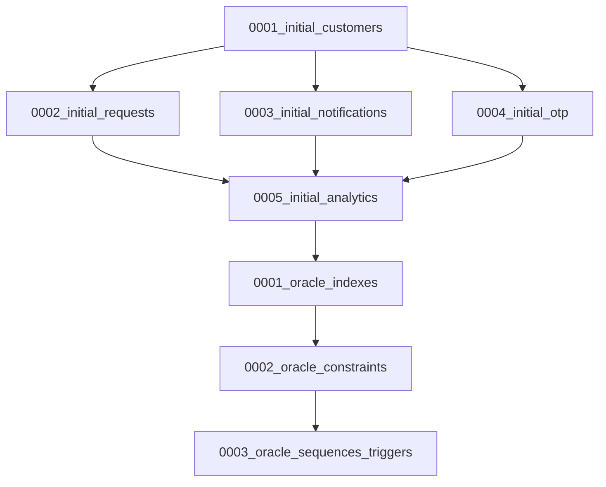

# Database Migration and Deployment Guide

## Overview

This document provides comprehensive guidance for deploying the Card Limit Increase System database to Oracle environments. It covers migration creation, deployment procedures, optimization strategies, and maintenance workflows for production-grade database operations.

## Table of Contents

1. [Migration Architecture](#migration-architecture)
2. [Prerequisites](#prerequisites)
3. [Migration Files Overview](#migration-files-overview)
4. [Deployment Procedures](#deployment-procedures)
5. [Oracle Optimizations](#oracle-optimizations)
6. [Performance Tuning](#performance-tuning)
7. [Backup and Recovery](#backup-and-recovery)
8. [Monitoring and Maintenance](#monitoring-and-maintenance)
9. [Troubleshooting](#troubleshooting)

## Migration Architecture

### Migration Strategy

The database migration follows a phased approach:

```
Phase 1: Core Tables → Phase 2: Relationships → Phase 3: Optimizations → Phase 4: Analytics
```

### Migration Dependencies



## Prerequisites

### System Requirements

#### Oracle Database
- **Version**: Oracle 19c or higher
- **Edition**: Enterprise Edition (recommended for production)
- **Memory**: Minimum 8GB RAM allocated to Oracle
- **Storage**: SSD storage with 500GB+ available space
- **Character Set**: AL32UTF8 (Unicode support)

#### Python Environment
- **Python**: 3.9+
- **cx_Oracle**: 8.3.0+
- **Django**: 4.2.7+
- **Oracle Instant Client**: 19.3+

#### Database User Privileges
```sql
-- Required privileges for deployment user
GRANT CONNECT TO card_limit_user;
GRANT RESOURCE TO card_limit_user;
GRANT CREATE SESSION TO card_limit_user;
GRANT CREATE TABLE TO card_limit_user;
GRANT CREATE SEQUENCE TO card_limit_user;
GRANT CREATE TRIGGER TO card_limit_user;
GRANT CREATE PROCEDURE TO card_limit_user;
GRANT CREATE VIEW TO card_limit_user;
GRANT CREATE INDEX TO card_limit_user;
GRANT CREATE MATERIALIZED VIEW TO card_limit_user;
GRANT UNLIMITED TABLESPACE TO card_limit_user;
```

### Environment Setup

#### 1. Oracle Client Installation
```bash
# Download Oracle Instant Client
wget https://download.oracle.com/otn_software/linux/instantclient/instantclient-basic-linux.x64-19.17.0.0.0dbru.zip

# Extract and setup
unzip instantclient-basic-linux.x64-19.17.0.0.0dbru.zip
export ORACLE_HOME=/opt/oracle/instantclient_19_17
export LD_LIBRARY_PATH=$ORACLE_HOME:$LD_LIBRARY_PATH
export PATH=$ORACLE_HOME:$PATH
```

#### 2. Environment Variables
```bash
# Database connection
export DB_NAME=HDFC_CARD_LIMIT
export DB_USER=card_limit_user
export DB_PASSWORD=secure_password_123
export DB_HOST=oracle-prod.hdfc.com
export DB_PORT=1521

# Admin credentials for user creation
export DB_ADMIN_USER=system
export DB_ADMIN_PASSWORD=admin_password

# Oracle specific
export ORACLE_DSN=${DB_HOST}:${DB_PORT}/${DB_NAME}
export NLS_LANG=AMERICAN_AMERICA.AL32UTF8
```

## Migration Files Overview

### Core Table Migrations

#### 0001_initial_customers.py
**Purpose**: Creates customer and card detail tables
**Tables Created**:
- `customer`: Core customer information with encrypted PII
- `carddetail`: Card information with PCI DSS compliance

**Key Features**:
- UUID primary keys for security
- Encrypted sensitive fields
- Comprehensive indexing
- Data validation constraints

#### 0002_initial_requests.py
**Purpose**: Creates limit request workflow tables
**Tables Created**:
- `limitrequest`: Main request tracking
- `requestdocument`: Document management
- `approvalworkflow`: Workflow state management

**Key Features**:
- Request lifecycle tracking
- Document integrity verification
- Workflow step automation
- Performance metrics calculation

#### 0003_initial_notifications.py
**Purpose**: Creates notification system tables
**Tables Created**:
- `notificationlog`: Communication tracking
- `notificationtemplate`: Template management
- `notificationpreference`: Customer preferences

**Key Features**:
- Multi-channel notification support
- Template-based messaging
- Delivery tracking and retry logic
- Customer preference management

#### 0004_initial_otp.py
**Purpose**: Creates OTP security system tables
**Tables Created**:
- `otplog`: OTP generation and verification
- `otpratelimit`: Rate limiting controls
- `otpauditlog`: Security audit trail

**Key Features**:
- Secure OTP storage (hashed only)
- Rate limiting and blocking
- Comprehensive audit logging
- Multi-delivery method support

#### 0005_initial_analytics.py
**Purpose**: Creates analytics and reporting tables
**Tables Created**:
- `analyticsmetric`: Real-time metrics
- `customeranalytics`: Customer insights
- `systemhealthmetrics`: System monitoring
- `businessmetrics`: Business intelligence

**Key Features**:
- Real-time analytics collection
- Customer behavior tracking
- System health monitoring
- Business intelligence metrics

### Oracle Optimization Migrations

#### 0001_oracle_indexes.py
**Purpose**: Creates Oracle-specific performance indexes
**Optimizations**:
- Composite indexes for common queries
- Partial indexes for filtered searches
- Function-based indexes for computed columns
- Covering indexes to avoid table lookups

**Index Categories**:
```sql
-- Search Optimization
idx_customer_search (firebase_uid, email, is_active)
idx_request_processing (status, priority, created_at)

-- Performance Optimization  
idx_customer_date_range (created_at, is_active)
idx_notification_delivery (customer_id, status, notification_type)

-- Security Optimization
idx_otp_audit_security (ip_address, timestamp, action)
idx_rate_limit_security (identifier, is_blocked, window_end)
```

#### 0002_oracle_constraints.py
**Purpose**: Adds business logic and data integrity constraints
**Constraint Types**:
- **Check Constraints**: Data validation rules
- **Referential Integrity**: Foreign key relationships
- **Business Rules**: Domain-specific validations

**Key Constraints**:
```sql
-- Data Validation
chk_customer_age: Ensures customers are 18+
chk_card_expiry_month: Validates month range (1-12)
chk_request_limits: Ensures requested > current limit

-- Business Logic
chk_analytics_request_counts: Ensures total = approved + rejected
chk_business_request_breakdown: Validates request breakdowns
chk_health_percentages: Ensures percentages are 0-100
```

#### 0003_oracle_sequences_triggers.py
**Purpose**: Creates sequences, triggers, and advanced features
**Components**:
- **Sequences**: Auto-incrementing reference numbers
- **Triggers**: Automated business logic
- **Materialized Views**: Pre-computed reporting data
- **Partitioning**: Performance optimization for large tables

**Key Features**:
```sql
-- Automatic Reference Generation
customer_ref_seq: CUST000001, CUST000002...
limit_request_ref_seq: LR00000001, LR00000002...

-- Real-time Analytics
trg_analytics_update: Updates customer metrics on request changes
trg_carddetail_limit_sync: Syncs limit changes with analytics

-- Performance Optimization
mv_daily_business_summary: Pre-computed daily metrics
mv_customer_risk_profile: Real-time risk assessment
```

## Deployment Procedures

### Development Environment Deployment

#### 1. Initial Setup
```bash
# Navigate to project directory
cd /path/to/card_limit_system

# Activate virtual environment
source venv/bin/activate

# Install dependencies
pip install -r requirements.txt

# Set environment variables
source .env.development
```

#### 2. Database User Creation
```bash
# Create database user (run as admin)
python manage.py deploy_database --environment=development --create-user
```

#### 3. Run Migrations
```bash
# Create migration files
python manage.py create_migrations --with-data

# Apply migrations
python manage.py deploy_database --environment=development --run-migrations
```

#### 4. Load Initial Data
```bash
# Load fixtures and initial data
python manage.py deploy_database --environment=development --load-initial-data
```

#### 5. Verify Deployment
```bash
# Verify database integrity
python manage.py deploy_database --environment=development --verify-deployment
```

### Staging Environment Deployment

#### 1. Pre-Deployment Backup
```bash
# Create backup before deployment
python manage.py deploy_database --environment=staging --backup-existing
```

#### 2. Deploy with Verification
```bash
# Full deployment with all options
python manage.py deploy_database \
    --environment=staging \
    --create-user \
    --run-migrations \
    --load-initial-data \
    --verify-deployment
```

#### 3. Performance Testing
```bash
# Run performance tests
python manage.py test tests.performance --settings=card_limit_system.settings.staging
```

### Production Environment Deployment

#### 1. Pre-Deployment Checklist
- [ ] Database backup completed
- [ ] Maintenance window scheduled
- [ ] Rollback plan prepared
- [ ] Team notifications sent
- [ ] Monitoring alerts configured

#### 2. Blue-Green Deployment Strategy
```bash
# Step 1: Deploy to green environment
python manage.py deploy_database \
    --environment=production_green \
    --create-user \
    --run-migrations \
    --load-initial-data \
    --verify-deployment

# Step 2: Verify green environment
python manage.py health_check --environment=production_green

# Step 3: Switch traffic to green
# (Application load balancer configuration)

# Step 4: Monitor and validate
python manage.py monitor_deployment --environment=production_green
```

#### 3. Zero-Downtime Migration
```bash
# For schema changes that don't break compatibility
python manage.py migrate --database=production --fake-initial

# Apply new migrations
python manage.py migrate --database=production
```

## Oracle Optimizations

### Indexing Strategy

#### 1. Composite Indexes
```sql
-- Customer search optimization
CREATE INDEX idx_customer_search 
ON customer(firebase_uid, email, is_active)
TABLESPACE USERS;

-- Request processing optimization
CREATE INDEX idx_request_processing 
ON limitrequest(status, priority, created_at)
TABLESPACE USERS;
```

#### 2. Partial Indexes
```sql
-- Active customers only
CREATE INDEX idx_customer_active 
ON customer(created_at) 
WHERE is_active = 1;

-- Pending requests only
CREATE INDEX idx_request_pending 
ON limitrequest(customer_id, created_at) 
WHERE status IN ('pending', 'under_review');
```

#### 3. Function-Based Indexes
```sql
-- Case-insensitive email search
CREATE INDEX idx_customer_email_ci 
ON customer(UPPER(email))
WHERE is_active = 1;

-- Date-based partitioning support
CREATE INDEX idx_notification_month 
ON notificationlog(TRUNC(created_at, 'MM'));
```

### Query Optimization

#### 1. Execution Plan Analysis
```sql
-- Analyze query performance
EXPLAIN PLAN FOR
SELECT c.*, ca.* 
FROM customer c 
LEFT JOIN customeranalytics ca ON c.id = ca.customer_id 
WHERE c.firebase_uid = 'user123' 
AND c.is_active = 1;

SELECT * FROM TABLE(DBMS_XPLAN.DISPLAY);
```

#### 2. Statistics Collection
```sql
-- Gather table statistics
BEGIN
    DBMS_STATS.GATHER_TABLE_STATS(
        ownname => 'CARD_LIMIT_USER',
        tabname => 'CUSTOMER',
        estimate_percent => DBMS_STATS.AUTO_SAMPLE_SIZE,
        cascade => TRUE
    );
END;
/
```

#### 3. Query Hints
```sql
-- Force index usage for critical queries
SELECT /*+ INDEX(c idx_customer_firebase_uid) */ 
       c.*, cd.* 
FROM customer c 
JOIN carddetail cd ON c.id = cd.customer_id 
WHERE c.firebase_uid = 'user123';
```

### Memory Optimization

#### 1. Buffer Pool Configuration
```sql
-- Increase buffer cache for frequently accessed tables
ALTER TABLE customer STORAGE (BUFFER_POOL KEEP);
ALTER TABLE limitrequest STORAGE (BUFFER_POOL KEEP);
ALTER TABLE carddetail STORAGE (BUFFER_POOL KEEP);
```

#### 2. Result Cache
```sql
-- Enable result cache for reference data
SELECT /*+ RESULT_CACHE */ 
       template_id, title_template, message_template
FROM notificationtemplate 
WHERE is_active = 1;
```

## Performance Tuning

### Database Parameters

#### 1. Memory Settings
```sql
-- SGA configuration
ALTER SYSTEM SET sga_target = 4G SCOPE=SPFILE;
ALTER SYSTEM SET pga_aggregate_target = 2G SCOPE=SPFILE;
ALTER SYSTEM SET shared_pool_size = 1G SCOPE=SPFILE;
ALTER SYSTEM SET db_cache_size = 2G SCOPE=SPFILE;
```

#### 2. I/O Optimization
```sql
-- Optimize I/O operations
ALTER SYSTEM SET db_writer_processes = 4 SCOPE=SPFILE;
ALTER SYSTEM SET log_writer_io_size = 32K SCOPE=SPFILE;
ALTER SYSTEM SET disk_asynch_io = TRUE SCOPE=SPFILE;
```

#### 3. Connection Pooling
```sql
-- Configure connection pooling
ALTER SYSTEM SET processes = 1000 SCOPE=SPFILE;
ALTER SYSTEM SET sessions = 1200 SCOPE=SPFILE;
ALTER SYSTEM SET shared_servers = 10 SCOPE=SPFILE;
```

### Partitioning Strategy

#### 1. Range Partitioning
```sql
-- Partition notification log by month
ALTER TABLE notificationlog MODIFY
PARTITION BY RANGE (created_at) 
INTERVAL (INTERVAL '1' MONTH)
(
    PARTITION p_notifications_2024_01 VALUES LESS THAN (DATE '2024-02-01'),
    PARTITION p_notifications_2024_02 VALUES LESS THAN (DATE '2024-03-01')
);
```

#### 2. Hash Partitioning
```sql
-- Partition analytics metrics by hash
ALTER TABLE analyticsmetric MODIFY
PARTITION BY HASH (metric_name)
PARTITIONS 8;
```

### Compression

#### 1. Table Compression
```sql
-- Enable compression for large tables
ALTER TABLE notificationlog MOVE COMPRESS FOR OLTP;
ALTER TABLE otpauditlog MOVE COMPRESS FOR OLTP;
ALTER TABLE analyticsmetric MOVE COMPRESS FOR OLTP;
```

#### 2. Index Compression
```sql
-- Compress frequently used indexes
ALTER INDEX idx_notification_delivery REBUILD COMPRESS;
ALTER INDEX idx_customer_search REBUILD COMPRESS;
```

## Backup and Recovery

### Backup Strategy

#### 1. Full Database Backup
```bash
#!/bin/bash
# Full database backup script

BACKUP_DIR="/backup/oracle/card_limit_system"
DATE=$(date +%Y%m%d_%H%M%S)
BACKUP_FILE="${BACKUP_DIR}/full_backup_${DATE}.rman"

# RMAN backup
rman target / << EOF
RUN {
    ALLOCATE CHANNEL ch1 TYPE DISK;
    ALLOCATE CHANNEL ch2 TYPE DISK;
    BACKUP AS COMPRESSED BACKUPSET 
           DATABASE 
           FORMAT '${BACKUP_FILE}_%U';
    BACKUP CURRENT CONTROLFILE 
           FORMAT '${BACKUP_DIR}/controlfile_${DATE}.ctl';
    BACKUP SPFILE 
           FORMAT '${BACKUP_DIR}/spfile_${DATE}.ora';
    RELEASE CHANNEL ch1;
    RELEASE CHANNEL ch2;
}
EXIT;
EOF
```

#### 2. Incremental Backup
```bash
#!/bin/bash
# Incremental backup script

BACKUP_DIR="/backup/oracle/card_limit_system/incremental"
DATE=$(date +%Y%m%d_%H%M%S)

rman target / << EOF
RUN {
    ALLOCATE CHANNEL ch1 TYPE DISK;
    BACKUP AS COMPRESSED BACKUPSET 
           INCREMENTAL LEVEL 1 
           DATABASE 
           FORMAT '${BACKUP_DIR}/incr_${DATE}_%U';
    BACKUP CURRENT CONTROLFILE 
           FORMAT '${BACKUP_DIR}/controlfile_${DATE}.ctl';
    RELEASE CHANNEL ch1;
}
EXIT;
EOF
```

#### 3. Data Pump Export
```bash
#!/bin/bash
# Schema-level export

expdp card_limit_user/secure_password@HDFC_CARD_LIMIT \
    directory=DATA_PUMP_DIR \
    dumpfile=card_limit_schema_$(date +%Y%m%d).dmp \
    logfile=card_limit_export_$(date +%Y%m%d).log \
    schemas=card_limit_user \
    compression=all
```

### Recovery Procedures

#### 1. Point-in-Time Recovery
```sql
-- Recover to specific SCN
STARTUP MOUNT;
RESTORE DATABASE;
RECOVER DATABASE UNTIL SCN 12345678;
ALTER DATABASE OPEN RESETLOGS;
```

#### 2. Table Recovery
```sql
-- Recover specific table
RECOVER TABLE card_limit_user.customer 
UNTIL TIME "TO_DATE('2024-01-15 14:30:00', 'YYYY-MM-DD HH24:MI:SS')"
AUXILIARY DESTINATION '/tmp/aux_dest'
REMAP TABLE 'card_limit_user.customer':'card_limit_user.customer_recovered';
```

#### 3. Data Pump Import
```bash
# Import from backup
impdp card_limit_user/secure_password@HDFC_CARD_LIMIT \
    directory=DATA_PUMP_DIR \
    dumpfile=card_limit_schema_20240115.dmp \
    logfile=card_limit_import_$(date +%Y%m%d).log \
    table_exists_action=replace
```

## Monitoring and Maintenance

### Health Monitoring

#### 1. Database Health Check Script
```python
# scripts/db_health_check.py
import cx_Oracle
import logging
from datetime import datetime, timedelta

def check_database_health():
    """Comprehensive database health check."""
    
    checks = {
        'connection': check_connection,
        'tablespace': check_tablespace_usage,
        'session_count': check_session_count,
        'lock_conflicts': check_lock_conflicts,
        'query_performance': check_query_performance,
        'backup_status': check_backup_status
    }
    
    results = {}
    for check_name, check_func in checks.items():
        try:
            results[check_name] = check_func()
        except Exception as e:
            results[check_name] = {'status': 'ERROR', 'message': str(e)}
    
    return results

def check_connection():
    """Test database connectivity."""
    try:
        with cx_Oracle.connect(connection_string) as conn:
            cursor = conn.cursor()
            cursor.execute("SELECT 1 FROM DUAL")
            return {'status': 'OK', 'message': 'Database connection successful'}
    except Exception as e:
        return {'status': 'ERROR', 'message': f'Connection failed: {str(e)}'}

def check_tablespace_usage():
    """Check tablespace usage."""
    query = """
    SELECT 
        tablespace_name,
        ROUND(used_percent, 2) as used_percent,
        ROUND(free_space_gb, 2) as free_gb
    FROM (
        SELECT 
            df.tablespace_name,
            (df.total_size - fs.free_space) / df.total_size * 100 as used_percent,
            fs.free_space / 1024 / 1024 / 1024 as free_space_gb
        FROM 
            (SELECT tablespace_name, SUM(bytes) as total_size 
             FROM dba_data_files GROUP BY tablespace_name) df
        JOIN 
            (SELECT tablespace_name, SUM(bytes) as free_space 
             FROM dba_free_space GROUP BY tablespace_name) fs
        ON df.tablespace_name = fs.tablespace_name
    )
    WHERE used_percent > 80
    """
    
    # Execute query and return results
    # Implementation details...
```

#### 2. Performance Monitoring
```sql
-- Active session monitoring
SELECT 
    s.sid,
    s.serial#,
    s.username,
    s.program,
    s.status,
    s.last_call_et/60 as minutes_active,
    sq.sql_text
FROM v$session s
LEFT JOIN v$sql sq ON s.sql_id = sq.sql_id
WHERE s.type = 'USER'
AND s.status = 'ACTIVE'
ORDER BY s.last_call_et DESC;

-- Top SQL by execution time
SELECT 
    sql_id,
    executions,
    ROUND(elapsed_time/1000000, 2) as elapsed_seconds,
    ROUND(cpu_time/1000000, 2) as cpu_seconds,
    ROUND(elapsed_time/executions/1000000, 4) as avg_elapsed,
    sql_text
FROM v$sql
WHERE executions > 0
ORDER BY elapsed_time DESC
FETCH FIRST 10 ROWS ONLY;
```

### Maintenance Tasks

#### 1. Statistics Maintenance
```sql
-- Automated statistics gathering
BEGIN
    DBMS_SCHEDULER.CREATE_JOB (
        job_name        => 'GATHER_CARD_LIMIT_STATS',
        job_type        => 'PLSQL_BLOCK',
        job_action      => 'BEGIN DBMS_STATS.GATHER_SCHEMA_STATS(''CARD_LIMIT_USER''); END;',
        start_date      => SYSTIMESTAMP,
        repeat_interval => 'FREQ=DAILY; BYHOUR=1; BYMINUTE=0; BYSECOND=0',
        enabled         => TRUE,
        comments        => 'Daily statistics gathering for Card Limit System'
    );
END;
/
```

#### 2. Index Maintenance
```sql
-- Rebuild fragmented indexes
DECLARE
    v_sql VARCHAR2(1000);
BEGIN
    FOR idx IN (
        SELECT index_name 
        FROM user_indexes 
        WHERE status = 'UNUSABLE' 
        OR index_name IN (
            SELECT index_name 
            FROM user_ind_statistics 
            WHERE blevel > 4
        )
    ) LOOP
        v_sql := 'ALTER INDEX ' || idx.index_name || ' REBUILD ONLINE';
        EXECUTE IMMEDIATE v_sql;
        DBMS_OUTPUT.PUT_LINE('Rebuilt index: ' || idx.index_name);
    END LOOP;
END;
/
```

#### 3. Partition Maintenance
```sql
-- Automated partition management
BEGIN
    DBMS_SCHEDULER.CREATE_JOB (
        job_name        => 'PARTITION_MAINTENANCE',
        job_type        => 'PLSQL_BLOCK',
        job_action      => 'BEGIN
                            -- Drop old partitions (older than 2 years)
                            FOR part IN (
                                SELECT partition_name, table_name
                                FROM user_tab_partitions
                                WHERE partition_name LIKE ''P_%''
                                AND partition_name < ''P_'' || TO_CHAR(ADD_MONTHS(SYSDATE, -24), ''YYYY_MM'')
                            ) LOOP
                                EXECUTE IMMEDIATE ''ALTER TABLE '' || part.table_name || 
                                                '' DROP PARTITION '' || part.partition_name;
                            END LOOP;
                            END;',
        start_date      => SYSTIMESTAMP,
        repeat_interval => 'FREQ=MONTHLY; BYMONTHDAY=1; BYHOUR=2',
        enabled         => TRUE
    );
END;
/
```

## Troubleshooting

### Common Issues

#### 1. Connection Issues
**Problem**: ORA-12541: TNS:no listener
**Solution**:
```bash
# Check listener status
lsnrctl status

# Start listener if needed
lsnrctl start

# Verify TNS configuration
tnsping HDFC_CARD_LIMIT
```

#### 2. Tablespace Full
**Problem**: ORA-01653: unable to extend table
**Solution**:
```sql
-- Add datafile to tablespace
ALTER TABLESPACE USERS 
ADD DATAFILE '/u01/app/oracle/oradata/HDFC/users02.dbf' 
SIZE 1G AUTOEXTEND ON NEXT 100M MAXSIZE 10G;

-- Or resize existing datafile
ALTER DATABASE DATAFILE '/u01/app/oracle/oradata/HDFC/users01.dbf' 
RESIZE 5G;
```

#### 3. Performance Issues
**Problem**: Slow query performance
**Solution**:
```sql
-- Identify slow queries
SELECT sql_id, executions, elapsed_time, sql_text
FROM v$sql 
WHERE elapsed_time > 10000000  -- 10 seconds
ORDER BY elapsed_time DESC;

-- Analyze execution plan
SELECT * FROM TABLE(DBMS_XPLAN.DISPLAY_CURSOR('&sql_id'));

-- Gather statistics if needed
EXEC DBMS_STATS.GATHER_TABLE_STATS('CARD_LIMIT_USER', 'CUSTOMER');
```

#### 4. Lock Conflicts
**Problem**: Session blocking
**Solution**:
```sql
-- Find blocking sessions
SELECT 
    blocking_session,
    sid,
    serial#,
    wait_class,
    seconds_in_wait
FROM v$session 
WHERE blocking_session IS NOT NULL;

-- Kill blocking session if necessary
ALTER SYSTEM KILL SESSION 'sid,serial#' IMMEDIATE;
```

### Emergency Procedures

#### 1. Database Corruption
```sql
-- Check for corruption
RMAN> VALIDATE DATABASE;

-- Recover if corruption found
RMAN> RECOVER CORRUPTION LIST;
```

#### 2. Complete System Failure
```bash
# Restore from backup
rman target / << EOF
STARTUP NOMOUNT;
RESTORE SPFILE FROM '/backup/oracle/spfile_latest.ora';
STARTUP FORCE MOUNT;
RESTORE DATABASE;
RECOVER DATABASE;
ALTER DATABASE OPEN;
EOF
```

#### 3. Data Recovery
```sql
-- Flashback query for accidental deletes
SELECT * FROM customer AS OF TIMESTAMP (SYSTIMESTAMP - INTERVAL '1' HOUR)
WHERE id = 'lost_customer_id';

-- Flashback table if flashback is enabled
FLASHBACK TABLE customer TO TIMESTAMP (SYSTIMESTAMP - INTERVAL '1' HOUR);
```

## Conclusion

This comprehensive database migration and deployment guide ensures reliable, performant, and secure Oracle database operations for the Card Limit Increase System. Regular monitoring, maintenance, and adherence to these procedures will maintain optimal system performance and data integrity.

For additional support or complex deployment scenarios, consult with the database administration team and refer to Oracle documentation for environment-specific configurations.