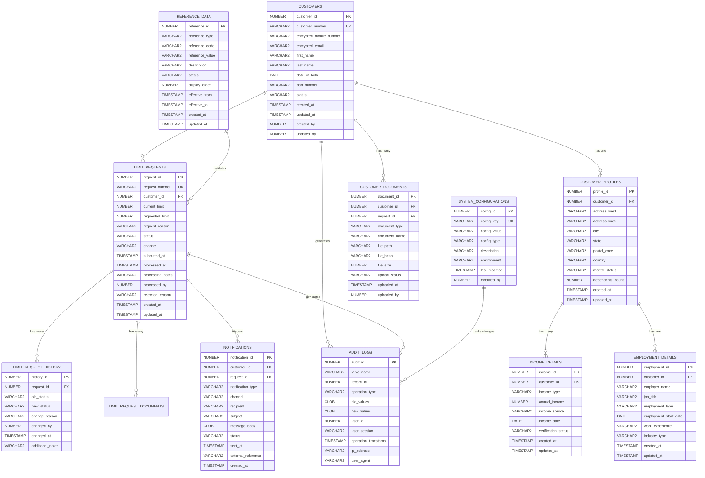

# Database Schema Documentation

## Table of Contents
1. [Database Overview](#database-overview)
2. [Entity Relationship Diagram](#entity-relationship-diagram)
3. [Table Structures](#table-structures)
4. [Indexes and Constraints](#indexes-and-constraints)
5. [Stored Procedures](#stored-procedures)
6. [Triggers](#triggers)
7. [Views](#views)
8. [Data Migration Scripts](#data-migration-scripts)
9. [Performance Optimization](#performance-optimization)
10. [Backup and Recovery](#backup-and-recovery)

---

## Database Overview

### 1. Database Information

```sql
-- Database: HDFC_CARD_LIMIT_DB
-- Version: Oracle 19c Enterprise Edition
-- Character Set: AL32UTF8
-- National Character Set: AL16UTF16
-- Time Zone: Asia/Kolkata

-- Tablespace Configuration
CREATE TABLESPACE HDFC_DATA
DATAFILE '/u01/app/oracle/oradata/HDFC/hdfc_data01.dbf' SIZE 1G
AUTOEXTEND ON NEXT 100M MAXSIZE 10G
EXTENT MANAGEMENT LOCAL
SEGMENT SPACE MANAGEMENT AUTO;

CREATE TABLESPACE HDFC_INDEX
DATAFILE '/u01/app/oracle/oradata/HDFC/hdfc_index01.dbf' SIZE 500M
AUTOEXTEND ON NEXT 50M MAXSIZE 5G
EXTENT MANAGEMENT LOCAL
SEGMENT SPACE MANAGEMENT AUTO;

CREATE TABLESPACE HDFC_TEMP
TEMPFILE '/u01/app/oracle/oradata/HDFC/hdfc_temp01.dbf' SIZE 200M
AUTOEXTEND ON NEXT 50M MAXSIZE 2G;
```

### 2. Schema Design Principles

- **ACID Compliance**: All transactions maintain atomicity, consistency, isolation, and durability
- **Data Integrity**: Foreign key constraints and check constraints enforce data validity
- **Audit Trail**: All critical tables include audit columns for compliance
- **Encryption**: Sensitive data fields are encrypted at rest
- **Partitioning**: Large tables are partitioned for performance
- **Indexing Strategy**: Optimized indexes for query performance

---

## Entity Relationship Diagram



---

## Table Structures

### 1. Core Business Tables

#### CUSTOMERS Table

```sql
CREATE TABLE customers (
    customer_id             NUMBER GENERATED BY DEFAULT AS IDENTITY PRIMARY KEY,
    customer_number         VARCHAR2(20) NOT NULL,
    encrypted_mobile_number VARCHAR2(255) NOT NULL,
    encrypted_email         VARCHAR2(255),
    first_name              VARCHAR2(100) NOT NULL,
    last_name               VARCHAR2(100) NOT NULL,
    date_of_birth           DATE,
    pan_number              VARCHAR2(10),
    status                  VARCHAR2(20) DEFAULT 'ACTIVE',
    created_at              TIMESTAMP DEFAULT CURRENT_TIMESTAMP,
    updated_at              TIMESTAMP DEFAULT CURRENT_TIMESTAMP,
    created_by              NUMBER,
    updated_by              NUMBER,
    
    CONSTRAINT customers_uk_customer_number UNIQUE (customer_number),
    CONSTRAINT customers_uk_pan_number UNIQUE (pan_number),
    CONSTRAINT customers_ck_status CHECK (status IN ('ACTIVE', 'INACTIVE', 'SUSPENDED', 'BLOCKED')),
    CONSTRAINT customers_ck_pan_format CHECK (REGEXP_LIKE(pan_number, '^[A-Z]{5}[0-9]{4}[A-Z]$'))
) TABLESPACE hdfc_data;

-- Add comments
COMMENT ON TABLE customers IS 'Master table for customer information';
COMMENT ON COLUMN customers.customer_id IS 'Primary key - auto-generated customer ID';
COMMENT ON COLUMN customers.customer_number IS 'Business key - unique customer identifier';
COMMENT ON COLUMN customers.encrypted_mobile_number IS 'Encrypted mobile number for security';
COMMENT ON COLUMN customers.encrypted_email IS 'Encrypted email address for security';
COMMENT ON COLUMN customers.pan_number IS 'PAN card number in AAAAA9999A format';
```

#### CUSTOMER_PROFILES Table

```sql
CREATE TABLE customer_profiles (
    profile_id      NUMBER GENERATED BY DEFAULT AS IDENTITY PRIMARY KEY,
    customer_id     NUMBER NOT NULL,
    address_line1   VARCHAR2(255),
    address_line2   VARCHAR2(255),
    city            VARCHAR2(100),
    state           VARCHAR2(100),
    postal_code     VARCHAR2(10),
    country         VARCHAR2(50) DEFAULT 'India',
    marital_status  VARCHAR2(20),
    dependents_count NUMBER DEFAULT 0,
    created_at      TIMESTAMP DEFAULT CURRENT_TIMESTAMP,
    updated_at      TIMESTAMP DEFAULT CURRENT_TIMESTAMP,
    
    CONSTRAINT customer_profiles_fk_customer FOREIGN KEY (customer_id) 
        REFERENCES customers(customer_id) ON DELETE CASCADE,
    CONSTRAINT customer_profiles_ck_marital_status 
        CHECK (marital_status IN ('SINGLE', 'MARRIED', 'DIVORCED', 'WIDOWED')),
    CONSTRAINT customer_profiles_ck_dependents_count 
        CHECK (dependents_count >= 0 AND dependents_count <= 20)
) TABLESPACE hdfc_data;

COMMENT ON TABLE customer_profiles IS 'Extended customer profile information';
```

#### LIMIT_REQUESTS Table

```sql
CREATE TABLE limit_requests (
    request_id          NUMBER GENERATED BY DEFAULT AS IDENTITY PRIMARY KEY,
    request_number      VARCHAR2(30) NOT NULL,
    customer_id         NUMBER NOT NULL,
    current_limit       NUMBER(15,2) NOT NULL,
    requested_limit     NUMBER(15,2) NOT NULL,
    request_reason      VARCHAR2(500),
    status              VARCHAR2(30) DEFAULT 'SUBMITTED',
    channel             VARCHAR2(20) NOT NULL,
    submitted_at        TIMESTAMP DEFAULT CURRENT_TIMESTAMP,
    processed_at        TIMESTAMP,
    processing_notes    VARCHAR2(1000),
    processed_by        NUMBER,
    rejection_reason    VARCHAR2(500),
    created_at          TIMESTAMP DEFAULT CURRENT_TIMESTAMP,
    updated_at          TIMESTAMP DEFAULT CURRENT_TIMESTAMP,
    
    CONSTRAINT limit_requests_uk_request_number UNIQUE (request_number),
    CONSTRAINT limit_requests_fk_customer FOREIGN KEY (customer_id) 
        REFERENCES customers(customer_id),
    CONSTRAINT limit_requests_ck_status CHECK (status IN (
        'SUBMITTED', 'UNDER_REVIEW', 'APPROVED', 'REJECTED', 'CANCELLED')),
    CONSTRAINT limit_requests_ck_channel CHECK (channel IN (
        'MOBILE_APP', 'INTERNET_BANKING', 'CUSTOMER_CARE', 'BRANCH')),
    CONSTRAINT limit_requests_ck_limit_amount CHECK (
        requested_limit > current_limit AND 
        requested_limit <= 10000000 AND 
        current_limit >= 0)
) TABLESPACE hdfc_data
PARTITION BY RANGE (submitted_at) (
    PARTITION p_2023 VALUES LESS THAN (DATE '2024-01-01'),
    PARTITION p_2024 VALUES LESS THAN (DATE '2025-01-01'),
    PARTITION p_2025 VALUES LESS THAN (DATE '2026-01-01'),
    PARTITION p_future VALUES LESS THAN (MAXVALUE)
);

COMMENT ON TABLE limit_requests IS 'Card limit increase requests from customers';
COMMENT ON COLUMN limit_requests.request_number IS 'Unique business identifier for the request';
COMMENT ON COLUMN limit_requests.current_limit IS 'Current credit card limit amount';
COMMENT ON COLUMN limit_requests.requested_limit IS 'Requested new limit amount';
```

#### LIMIT_REQUEST_HISTORY Table

```sql
CREATE TABLE limit_request_history (
    history_id          NUMBER GENERATED BY DEFAULT AS IDENTITY PRIMARY KEY,
    request_id          NUMBER NOT NULL,
    old_status          VARCHAR2(30),
    new_status          VARCHAR2(30) NOT NULL,
    change_reason       VARCHAR2(500),
    changed_by          NUMBER,
    changed_at          TIMESTAMP DEFAULT CURRENT_TIMESTAMP,
    additional_notes    VARCHAR2(1000),
    
    CONSTRAINT limit_request_history_fk_request FOREIGN KEY (request_id) 
        REFERENCES limit_requests(request_id) ON DELETE CASCADE
) TABLESPACE hdfc_data;

COMMENT ON TABLE limit_request_history IS 'Audit trail for limit request status changes';
```

### 2. Reference and Configuration Tables

#### REFERENCE_DATA Table

```sql
CREATE TABLE reference_data (
    reference_id    NUMBER GENERATED BY DEFAULT AS IDENTITY PRIMARY KEY,
    reference_type  VARCHAR2(50) NOT NULL,
    reference_code  VARCHAR2(50) NOT NULL,
    reference_value VARCHAR2(200) NOT NULL,
    description     VARCHAR2(500),
    status          VARCHAR2(20) DEFAULT 'ACTIVE',
    display_order   NUMBER DEFAULT 0,
    effective_from  TIMESTAMP DEFAULT CURRENT_TIMESTAMP,
    effective_to    TIMESTAMP,
    created_at      TIMESTAMP DEFAULT CURRENT_TIMESTAMP,
    updated_at      TIMESTAMP DEFAULT CURRENT_TIMESTAMP,
    
    CONSTRAINT reference_data_uk_type_code UNIQUE (reference_type, reference_code),
    CONSTRAINT reference_data_ck_status CHECK (status IN ('ACTIVE', 'INACTIVE'))
) TABLESPACE hdfc_data;

-- Insert reference data
INSERT INTO reference_data (reference_type, reference_code, reference_value, description) VALUES
('REQUEST_STATUS', 'SUBMITTED', 'Submitted', 'Request has been submitted'),
('REQUEST_STATUS', 'UNDER_REVIEW', 'Under Review', 'Request is being reviewed'),
('REQUEST_STATUS', 'APPROVED', 'Approved', 'Request has been approved'),
('REQUEST_STATUS', 'REJECTED', 'Rejected', 'Request has been rejected'),
('REQUEST_STATUS', 'CANCELLED', 'Cancelled', 'Request has been cancelled'),
('CHANNEL', 'MOBILE_APP', 'Mobile App', 'Request submitted through mobile app'),
('CHANNEL', 'INTERNET_BANKING', 'Internet Banking', 'Request submitted through internet banking'),
('CHANNEL', 'CUSTOMER_CARE', 'Customer Care', 'Request submitted through customer care'),
('CHANNEL', 'BRANCH', 'Branch', 'Request submitted at branch'),
('INCOME_TYPE', 'SALARY', 'Salary', 'Regular salary income'),
('INCOME_TYPE', 'BUSINESS', 'Business Income', 'Business or professional income'),
('INCOME_TYPE', 'RENTAL', 'Rental Income', 'Income from property rental'),
('INCOME_TYPE', 'OTHER', 'Other Income', 'Other sources of income');

COMMIT;
```

#### SYSTEM_CONFIGURATIONS Table

```sql
CREATE TABLE system_configurations (
    config_id       NUMBER GENERATED BY DEFAULT AS IDENTITY PRIMARY KEY,
    config_key      VARCHAR2(100) NOT NULL,
    config_value    VARCHAR2(4000) NOT NULL,
    config_type     VARCHAR2(20) DEFAULT 'STRING',
    description     VARCHAR2(500),
    environment     VARCHAR2(20) DEFAULT 'ALL',
    last_modified   TIMESTAMP DEFAULT CURRENT_TIMESTAMP,
    modified_by     NUMBER,
    
    CONSTRAINT system_configurations_uk_key UNIQUE (config_key),
    CONSTRAINT system_configurations_ck_type CHECK (config_type IN (
        'STRING', 'NUMBER', 'BOOLEAN', 'JSON', 'ENCRYPTED')),
    CONSTRAINT system_configurations_ck_environment CHECK (environment IN (
        'ALL', 'DEVELOPMENT', 'TESTING', 'STAGING', 'PRODUCTION'))
) TABLESPACE hdfc_data;

-- Insert system configurations
INSERT INTO system_configurations (config_key, config_value, config_type, description) VALUES
('MAX_LIMIT_AMOUNT', '10000000', 'NUMBER', 'Maximum allowable credit limit'),
('MIN_INCOME_MULTIPLIER', '3', 'NUMBER', 'Minimum income multiplier for limit calculation'),
('AUTO_APPROVAL_THRESHOLD', '500000', 'NUMBER', 'Threshold for automatic approval'),
('NOTIFICATION_RETRY_COUNT', '3', 'NUMBER', 'Number of retry attempts for notifications'),
('SESSION_TIMEOUT_MINUTES', '30', 'NUMBER', 'User session timeout in minutes'),
('ENABLE_SMS_NOTIFICATIONS', 'true', 'BOOLEAN', 'Enable SMS notifications'),
('ENABLE_EMAIL_NOTIFICATIONS', 'true', 'BOOLEAN', 'Enable email notifications'),
('ENABLE_PUSH_NOTIFICATIONS', 'true', 'BOOLEAN', 'Enable push notifications');

COMMIT;
```

### 3. Supporting Tables

#### INCOME_DETAILS Table

```sql
CREATE TABLE income_details (
    income_id           NUMBER GENERATED BY DEFAULT AS IDENTITY PRIMARY KEY,
    customer_id         NUMBER NOT NULL,
    income_type         VARCHAR2(20) NOT NULL,
    annual_income       NUMBER(15,2) NOT NULL,
    income_source       VARCHAR2(200),
    income_date         DATE,
    verification_status VARCHAR2(20) DEFAULT 'PENDING',
    created_at          TIMESTAMP DEFAULT CURRENT_TIMESTAMP,
    updated_at          TIMESTAMP DEFAULT CURRENT_TIMESTAMP,
    
    CONSTRAINT income_details_fk_customer FOREIGN KEY (customer_id) 
        REFERENCES customers(customer_id) ON DELETE CASCADE,
    CONSTRAINT income_details_ck_income_type CHECK (income_type IN (
        'SALARY', 'BUSINESS', 'RENTAL', 'OTHER')),
    CONSTRAINT income_details_ck_verification_status CHECK (verification_status IN (
        'PENDING', 'VERIFIED', 'REJECTED')),
    CONSTRAINT income_details_ck_annual_income CHECK (annual_income > 0)
) TABLESPACE hdfc_data;
```

#### EMPLOYMENT_DETAILS Table

```sql
CREATE TABLE employment_details (
    employment_id           NUMBER GENERATED BY DEFAULT AS IDENTITY PRIMARY KEY,
    customer_id             NUMBER NOT NULL,
    employer_name           VARCHAR2(200),
    job_title               VARCHAR2(100),
    employment_type         VARCHAR2(20),
    employment_start_date   DATE,
    work_experience         VARCHAR2(50),
    industry_type           VARCHAR2(100),
    created_at              TIMESTAMP DEFAULT CURRENT_TIMESTAMP,
    updated_at              TIMESTAMP DEFAULT CURRENT_TIMESTAMP,
    
    CONSTRAINT employment_details_fk_customer FOREIGN KEY (customer_id) 
        REFERENCES customers(customer_id) ON DELETE CASCADE,
    CONSTRAINT employment_details_ck_employment_type CHECK (employment_type IN (
        'PERMANENT', 'CONTRACT', 'PART_TIME', 'SELF_EMPLOYED', 'RETIRED'))
) TABLESPACE hdfc_data;
```

#### CUSTOMER_DOCUMENTS Table

```sql
CREATE TABLE customer_documents (
    document_id     NUMBER GENERATED BY DEFAULT AS IDENTITY PRIMARY KEY,
    customer_id     NUMBER NOT NULL,
    request_id      NUMBER,
    document_type   VARCHAR2(50) NOT NULL,
    document_name   VARCHAR2(255) NOT NULL,
    file_path       VARCHAR2(1000) NOT NULL,
    file_hash       VARCHAR2(64) NOT NULL,
    file_size       NUMBER NOT NULL,
    upload_status   VARCHAR2(20) DEFAULT 'UPLOADED',
    uploaded_at     TIMESTAMP DEFAULT CURRENT_TIMESTAMP,
    uploaded_by     NUMBER,
    
    CONSTRAINT customer_documents_fk_customer FOREIGN KEY (customer_id) 
        REFERENCES customers(customer_id) ON DELETE CASCADE,
    CONSTRAINT customer_documents_fk_request FOREIGN KEY (request_id) 
        REFERENCES limit_requests(request_id) ON DELETE CASCADE,
    CONSTRAINT customer_documents_ck_document_type CHECK (document_type IN (
        'INCOME_PROOF', 'IDENTITY_PROOF', 'ADDRESS_PROOF', 'BANK_STATEMENT', 'OTHER')),
    CONSTRAINT customer_documents_ck_upload_status CHECK (upload_status IN (
        'UPLOADED', 'VERIFIED', 'REJECTED', 'EXPIRED')),
    CONSTRAINT customer_documents_ck_file_size CHECK (file_size > 0 AND file_size <= 10485760) -- 10MB max
) TABLESPACE hdfc_data;
```

#### NOTIFICATIONS Table

```sql
CREATE TABLE notifications (
    notification_id     NUMBER GENERATED BY DEFAULT AS IDENTITY PRIMARY KEY,
    customer_id         NUMBER NOT NULL,
    request_id          NUMBER,
    notification_type   VARCHAR2(50) NOT NULL,
    channel             VARCHAR2(20) NOT NULL,
    recipient           VARCHAR2(255) NOT NULL,
    subject             VARCHAR2(500),
    message_body        CLOB NOT NULL,
    status              VARCHAR2(20) DEFAULT 'PENDING',
    sent_at             TIMESTAMP,
    external_reference  VARCHAR2(100),
    created_at          TIMESTAMP DEFAULT CURRENT_TIMESTAMP,
    
    CONSTRAINT notifications_fk_customer FOREIGN KEY (customer_id) 
        REFERENCES customers(customer_id),
    CONSTRAINT notifications_fk_request FOREIGN KEY (request_id) 
        REFERENCES limit_requests(request_id),
    CONSTRAINT notifications_ck_channel CHECK (channel IN (
        'EMAIL', 'SMS', 'PUSH', 'IN_APP')),
    CONSTRAINT notifications_ck_status CHECK (status IN (
        'PENDING', 'SENT', 'DELIVERED', 'FAILED', 'CANCELLED'))
) TABLESPACE hdfc_data
PARTITION BY RANGE (created_at) (
    PARTITION p_2023 VALUES LESS THAN (DATE '2024-01-01'),
    PARTITION p_2024 VALUES LESS THAN (DATE '2025-01-01'),
    PARTITION p_2025 VALUES LESS THAN (DATE '2026-01-01'),
    PARTITION p_future VALUES LESS THAN (MAXVALUE)
);
```

#### AUDIT_LOGS Table

```sql
CREATE TABLE audit_logs (
    audit_id                NUMBER GENERATED BY DEFAULT AS IDENTITY PRIMARY KEY,
    table_name              VARCHAR2(50) NOT NULL,
    record_id               NUMBER NOT NULL,
    operation_type          VARCHAR2(10) NOT NULL,
    old_values              CLOB,
    new_values              CLOB,
    user_id                 NUMBER,
    user_session            VARCHAR2(100),
    operation_timestamp     TIMESTAMP DEFAULT CURRENT_TIMESTAMP,
    ip_address              VARCHAR2(45),
    user_agent              VARCHAR2(500),
    
    CONSTRAINT audit_logs_ck_operation_type CHECK (operation_type IN (
        'INSERT', 'UPDATE', 'DELETE'))
) TABLESPACE hdfc_data
PARTITION BY RANGE (operation_timestamp) (
    PARTITION p_2023 VALUES LESS THAN (DATE '2024-01-01'),
    PARTITION p_2024 VALUES LESS THAN (DATE '2025-01-01'),
    PARTITION p_2025 VALUES LESS THAN (DATE '2026-01-01'),
    PARTITION p_future VALUES LESS THAN (MAXVALUE)
);

COMMENT ON TABLE audit_logs IS 'Comprehensive audit trail for all table operations';
```

---

## Indexes and Constraints

### 1. Primary and Unique Indexes

```sql
-- Primary key indexes are automatically created
-- Additional unique indexes for business keys

CREATE UNIQUE INDEX idx_customers_customer_number 
    ON customers(customer_number) TABLESPACE hdfc_index;

CREATE UNIQUE INDEX idx_customers_pan_number 
    ON customers(pan_number) TABLESPACE hdfc_index;

CREATE UNIQUE INDEX idx_limit_requests_request_number 
    ON limit_requests(request_number) TABLESPACE hdfc_index;

CREATE UNIQUE INDEX idx_system_config_key 
    ON system_configurations(config_key) TABLESPACE hdfc_index;

CREATE UNIQUE INDEX idx_reference_data_type_code 
    ON reference_data(reference_type, reference_code) TABLESPACE hdfc_index;
```

### 2. Foreign Key Indexes

```sql
-- Indexes on foreign key columns for performance
CREATE INDEX idx_customer_profiles_customer_id 
    ON customer_profiles(customer_id) TABLESPACE hdfc_index;

CREATE INDEX idx_limit_requests_customer_id 
    ON limit_requests(customer_id) TABLESPACE hdfc_index;

CREATE INDEX idx_limit_request_history_request_id 
    ON limit_request_history(request_id) TABLESPACE hdfc_index;

CREATE INDEX idx_income_details_customer_id 
    ON income_details(customer_id) TABLESPACE hdfc_index;

CREATE INDEX idx_employment_details_customer_id 
    ON employment_details(customer_id) TABLESPACE hdfc_index;

CREATE INDEX idx_customer_documents_customer_id 
    ON customer_documents(customer_id) TABLESPACE hdfc_index;

CREATE INDEX idx_customer_documents_request_id 
    ON customer_documents(request_id) TABLESPACE hdfc_index;

CREATE INDEX idx_notifications_customer_id 
    ON notifications(customer_id) TABLESPACE hdfc_index;

CREATE INDEX idx_notifications_request_id 
    ON notifications(request_id) TABLESPACE hdfc_index;
```

### 3. Performance Indexes

```sql
-- Indexes for common query patterns
CREATE INDEX idx_customers_status_created_at 
    ON customers(status, created_at) TABLESPACE hdfc_index;

CREATE INDEX idx_limit_requests_status_submitted_at 
    ON limit_requests(status, submitted_at) TABLESPACE hdfc_index;

CREATE INDEX idx_limit_requests_customer_status 
    ON limit_requests(customer_id, status) TABLESPACE hdfc_index;

CREATE INDEX idx_notifications_status_created_at 
    ON notifications(status, created_at) TABLESPACE hdfc_index;

CREATE INDEX idx_audit_logs_table_record_timestamp 
    ON audit_logs(table_name, record_id, operation_timestamp) TABLESPACE hdfc_index;

-- Composite index for complex queries
CREATE INDEX idx_limit_requests_complex 
    ON limit_requests(customer_id, status, submitted_at, channel) TABLESPACE hdfc_index;

-- Function-based index for case-insensitive searches
CREATE INDEX idx_customers_name_upper 
    ON customers(UPPER(first_name), UPPER(last_name)) TABLESPACE hdfc_index;
```

### 4. Advanced Constraints

```sql
-- Complex check constraints
ALTER TABLE limit_requests ADD CONSTRAINT limit_requests_ck_processed_at 
    CHECK ((status IN ('APPROVED', 'REJECTED') AND processed_at IS NOT NULL) OR 
           (status NOT IN ('APPROVED', 'REJECTED') AND processed_at IS NULL));

ALTER TABLE limit_requests ADD CONSTRAINT limit_requests_ck_rejection_reason 
    CHECK ((status = 'REJECTED' AND rejection_reason IS NOT NULL) OR 
           (status != 'REJECTED' AND rejection_reason IS NULL));

-- Temporal constraints
ALTER TABLE reference_data ADD CONSTRAINT reference_data_ck_effective_dates 
    CHECK (effective_to IS NULL OR effective_to > effective_from);

-- Business rule constraints
ALTER TABLE income_details ADD CONSTRAINT income_details_ck_income_date 
    CHECK (income_date <= SYSDATE);

ALTER TABLE employment_details ADD CONSTRAINT employment_details_ck_start_date 
    CHECK (employment_start_date <= SYSDATE);
```

---

## Stored Procedures

### 1. Customer Management Procedures

```sql
-- Procedure to create a new customer
CREATE OR REPLACE PROCEDURE create_customer (
    p_customer_number IN VARCHAR2,
    p_mobile_number IN VARCHAR2,
    p_email IN VARCHAR2,
    p_first_name IN VARCHAR2,
    p_last_name IN VARCHAR2,
    p_date_of_birth IN DATE,
    p_pan_number IN VARCHAR2,
    p_created_by IN NUMBER,
    p_customer_id OUT NUMBER,
    p_status OUT VARCHAR2,
    p_message OUT VARCHAR2
) IS
    v_encrypted_mobile VARCHAR2(255);
    v_encrypted_email VARCHAR2(255);
    v_count NUMBER;
BEGIN
    -- Validate input parameters
    IF p_customer_number IS NULL OR p_mobile_number IS NULL OR 
       p_first_name IS NULL OR p_last_name IS NULL THEN
        p_status := 'ERROR';
        p_message := 'Required fields cannot be null';
        RETURN;
    END IF;
    
    -- Check for duplicate customer number
    SELECT COUNT(*)
    INTO v_count
    FROM customers
    WHERE customer_number = p_customer_number;
    
    IF v_count > 0 THEN
        p_status := 'ERROR';
        p_message := 'Customer number already exists';
        RETURN;
    END IF;
    
    -- Check for duplicate PAN number
    IF p_pan_number IS NOT NULL THEN
        SELECT COUNT(*)
        INTO v_count
        FROM customers
        WHERE pan_number = p_pan_number;
        
        IF v_count > 0 THEN
            p_status := 'ERROR';
            p_message := 'PAN number already exists';
            RETURN;
        END IF;
    END IF;
    
    -- Encrypt sensitive data
    v_encrypted_mobile := encrypt_data(p_mobile_number);
    v_encrypted_email := encrypt_data(p_email);
    
    -- Insert customer record
    INSERT INTO customers (
        customer_number, encrypted_mobile_number, encrypted_email,
        first_name, last_name, date_of_birth, pan_number, created_by
    ) VALUES (
        p_customer_number, v_encrypted_mobile, v_encrypted_email,
        p_first_name, p_last_name, p_date_of_birth, p_pan_number, p_created_by
    ) RETURNING customer_id INTO p_customer_id;
    
    COMMIT;
    
    p_status := 'SUCCESS';
    p_message := 'Customer created successfully';
    
EXCEPTION
    WHEN OTHERS THEN
        ROLLBACK;
        p_status := 'ERROR';
        p_message := 'Error creating customer: ' || SQLERRM;
        
        -- Log error
        INSERT INTO error_logs (error_message, error_timestamp, procedure_name)
        VALUES (SQLERRM, SYSDATE, 'create_customer');
        COMMIT;
END create_customer;
/

-- Procedure to update customer information
CREATE OR REPLACE PROCEDURE update_customer (
    p_customer_id IN NUMBER,
    p_mobile_number IN VARCHAR2 DEFAULT NULL,
    p_email IN VARCHAR2 DEFAULT NULL,
    p_first_name IN VARCHAR2 DEFAULT NULL,
    p_last_name IN VARCHAR2 DEFAULT NULL,
    p_status IN VARCHAR2 DEFAULT NULL,
    p_updated_by IN NUMBER,
    p_result_status OUT VARCHAR2,
    p_message OUT VARCHAR2
) IS
    v_encrypted_mobile VARCHAR2(255);
    v_encrypted_email VARCHAR2(255);
    v_count NUMBER;
BEGIN
    -- Check if customer exists
    SELECT COUNT(*)
    INTO v_count
    FROM customers
    WHERE customer_id = p_customer_id;
    
    IF v_count = 0 THEN
        p_result_status := 'ERROR';
        p_message := 'Customer not found';
        RETURN;
    END IF;
    
    -- Encrypt sensitive data if provided
    IF p_mobile_number IS NOT NULL THEN
        v_encrypted_mobile := encrypt_data(p_mobile_number);
    END IF;
    
    IF p_email IS NOT NULL THEN
        v_encrypted_email := encrypt_data(p_email);
    END IF;
    
    -- Update customer record
    UPDATE customers
    SET encrypted_mobile_number = NVL(v_encrypted_mobile, encrypted_mobile_number),
        encrypted_email = NVL(v_encrypted_email, encrypted_email),
        first_name = NVL(p_first_name, first_name),
        last_name = NVL(p_last_name, last_name),
        status = NVL(p_status, status),
        updated_at = CURRENT_TIMESTAMP,
        updated_by = p_updated_by
    WHERE customer_id = p_customer_id;
    
    COMMIT;
    
    p_result_status := 'SUCCESS';
    p_message := 'Customer updated successfully';
    
EXCEPTION
    WHEN OTHERS THEN
        ROLLBACK;
        p_result_status := 'ERROR';
        p_message := 'Error updating customer: ' || SQLERRM;
END update_customer;
/
```

### 2. Limit Request Processing Procedures

```sql
-- Procedure to submit a limit request
CREATE OR REPLACE PROCEDURE submit_limit_request (
    p_customer_id IN NUMBER,
    p_current_limit IN NUMBER,
    p_requested_limit IN NUMBER,
    p_request_reason IN VARCHAR2,
    p_channel IN VARCHAR2,
    p_request_id OUT NUMBER,
    p_request_number OUT VARCHAR2,
    p_status OUT VARCHAR2,
    p_message OUT VARCHAR2
) IS
    v_customer_count NUMBER;
    v_pending_count NUMBER;
    v_request_number VARCHAR2(30);
BEGIN
    -- Validate customer exists and is active
    SELECT COUNT(*)
    INTO v_customer_count
    FROM customers
    WHERE customer_id = p_customer_id AND status = 'ACTIVE';
    
    IF v_customer_count = 0 THEN
        p_status := 'ERROR';
        p_message := 'Customer not found or inactive';
        RETURN;
    END IF;
    
    -- Check for pending requests
    SELECT COUNT(*)
    INTO v_pending_count
    FROM limit_requests
    WHERE customer_id = p_customer_id 
    AND status IN ('SUBMITTED', 'UNDER_REVIEW');
    
    IF v_pending_count > 0 THEN
        p_status := 'ERROR';
        p_message := 'Customer has pending limit request';
        RETURN;
    END IF;
    
    -- Generate request number
    v_request_number := generate_request_number();
    
    -- Insert limit request
    INSERT INTO limit_requests (
        request_number, customer_id, current_limit, requested_limit,
        request_reason, channel, status
    ) VALUES (
        v_request_number, p_customer_id, p_current_limit, p_requested_limit,
        p_request_reason, p_channel, 'SUBMITTED'
    ) RETURNING request_id INTO p_request_id;
    
    -- Insert history record
    INSERT INTO limit_request_history (
        request_id, old_status, new_status, change_reason, changed_by
    ) VALUES (
        p_request_id, NULL, 'SUBMITTED', 'Request submitted', p_customer_id
    );
    
    COMMIT;
    
    p_request_number := v_request_number;
    p_status := 'SUCCESS';
    p_message := 'Limit request submitted successfully';
    
    -- Trigger notification (asynchronous)
    send_notification(p_customer_id, p_request_id, 'REQUEST_SUBMITTED');
    
EXCEPTION
    WHEN OTHERS THEN
        ROLLBACK;
        p_status := 'ERROR';
        p_message := 'Error submitting limit request: ' || SQLERRM;
END submit_limit_request;
/

-- Procedure to process a limit request
CREATE OR REPLACE PROCEDURE process_limit_request (
    p_request_id IN NUMBER,
    p_new_status IN VARCHAR2,
    p_processing_notes IN VARCHAR2,
    p_rejection_reason IN VARCHAR2 DEFAULT NULL,
    p_processed_by IN NUMBER,
    p_status OUT VARCHAR2,
    p_message OUT VARCHAR2
) IS
    v_current_status VARCHAR2(30);
    v_customer_id NUMBER;
    v_count NUMBER;
BEGIN
    -- Get current request details
    SELECT status, customer_id
    INTO v_current_status, v_customer_id
    FROM limit_requests
    WHERE request_id = p_request_id;
    
    -- Validate status transition
    IF NOT is_valid_status_transition(v_current_status, p_new_status) THEN
        p_status := 'ERROR';
        p_message := 'Invalid status transition from ' || v_current_status || ' to ' || p_new_status;
        RETURN;
    END IF;
    
    -- Update limit request
    UPDATE limit_requests
    SET status = p_new_status,
        processed_at = CURRENT_TIMESTAMP,
        processing_notes = p_processing_notes,
        rejection_reason = p_rejection_reason,
        processed_by = p_processed_by,
        updated_at = CURRENT_TIMESTAMP
    WHERE request_id = p_request_id;
    
    -- Insert history record
    INSERT INTO limit_request_history (
        request_id, old_status, new_status, change_reason, 
        changed_by, additional_notes
    ) VALUES (
        p_request_id, v_current_status, p_new_status, 
        'Status updated by processor', p_processed_by, p_processing_notes
    );
    
    COMMIT;
    
    p_status := 'SUCCESS';
    p_message := 'Request processed successfully';
    
    -- Send appropriate notification
    IF p_new_status = 'APPROVED' THEN
        send_notification(v_customer_id, p_request_id, 'REQUEST_APPROVED');
    ELSIF p_new_status = 'REJECTED' THEN
        send_notification(v_customer_id, p_request_id, 'REQUEST_REJECTED');
    END IF;
    
EXCEPTION
    WHEN NO_DATA_FOUND THEN
        p_status := 'ERROR';
        p_message := 'Request not found';
    WHEN OTHERS THEN
        ROLLBACK;
        p_status := 'ERROR';
        p_message := 'Error processing request: ' || SQLERRM;
END process_limit_request;
/
```

### 3. Utility Functions and Procedures

```sql
-- Function to generate unique request number
CREATE OR REPLACE FUNCTION generate_request_number
RETURN VARCHAR2 IS
    v_sequence_number NUMBER;
    v_request_number VARCHAR2(30);
BEGIN
    SELECT limit_request_seq.NEXTVAL INTO v_sequence_number FROM DUAL;
    
    v_request_number := 'LR' || TO_CHAR(SYSDATE, 'YYYYMMDD') || 
                       LPAD(v_sequence_number, 8, '0');
    
    RETURN v_request_number;
END generate_request_number;
/

-- Function to validate status transitions
CREATE OR REPLACE FUNCTION is_valid_status_transition (
    p_current_status VARCHAR2,
    p_new_status VARCHAR2
) RETURN BOOLEAN IS
BEGIN
    -- Define valid transitions
    CASE p_current_status
        WHEN 'SUBMITTED' THEN
            RETURN p_new_status IN ('UNDER_REVIEW', 'CANCELLED');
        WHEN 'UNDER_REVIEW' THEN
            RETURN p_new_status IN ('APPROVED', 'REJECTED', 'CANCELLED');
        WHEN 'APPROVED' THEN
            RETURN FALSE; -- No further transitions allowed
        WHEN 'REJECTED' THEN
            RETURN FALSE; -- No further transitions allowed
        WHEN 'CANCELLED' THEN
            RETURN FALSE; -- No further transitions allowed
        ELSE
            RETURN FALSE;
    END CASE;
END is_valid_status_transition;
/

-- Function to encrypt sensitive data
CREATE OR REPLACE FUNCTION encrypt_data (
    p_data VARCHAR2
) RETURN VARCHAR2 IS
    v_encrypted_data VARCHAR2(4000);
    v_encryption_key VARCHAR2(32) := 'HDFC_ENCRYPTION_KEY_2024_SECURE';
BEGIN
    IF p_data IS NULL THEN
        RETURN NULL;
    END IF;
    
    -- Use Oracle's DBMS_CRYPTO package for encryption
    v_encrypted_data := DBMS_CRYPTO.ENCRYPT(
        src => UTL_RAW.CAST_TO_RAW(p_data),
        typ => DBMS_CRYPTO.AES256_CBC,
        key => UTL_RAW.CAST_TO_RAW(v_encryption_key)
    );
    
    RETURN UTL_RAW.CAST_TO_VARCHAR2(v_encrypted_data);
    
EXCEPTION
    WHEN OTHERS THEN
        -- Log encryption error
        INSERT INTO error_logs (error_message, error_timestamp, procedure_name)
        VALUES ('Encryption error: ' || SQLERRM, SYSDATE, 'encrypt_data');
        COMMIT;
        
        RETURN NULL;
END encrypt_data;
/

-- Function to decrypt sensitive data
CREATE OR REPLACE FUNCTION decrypt_data (
    p_encrypted_data VARCHAR2
) RETURN VARCHAR2 IS
    v_decrypted_data VARCHAR2(4000);
    v_encryption_key VARCHAR2(32) := 'HDFC_ENCRYPTION_KEY_2024_SECURE';
BEGIN
    IF p_encrypted_data IS NULL THEN
        RETURN NULL;
    END IF;
    
    -- Use Oracle's DBMS_CRYPTO package for decryption
    v_decrypted_data := DBMS_CRYPTO.DECRYPT(
        src => UTL_RAW.CAST_TO_RAW(p_encrypted_data),
        typ => DBMS_CRYPTO.AES256_CBC,
        key => UTL_RAW.CAST_TO_RAW(v_encryption_key)
    );
    
    RETURN UTL_RAW.CAST_TO_VARCHAR2(v_decrypted_data);
    
EXCEPTION
    WHEN OTHERS THEN
        -- Log decryption error
        INSERT INTO error_logs (error_message, error_timestamp, procedure_name)
        VALUES ('Decryption error: ' || SQLERRM, SYSDATE, 'decrypt_data');
        COMMIT;
        
        RETURN NULL;
END decrypt_data;
/

-- Procedure to send notifications (placeholder for external integration)
CREATE OR REPLACE PROCEDURE send_notification (
    p_customer_id IN NUMBER,
    p_request_id IN NUMBER,
    p_notification_type IN VARCHAR2
) IS
    v_notification_id NUMBER;
BEGIN
    -- Insert notification record
    INSERT INTO notifications (
        customer_id, request_id, notification_type, 
        channel, recipient, subject, message_body, status
    ) VALUES (
        p_customer_id, p_request_id, p_notification_type,
        'EMAIL', 'customer@example.com', 
        'Limit Request Update', 'Your request has been updated', 'PENDING'
    ) RETURNING notification_id INTO v_notification_id;
    
    COMMIT;
    
    -- Here you would integrate with external notification service
    -- This is handled by the Django application layer
    
EXCEPTION
    WHEN OTHERS THEN
        -- Log notification error but don't fail the main transaction
        INSERT INTO error_logs (error_message, error_timestamp, procedure_name)
        VALUES ('Notification error: ' || SQLERRM, SYSDATE, 'send_notification');
        COMMIT;
END send_notification;
/
```

---

## Triggers

### 1. Audit Triggers

```sql
-- Audit trigger for customers table
CREATE OR REPLACE TRIGGER trg_customers_audit
    AFTER INSERT OR UPDATE OR DELETE ON customers
    FOR EACH ROW
DECLARE
    v_operation_type VARCHAR2(10);
    v_old_values CLOB;
    v_new_values CLOB;
BEGIN
    -- Determine operation type
    IF INSERTING THEN
        v_operation_type := 'INSERT';
        v_old_values := NULL;
        v_new_values := format_customer_json(:NEW);
    ELSIF UPDATING THEN
        v_operation_type := 'UPDATE';
        v_old_values := format_customer_json(:OLD);
        v_new_values := format_customer_json(:NEW);
    ELSIF DELETING THEN
        v_operation_type := 'DELETE';
        v_old_values := format_customer_json(:OLD);
        v_new_values := NULL;
    END IF;
    
    -- Insert audit record
    INSERT INTO audit_logs (
        table_name, record_id, operation_type, 
        old_values, new_values, user_id, 
        user_session, ip_address, user_agent
    ) VALUES (
        'CUSTOMERS', 
        COALESCE(:NEW.customer_id, :OLD.customer_id),
        v_operation_type, v_old_values, v_new_values,
        COALESCE(:NEW.updated_by, :OLD.updated_by),
        get_session_info('SESSION_ID'),
        get_session_info('IP_ADDRESS'),
        get_session_info('USER_AGENT')
    );
END;
/

-- Audit trigger for limit_requests table
CREATE OR REPLACE TRIGGER trg_limit_requests_audit
    AFTER INSERT OR UPDATE OR DELETE ON limit_requests
    FOR EACH ROW
DECLARE
    v_operation_type VARCHAR2(10);
    v_old_values CLOB;
    v_new_values CLOB;
BEGIN
    IF INSERTING THEN
        v_operation_type := 'INSERT';
        v_old_values := NULL;
        v_new_values := format_limit_request_json(:NEW);
    ELSIF UPDATING THEN
        v_operation_type := 'UPDATE';
        v_old_values := format_limit_request_json(:OLD);
        v_new_values := format_limit_request_json(:NEW);
    ELSIF DELETING THEN
        v_operation_type := 'DELETE';
        v_old_values := format_limit_request_json(:OLD);
        v_new_values := NULL;
    END IF;
    
    INSERT INTO audit_logs (
        table_name, record_id, operation_type, 
        old_values, new_values, user_id
    ) VALUES (
        'LIMIT_REQUESTS', 
        COALESCE(:NEW.request_id, :OLD.request_id),
        v_operation_type, v_old_values, v_new_values,
        COALESCE(:NEW.processed_by, :OLD.processed_by)
    );
END;
/
```

### 2. Business Logic Triggers

```sql
-- Trigger to automatically update timestamps
CREATE OR REPLACE TRIGGER trg_customers_timestamp
    BEFORE UPDATE ON customers
    FOR EACH ROW
BEGIN
    :NEW.updated_at := CURRENT_TIMESTAMP;
END;
/

CREATE OR REPLACE TRIGGER trg_limit_requests_timestamp
    BEFORE UPDATE ON limit_requests
    FOR EACH ROW
BEGIN
    :NEW.updated_at := CURRENT_TIMESTAMP;
END;
/

-- Trigger to validate business rules
CREATE OR REPLACE TRIGGER trg_limit_requests_validation
    BEFORE INSERT OR UPDATE ON limit_requests
    FOR EACH ROW
DECLARE
    v_customer_status VARCHAR2(20);
    v_max_limit_config NUMBER;
BEGIN
    -- Check customer status
    SELECT status INTO v_customer_status
    FROM customers
    WHERE customer_id = :NEW.customer_id;
    
    IF v_customer_status != 'ACTIVE' THEN
        RAISE_APPLICATION_ERROR(-20001, 'Cannot create limit request for inactive customer');
    END IF;
    
    -- Check maximum limit configuration
    SELECT TO_NUMBER(config_value) INTO v_max_limit_config
    FROM system_configurations
    WHERE config_key = 'MAX_LIMIT_AMOUNT';
    
    IF :NEW.requested_limit > v_max_limit_config THEN
        RAISE_APPLICATION_ERROR(-20002, 'Requested limit exceeds maximum allowed limit');
    END IF;
    
    -- Set processing timestamp for approved/rejected status
    IF :NEW.status IN ('APPROVED', 'REJECTED') AND :OLD.status NOT IN ('APPROVED', 'REJECTED') THEN
        :NEW.processed_at := CURRENT_TIMESTAMP;
    END IF;
    
EXCEPTION
    WHEN NO_DATA_FOUND THEN
        RAISE_APPLICATION_ERROR(-20003, 'Customer not found or configuration missing');
END;
/

-- Trigger to enforce data consistency
CREATE OR REPLACE TRIGGER trg_reference_data_consistency
    BEFORE INSERT OR UPDATE ON reference_data
    FOR EACH ROW
BEGIN
    -- Ensure effective dates are consistent
    IF :NEW.effective_to IS NOT NULL AND :NEW.effective_to <= :NEW.effective_from THEN
        RAISE_APPLICATION_ERROR(-20004, 'Effective to date must be after effective from date');
    END IF;
    
    -- Set updated timestamp
    :NEW.updated_at := CURRENT_TIMESTAMP;
END;
/
```

### 3. Utility Functions for Triggers

```sql
-- Function to format customer data as JSON for audit
CREATE OR REPLACE FUNCTION format_customer_json (
    p_customer customers%ROWTYPE
) RETURN CLOB IS
    v_json CLOB;
BEGIN
    v_json := '{' ||
        '"customer_id": ' || NVL(TO_CHAR(p_customer.customer_id), 'null') || ',' ||
        '"customer_number": "' || NVL(p_customer.customer_number, '') || '",' ||
        '"first_name": "' || NVL(p_customer.first_name, '') || '",' ||
        '"last_name": "' || NVL(p_customer.last_name, '') || '",' ||
        '"status": "' || NVL(p_customer.status, '') || '",' ||
        '"created_at": "' || NVL(TO_CHAR(p_customer.created_at, 'YYYY-MM-DD HH24:MI:SS'), '') || '",' ||
        '"updated_at": "' || NVL(TO_CHAR(p_customer.updated_at, 'YYYY-MM-DD HH24:MI:SS'), '') || '"' ||
        '}';
    
    RETURN v_json;
END format_customer_json;
/

-- Function to format limit request data as JSON for audit
CREATE OR REPLACE FUNCTION format_limit_request_json (
    p_request limit_requests%ROWTYPE
) RETURN CLOB IS
    v_json CLOB;
BEGIN
    v_json := '{' ||
        '"request_id": ' || NVL(TO_CHAR(p_request.request_id), 'null') || ',' ||
        '"request_number": "' || NVL(p_request.request_number, '') || '",' ||
        '"customer_id": ' || NVL(TO_CHAR(p_request.customer_id), 'null') || ',' ||
        '"current_limit": ' || NVL(TO_CHAR(p_request.current_limit), 'null') || ',' ||
        '"requested_limit": ' || NVL(TO_CHAR(p_request.requested_limit), 'null') || ',' ||
        '"status": "' || NVL(p_request.status, '') || '",' ||
        '"channel": "' || NVL(p_request.channel, '') || '",' ||
        '"submitted_at": "' || NVL(TO_CHAR(p_request.submitted_at, 'YYYY-MM-DD HH24:MI:SS'), '') || '",' ||
        '"processed_at": "' || NVL(TO_CHAR(p_request.processed_at, 'YYYY-MM-DD HH24:MI:SS'), '') || '"' ||
        '}';
    
    RETURN v_json;
END format_limit_request_json;
/

-- Function to get session information
CREATE OR REPLACE FUNCTION get_session_info (
    p_info_type VARCHAR2
) RETURN VARCHAR2 IS
BEGIN
    -- This would be implemented to get session information
    -- from application context or client identifier
    CASE p_info_type
        WHEN 'SESSION_ID' THEN
            RETURN SYS_CONTEXT('USERENV', 'SESSIONID');
        WHEN 'IP_ADDRESS' THEN
            RETURN SYS_CONTEXT('USERENV', 'IP_ADDRESS');
        WHEN 'USER_AGENT' THEN
            RETURN SYS_CONTEXT('USERENV', 'CLIENT_INFO');
        ELSE
            RETURN NULL;
    END CASE;
END get_session_info;
/
```

---

## Views

### 1. Business Intelligence Views

```sql
-- View for customer summary information
CREATE OR REPLACE VIEW vw_customer_summary AS
SELECT 
    c.customer_id,
    c.customer_number,
    c.first_name,
    c.last_name,
    c.status AS customer_status,
    c.created_at AS customer_since,
    cp.city,
    cp.state,
    cp.marital_status,
    ed.employer_name,
    ed.employment_type,
    id.annual_income,
    COUNT(lr.request_id) AS total_requests,
    MAX(lr.submitted_at) AS last_request_date,
    SUM(CASE WHEN lr.status = 'APPROVED' THEN 1 ELSE 0 END) AS approved_requests,
    SUM(CASE WHEN lr.status = 'REJECTED' THEN 1 ELSE 0 END) AS rejected_requests
FROM customers c
LEFT JOIN customer_profiles cp ON c.customer_id = cp.customer_id
LEFT JOIN employment_details ed ON c.customer_id = ed.customer_id
LEFT JOIN income_details id ON c.customer_id = id.customer_id
LEFT JOIN limit_requests lr ON c.customer_id = lr.customer_id
GROUP BY 
    c.customer_id, c.customer_number, c.first_name, c.last_name,
    c.status, c.created_at, cp.city, cp.state, cp.marital_status,
    ed.employer_name, ed.employment_type, id.annual_income;

COMMENT ON VIEW vw_customer_summary IS 'Comprehensive customer summary with request statistics';

-- View for limit request details
CREATE OR REPLACE VIEW vw_limit_request_details AS
SELECT 
    lr.request_id,
    lr.request_number,
    lr.customer_id,
    c.customer_number,
    c.first_name || ' ' || c.last_name AS customer_name,
    decrypt_data(c.encrypted_mobile_number) AS mobile_number,
    decrypt_data(c.encrypted_email) AS email,
    lr.current_limit,
    lr.requested_limit,
    lr.requested_limit - lr.current_limit AS increase_amount,
    ROUND(((lr.requested_limit - lr.current_limit) / lr.current_limit) * 100, 2) AS increase_percentage,
    lr.request_reason,
    lr.status,
    lr.channel,
    lr.submitted_at,
    lr.processed_at,
    lr.processing_notes,
    lr.rejection_reason,
    CASE 
        WHEN lr.processed_at IS NOT NULL THEN 
            ROUND((lr.processed_at - lr.submitted_at) * 24 * 60) -- Minutes
        ELSE 
            ROUND((SYSDATE - lr.submitted_at) * 24 * 60) -- Minutes since submission
    END AS processing_time_minutes,
    rd_status.reference_value AS status_description,
    rd_channel.reference_value AS channel_description
FROM limit_requests lr
JOIN customers c ON lr.customer_id = c.customer_id
LEFT JOIN reference_data rd_status ON rd_status.reference_type = 'REQUEST_STATUS' 
    AND rd_status.reference_code = lr.status
LEFT JOIN reference_data rd_channel ON rd_channel.reference_type = 'CHANNEL' 
    AND rd_channel.reference_code = lr.channel;

COMMENT ON VIEW vw_limit_request_details IS 'Detailed view of limit requests with customer information';

-- View for active limit requests
CREATE OR REPLACE VIEW vw_active_limit_requests AS
SELECT *
FROM vw_limit_request_details
WHERE status IN ('SUBMITTED', 'UNDER_REVIEW')
ORDER BY submitted_at DESC;

COMMENT ON VIEW vw_active_limit_requests IS 'Active limit requests awaiting processing';
```

### 2. Reporting Views

```sql
-- View for daily request statistics
CREATE OR REPLACE VIEW vw_daily_request_stats AS
SELECT 
    TRUNC(submitted_at) AS request_date,
    COUNT(*) AS total_requests,
    COUNT(CASE WHEN status = 'APPROVED' THEN 1 END) AS approved_count,
    COUNT(CASE WHEN status = 'REJECTED' THEN 1 END) AS rejected_count,
    COUNT(CASE WHEN status IN ('SUBMITTED', 'UNDER_REVIEW') THEN 1 END) AS pending_count,
    ROUND(AVG(requested_limit - current_limit), 2) AS avg_increase_amount,
    MIN(requested_limit - current_limit) AS min_increase_amount,
    MAX(requested_limit - current_limit) AS max_increase_amount,
    COUNT(DISTINCT customer_id) AS unique_customers,
    COUNT(CASE WHEN channel = 'MOBILE_APP' THEN 1 END) AS mobile_app_requests,
    COUNT(CASE WHEN channel = 'INTERNET_BANKING' THEN 1 END) AS internet_banking_requests,
    COUNT(CASE WHEN channel = 'CUSTOMER_CARE' THEN 1 END) AS customer_care_requests,
    COUNT(CASE WHEN channel = 'BRANCH' THEN 1 END) AS branch_requests
FROM limit_requests
GROUP BY TRUNC(submitted_at)
ORDER BY request_date DESC;

COMMENT ON VIEW vw_daily_request_stats IS 'Daily statistics for limit requests';

-- View for performance metrics
CREATE OR REPLACE VIEW vw_performance_metrics AS
SELECT 
    'Overall' AS metric_category,
    COUNT(*) AS total_requests,
    ROUND(AVG(CASE 
        WHEN processed_at IS NOT NULL THEN 
            (processed_at - submitted_at) * 24 * 60 
    END), 2) AS avg_processing_time_minutes,
    ROUND(COUNT(CASE WHEN status = 'APPROVED' THEN 1 END) * 100.0 / COUNT(*), 2) AS approval_rate_percentage,
    ROUND(COUNT(CASE WHEN status = 'REJECTED' THEN 1 END) * 100.0 / COUNT(*), 2) AS rejection_rate_percentage,
    COUNT(CASE WHEN status IN ('SUBMITTED', 'UNDER_REVIEW') THEN 1 END) AS pending_requests
FROM limit_requests
WHERE submitted_at >= TRUNC(SYSDATE) - 30 -- Last 30 days

UNION ALL

SELECT 
    'By Channel' AS metric_category,
    COUNT(*) AS total_requests,
    ROUND(AVG(CASE 
        WHEN processed_at IS NOT NULL THEN 
            (processed_at - submitted_at) * 24 * 60 
    END), 2) AS avg_processing_time_minutes,
    ROUND(COUNT(CASE WHEN status = 'APPROVED' THEN 1 END) * 100.0 / COUNT(*), 2) AS approval_rate_percentage,
    ROUND(COUNT(CASE WHEN status = 'REJECTED' THEN 1 END) * 100.0 / COUNT(*), 2) AS rejection_rate_percentage,
    COUNT(CASE WHEN status IN ('SUBMITTED', 'UNDER_REVIEW') THEN 1 END) AS pending_requests
FROM limit_requests
WHERE submitted_at >= TRUNC(SYSDATE) - 30
GROUP BY channel;

COMMENT ON VIEW vw_performance_metrics IS 'Performance metrics for the last 30 days';
```

### 3. Security and Audit Views

```sql
-- View for audit trail summary
CREATE OR REPLACE VIEW vw_audit_summary AS
SELECT 
    TRUNC(operation_timestamp) AS audit_date,
    table_name,
    operation_type,
    COUNT(*) AS operation_count,
    COUNT(DISTINCT user_id) AS unique_users,
    MIN(operation_timestamp) AS first_operation,
    MAX(operation_timestamp) AS last_operation
FROM audit_logs
WHERE operation_timestamp >= TRUNC(SYSDATE) - 7 -- Last 7 days
GROUP BY TRUNC(operation_timestamp), table_name, operation_type
ORDER BY audit_date DESC, table_name, operation_type;

COMMENT ON VIEW vw_audit_summary IS 'Summary of audit activities for the last 7 days';

-- View for data integrity monitoring
CREATE OR REPLACE VIEW vw_data_integrity_check AS
SELECT 
    'Customers' AS table_name,
    COUNT(*) AS total_records,
    COUNT(CASE WHEN status = 'ACTIVE' THEN 1 END) AS active_records,
    COUNT(CASE WHEN encrypted_mobile_number IS NULL THEN 1 END) AS missing_mobile_count,
    COUNT(CASE WHEN encrypted_email IS NULL THEN 1 END) AS missing_email_count,
    COUNT(CASE WHEN pan_number IS NULL THEN 1 END) AS missing_pan_count
FROM customers

UNION ALL

SELECT 
    'Limit Requests' AS table_name,
    COUNT(*) AS total_records,
    COUNT(CASE WHEN status IN ('SUBMITTED', 'UNDER_REVIEW') THEN 1 END) AS active_records,
    COUNT(CASE WHEN processed_at IS NULL AND status IN ('APPROVED', 'REJECTED') THEN 1 END) AS data_inconsistency_count,
    COUNT(CASE WHEN rejection_reason IS NULL AND status = 'REJECTED' THEN 1 END) AS missing_rejection_reason_count,
    0 AS missing_pan_count
FROM limit_requests;

COMMENT ON VIEW vw_data_integrity_check IS 'Data integrity monitoring across key tables';
```

---

## Data Migration Scripts

### 1. Initial Data Setup

```sql
-- Create sequences
CREATE SEQUENCE limit_request_seq
    START WITH 1000000
    INCREMENT BY 1
    NOCACHE
    NOCYCLE;

CREATE SEQUENCE customer_seq
    START WITH 100000
    INCREMENT BY 1
    NOCACHE
    NOCYCLE;

-- Insert initial reference data
BEGIN
    -- Request statuses
    INSERT INTO reference_data (reference_type, reference_code, reference_value, description, display_order) VALUES
    ('REQUEST_STATUS', 'SUBMITTED', 'Submitted', 'Request has been submitted by customer', 1);
    
    INSERT INTO reference_data (reference_type, reference_code, reference_value, description, display_order) VALUES
    ('REQUEST_STATUS', 'UNDER_REVIEW', 'Under Review', 'Request is being reviewed by bank staff', 2);
    
    INSERT INTO reference_data (reference_type, reference_code, reference_value, description, display_order) VALUES
    ('REQUEST_STATUS', 'APPROVED', 'Approved', 'Request has been approved', 3);
    
    INSERT INTO reference_data (reference_type, reference_code, reference_value, description, display_order) VALUES
    ('REQUEST_STATUS', 'REJECTED', 'Rejected', 'Request has been rejected', 4);
    
    INSERT INTO reference_data (reference_type, reference_code, reference_value, description, display_order) VALUES
    ('REQUEST_STATUS', 'CANCELLED', 'Cancelled', 'Request has been cancelled', 5);
    
    -- Channels
    INSERT INTO reference_data (reference_type, reference_code, reference_value, description, display_order) VALUES
    ('CHANNEL', 'MOBILE_APP', 'Mobile App', 'Request submitted through mobile application', 1);
    
    INSERT INTO reference_data (reference_type, reference_code, reference_value, description, display_order) VALUES
    ('CHANNEL', 'INTERNET_BANKING', 'Internet Banking', 'Request submitted through internet banking', 2);
    
    INSERT INTO reference_data (reference_type, reference_code, reference_value, description, display_order) VALUES
    ('CHANNEL', 'CUSTOMER_CARE', 'Customer Care', 'Request submitted through customer care', 3);
    
    INSERT INTO reference_data (reference_type, reference_code, reference_value, description, display_order) VALUES
    ('CHANNEL', 'BRANCH', 'Branch', 'Request submitted at bank branch', 4);
    
    -- Income types
    INSERT INTO reference_data (reference_type, reference_code, reference_value, description, display_order) VALUES
    ('INCOME_TYPE', 'SALARY', 'Salary', 'Regular salary income from employment', 1);
    
    INSERT INTO reference_data (reference_type, reference_code, reference_value, description, display_order) VALUES
    ('INCOME_TYPE', 'BUSINESS', 'Business Income', 'Income from business or professional practice', 2);
    
    INSERT INTO reference_data (reference_type, reference_code, reference_value, description, display_order) VALUES
    ('INCOME_TYPE', 'RENTAL', 'Rental Income', 'Income from property rental', 3);
    
    INSERT INTO reference_data (reference_type, reference_code, reference_value, description, display_order) VALUES
    ('INCOME_TYPE', 'OTHER', 'Other Income', 'Other sources of income', 4);
    
    -- Document types
    INSERT INTO reference_data (reference_type, reference_code, reference_value, description, display_order) VALUES
    ('DOCUMENT_TYPE', 'INCOME_PROOF', 'Income Proof', 'Documents proving income', 1);
    
    INSERT INTO reference_data (reference_type, reference_code, reference_value, description, display_order) VALUES
    ('DOCUMENT_TYPE', 'IDENTITY_PROOF', 'Identity Proof', 'Government issued identity documents', 2);
    
    INSERT INTO reference_data (reference_type, reference_code, reference_value, description, display_order) VALUES
    ('DOCUMENT_TYPE', 'ADDRESS_PROOF', 'Address Proof', 'Documents proving current address', 3);
    
    INSERT INTO reference_data (reference_type, reference_code, reference_value, description, display_order) VALUES
    ('DOCUMENT_TYPE', 'BANK_STATEMENT', 'Bank Statement', 'Bank account statements', 4);
    
    COMMIT;
END;
/

-- Insert system configurations
BEGIN
    INSERT INTO system_configurations (config_key, config_value, config_type, description) VALUES
    ('MAX_LIMIT_AMOUNT', '10000000', 'NUMBER', 'Maximum allowable credit limit in INR');
    
    INSERT INTO system_configurations (config_key, config_value, config_type, description) VALUES
    ('MIN_INCOME_MULTIPLIER', '3', 'NUMBER', 'Minimum income multiplier for limit calculation');
    
    INSERT INTO system_configurations (config_key, config_value, config_type, description) VALUES
    ('AUTO_APPROVAL_THRESHOLD', '500000', 'NUMBER', 'Threshold amount for automatic approval in INR');
    
    INSERT INTO system_configurations (config_key, config_value, config_type, description) VALUES
    ('NOTIFICATION_RETRY_COUNT', '3', 'NUMBER', 'Number of retry attempts for failed notifications');
    
    INSERT INTO system_configurations (config_key, config_value, config_type, description) VALUES
    ('SESSION_TIMEOUT_MINUTES', '30', 'NUMBER', 'User session timeout in minutes');
    
    INSERT INTO system_configurations (config_key, config_value, config_type, description) VALUES
    ('ENABLE_SMS_NOTIFICATIONS', 'true', 'BOOLEAN', 'Enable SMS notifications');
    
    INSERT INTO system_configurations (config_key, config_value, config_type, description) VALUES
    ('ENABLE_EMAIL_NOTIFICATIONS', 'true', 'BOOLEAN', 'Enable email notifications');
    
    INSERT INTO system_configurations (config_key, config_value, config_type, description) VALUES
    ('ENABLE_PUSH_NOTIFICATIONS', 'true', 'BOOLEAN', 'Enable push notifications');
    
    INSERT INTO system_configurations (config_key, config_value, config_type, description) VALUES
    ('DAILY_REQUEST_LIMIT', '5', 'NUMBER', 'Maximum requests per customer per day');
    
    INSERT INTO system_configurations (config_key, config_value, config_type, description) VALUES
    ('MIN_REQUEST_INTERVAL_HOURS', '24', 'NUMBER', 'Minimum hours between requests from same customer');
    
    COMMIT;
END;
/
```

### 2. Data Migration from Legacy Systems

```sql
-- Migration script for customer data from legacy system
CREATE OR REPLACE PROCEDURE migrate_legacy_customers IS
    CURSOR legacy_customers IS
        SELECT 
            customer_number,
            mobile_number,
            email_address,
            first_name,
            last_name,
            date_of_birth,
            pan_number,
            status,
            created_date
        FROM legacy_customer_data
        WHERE migration_status = 'PENDING';
    
    v_customer_id NUMBER;
    v_status VARCHAR2(20);
    v_message VARCHAR2(1000);
    v_migrated_count NUMBER := 0;
    v_error_count NUMBER := 0;
BEGIN
    FOR rec IN legacy_customers LOOP
        BEGIN
            -- Create customer using existing procedure
            create_customer(
                p_customer_number => rec.customer_number,
                p_mobile_number => rec.mobile_number,
                p_email => rec.email_address,
                p_first_name => rec.first_name,
                p_last_name => rec.last_name,
                p_date_of_birth => rec.date_of_birth,
                p_pan_number => rec.pan_number,
                p_created_by => 0, -- System migration
                p_customer_id => v_customer_id,
                p_status => v_status,
                p_message => v_message
            );
            
            IF v_status = 'SUCCESS' THEN
                -- Update migration status in legacy table
                UPDATE legacy_customer_data
                SET migration_status = 'COMPLETED',
                    new_customer_id = v_customer_id,
                    migration_date = SYSDATE
                WHERE customer_number = rec.customer_number;
                
                v_migrated_count := v_migrated_count + 1;
            ELSE
                -- Log migration error
                UPDATE legacy_customer_data
                SET migration_status = 'ERROR',
                    migration_error = v_message,
                    migration_date = SYSDATE
                WHERE customer_number = rec.customer_number;
                
                v_error_count := v_error_count + 1;
            END IF;
            
            -- Commit every 100 records
            IF MOD(v_migrated_count + v_error_count, 100) = 0 THEN
                COMMIT;
            END IF;
            
        EXCEPTION
            WHEN OTHERS THEN
                v_error_count := v_error_count + 1;
                
                UPDATE legacy_customer_data
                SET migration_status = 'ERROR',
                    migration_error = SQLERRM,
                    migration_date = SYSDATE
                WHERE customer_number = rec.customer_number;
        END;
    END LOOP;
    
    COMMIT;
    
    -- Log migration summary
    INSERT INTO migration_logs (
        migration_type, total_records, successful_records, 
        error_records, migration_date
    ) VALUES (
        'CUSTOMER_MIGRATION', v_migrated_count + v_error_count, 
        v_migrated_count, v_error_count, SYSDATE
    );
    
    COMMIT;
    
    DBMS_OUTPUT.PUT_LINE('Migration completed. Migrated: ' || v_migrated_count || 
                        ', Errors: ' || v_error_count);
END migrate_legacy_customers;
/

-- Data validation script
CREATE OR REPLACE PROCEDURE validate_migrated_data IS
    v_customer_count NUMBER;
    v_orphaned_profiles NUMBER;
    v_invalid_references NUMBER;
BEGIN
    -- Validate customer data integrity
    SELECT COUNT(*) INTO v_customer_count
    FROM customers
    WHERE status NOT IN ('ACTIVE', 'INACTIVE', 'SUSPENDED', 'BLOCKED');
    
    IF v_customer_count > 0 THEN
        DBMS_OUTPUT.PUT_LINE('WARNING: ' || v_customer_count || ' customers with invalid status');
    END IF;
    
    -- Check for orphaned customer profiles
    SELECT COUNT(*) INTO v_orphaned_profiles
    FROM customer_profiles cp
    WHERE NOT EXISTS (
        SELECT 1 FROM customers c 
        WHERE c.customer_id = cp.customer_id
    );
    
    IF v_orphaned_profiles > 0 THEN
        DBMS_OUTPUT.PUT_LINE('ERROR: ' || v_orphaned_profiles || ' orphaned customer profiles');
    END IF;
    
    -- Check for invalid reference data
    SELECT COUNT(*) INTO v_invalid_references
    FROM limit_requests lr
    WHERE lr.status NOT IN (
        SELECT reference_code 
        FROM reference_data 
        WHERE reference_type = 'REQUEST_STATUS' 
        AND status = 'ACTIVE'
    );
    
    IF v_invalid_references > 0 THEN
        DBMS_OUTPUT.PUT_LINE('ERROR: ' || v_invalid_references || ' requests with invalid status');
    END IF;
    
    DBMS_OUTPUT.PUT_LINE('Data validation completed');
END validate_migrated_data;
/
```

### 3. Data Archival Scripts

```sql
-- Archive old data to improve performance
CREATE OR REPLACE PROCEDURE archive_old_data (
    p_archive_months IN NUMBER DEFAULT 24
) IS
    v_cutoff_date DATE;
    v_archived_requests NUMBER;
    v_archived_history NUMBER;
    v_archived_notifications NUMBER;
    v_archived_audit_logs NUMBER;
BEGIN
    v_cutoff_date := ADD_MONTHS(SYSDATE, -p_archive_months);
    
    -- Archive completed limit requests older than cutoff date
    INSERT INTO limit_requests_archive
    SELECT * FROM limit_requests
    WHERE status IN ('APPROVED', 'REJECTED', 'CANCELLED')
    AND processed_at < v_cutoff_date;
    
    v_archived_requests := SQL%ROWCOUNT;
    
    -- Archive related history records
    INSERT INTO limit_request_history_archive
    SELECT lrh.* FROM limit_request_history lrh
    JOIN limit_requests lr ON lrh.request_id = lr.request_id
    WHERE lr.status IN ('APPROVED', 'REJECTED', 'CANCELLED')
    AND lr.processed_at < v_cutoff_date;
    
    v_archived_history := SQL%ROWCOUNT;
    
    -- Archive old notifications
    INSERT INTO notifications_archive
    SELECT * FROM notifications
    WHERE created_at < v_cutoff_date
    AND status IN ('SENT', 'DELIVERED', 'FAILED');
    
    v_archived_notifications := SQL%ROWCOUNT;
    
    -- Archive old audit logs
    INSERT INTO audit_logs_archive
    SELECT * FROM audit_logs
    WHERE operation_timestamp < v_cutoff_date;
    
    v_archived_audit_logs := SQL%ROWCOUNT;
    
    -- Delete archived data from main tables
    DELETE FROM limit_request_history
    WHERE request_id IN (
        SELECT request_id FROM limit_requests
        WHERE status IN ('APPROVED', 'REJECTED', 'CANCELLED')
        AND processed_at < v_cutoff_date
    );
    
    DELETE FROM limit_requests
    WHERE status IN ('APPROVED', 'REJECTED', 'CANCELLED')
    AND processed_at < v_cutoff_date;
    
    DELETE FROM notifications
    WHERE created_at < v_cutoff_date
    AND status IN ('SENT', 'DELIVERED', 'FAILED');
    
    DELETE FROM audit_logs
    WHERE operation_timestamp < v_cutoff_date;
    
    COMMIT;
    
    -- Log archival activity
    INSERT INTO archival_logs (
        archival_date, cutoff_date, archived_requests, 
        archived_history, archived_notifications, archived_audit_logs
    ) VALUES (
        SYSDATE, v_cutoff_date, v_archived_requests,
        v_archived_history, v_archived_notifications, v_archived_audit_logs
    );
    
    COMMIT;
    
    DBMS_OUTPUT.PUT_LINE('Archival completed:');
    DBMS_OUTPUT.PUT_LINE('Requests: ' || v_archived_requests);
    DBMS_OUTPUT.PUT_LINE('History: ' || v_archived_history);
    DBMS_OUTPUT.PUT_LINE('Notifications: ' || v_archived_notifications);
    DBMS_OUTPUT.PUT_LINE('Audit Logs: ' || v_archived_audit_logs);
    
EXCEPTION
    WHEN OTHERS THEN
        ROLLBACK;
        RAISE;
END archive_old_data;
/
```

---

## Performance Optimization

### 1. Database Configuration

```sql
-- Oracle database parameters for optimal performance
-- These would be set in the Oracle parameter file (pfile/spfile)

-- Memory settings
-- SGA_TARGET = 4G
-- PGA_AGGREGATE_TARGET = 2G
-- SHARED_POOL_SIZE = 1G
-- DB_CACHE_SIZE = 2G

-- I/O settings
-- DB_BLOCK_SIZE = 8192
-- DB_FILE_MULTIBLOCK_READ_COUNT = 16

-- Optimizer settings
-- OPTIMIZER_MODE = ALL_ROWS
-- OPTIMIZER_INDEX_COST_ADJ = 50
-- OPTIMIZER_INDEX_CACHING = 90

-- Parallel processing
-- PARALLEL_MAX_SERVERS = 20
-- PARALLEL_ADAPTIVE_MULTI_USER = TRUE

-- Partitioning for performance
ALTER TABLE limit_requests ADD PARTITION p_2026 
    VALUES LESS THAN (DATE '2027-01-01');

ALTER TABLE notifications ADD PARTITION p_2026 
    VALUES LESS THAN (DATE '2027-01-01');

ALTER TABLE audit_logs ADD PARTITION p_2026 
    VALUES LESS THAN (DATE '2027-01-01');

-- Enable parallel DML
ALTER SESSION ENABLE PARALLEL DML;
```

### 2. Query Optimization

```sql
-- Optimizer hints for common queries
-- Get customer limit requests with hint
SELECT /*+ INDEX(lr idx_limit_requests_customer_status) */
    lr.request_number,
    lr.status,
    lr.submitted_at,
    lr.requested_limit
FROM limit_requests lr
WHERE lr.customer_id = :customer_id
AND lr.status IN ('SUBMITTED', 'UNDER_REVIEW')
ORDER BY lr.submitted_at DESC;

-- Complex reporting query with hints
SELECT /*+ USE_HASH(lr c) PARALLEL(4) */
    TRUNC(lr.submitted_at) AS request_date,
    COUNT(*) AS total_requests,
    AVG(lr.requested_limit - lr.current_limit) AS avg_increase
FROM limit_requests lr
JOIN customers c ON lr.customer_id = c.customer_id
WHERE lr.submitted_at >= TRUNC(SYSDATE) - 30
GROUP BY TRUNC(lr.submitted_at)
ORDER BY request_date DESC;

-- Materialized view for performance
CREATE MATERIALIZED VIEW mv_daily_request_summary
BUILD IMMEDIATE
REFRESH COMPLETE ON DEMAND
AS
SELECT 
    TRUNC(submitted_at) AS request_date,
    status,
    channel,
    COUNT(*) AS request_count,
    AVG(requested_limit - current_limit) AS avg_increase_amount,
    MIN(requested_limit - current_limit) AS min_increase_amount,
    MAX(requested_limit - current_limit) AS max_increase_amount
FROM limit_requests
GROUP BY TRUNC(submitted_at), status, channel;

-- Refresh the materialized view daily
BEGIN
    DBMS_SCHEDULER.CREATE_JOB(
        job_name => 'REFRESH_DAILY_SUMMARY_MV',
        job_type => 'PLSQL_BLOCK',
        job_action => 'BEGIN DBMS_MVIEW.REFRESH(''MV_DAILY_REQUEST_SUMMARY''); END;',
        start_date => SYSTIMESTAMP,
        repeat_interval => 'FREQ=DAILY; BYHOUR=1; BYMINUTE=0',
        enabled => TRUE
    );
END;
/
```

### 3. Index Optimization Strategy

```sql
-- Monitor index usage
CREATE OR REPLACE PROCEDURE monitor_index_usage IS
    CURSOR unused_indexes IS
        SELECT owner, index_name, table_name
        FROM dba_index_usage
        WHERE used = 'NO'
        AND owner = 'HDFC_USER';
BEGIN
    FOR rec IN unused_indexes LOOP
        DBMS_OUTPUT.PUT_LINE('Unused index: ' || rec.owner || '.' || rec.index_name || 
                           ' on table ' || rec.table_name);
    END LOOP;
END;
/

-- Rebuild fragmented indexes
CREATE OR REPLACE PROCEDURE rebuild_fragmented_indexes IS
    CURSOR fragmented_indexes IS
        SELECT index_name, tablespace_name
        FROM user_indexes
        WHERE index_name IN (
            SELECT index_name
            FROM user_ind_statistics
            WHERE height > 4  -- Indexes with height > 4 levels
            OR deleted_leaf_rows / DECODE(leaf_rows, 0, 1, leaf_rows) > 0.2 -- > 20% deleted
        );
BEGIN
    FOR rec IN fragmented_indexes LOOP
        EXECUTE IMMEDIATE 'ALTER INDEX ' || rec.index_name || 
                         ' REBUILD TABLESPACE ' || rec.tablespace_name || ' ONLINE';
        DBMS_OUTPUT.PUT_LINE('Rebuilt index: ' || rec.index_name);
    END LOOP;
END;
/

-- Gather optimizer statistics
BEGIN
    DBMS_SCHEDULER.CREATE_JOB(
        job_name => 'GATHER_STATS_JOB',
        job_type => 'PLSQL_BLOCK',
        job_action => 'BEGIN 
                        DBMS_STATS.GATHER_SCHEMA_STATS(
                            ownname => ''HDFC_USER'',
                            estimate_percent => DBMS_STATS.AUTO_SAMPLE_SIZE,
                            cascade => TRUE,
                            degree => 4
                        ); 
                       END;',
        start_date => SYSTIMESTAMP,
        repeat_interval => 'FREQ=WEEKLY; BYDAY=SUN; BYHOUR=2',
        enabled => TRUE
    );
END;
/
```

---

## Backup and Recovery

### 1. Backup Strategy

```sql
-- RMAN backup configuration
-- These commands would be run in RMAN

-- Configure backup optimization
CONFIGURE BACKUP OPTIMIZATION ON;
CONFIGURE CONTROLFILE AUTOBACKUP ON;
CONFIGURE RETENTION POLICY TO RECOVERY WINDOW OF 30 DAYS;

-- Configure compression
CONFIGURE COMPRESSION ALGORITHM 'MEDIUM';

-- Full database backup script
RUN {
    ALLOCATE CHANNEL c1 TYPE DISK;
    ALLOCATE CHANNEL c2 TYPE DISK;
    
    BACKUP AS COMPRESSED BACKUPSET DATABASE
    FORMAT '/backup/hdfc_db/full_backup_%d_%T_%s.bkp'
    TAG 'FULL_BACKUP'
    KEEP UNTIL TIME 'SYSDATE+365';
    
    BACKUP AS COMPRESSED BACKUPSET ARCHIVELOG ALL
    FORMAT '/backup/hdfc_db/archlog_%d_%T_%s.bkp'
    DELETE INPUT;
    
    BACKUP CURRENT CONTROLFILE
    FORMAT '/backup/hdfc_db/controlfile_%d_%T.ctl';
    
    RELEASE CHANNEL c1;
    RELEASE CHANNEL c2;
}

-- Incremental backup script (daily)
RUN {
    ALLOCATE CHANNEL c1 TYPE DISK;
    
    BACKUP AS COMPRESSED BACKUPSET INCREMENTAL LEVEL 1 DATABASE
    FORMAT '/backup/hdfc_db/incr_backup_%d_%T_%s.bkp'
    TAG 'INCREMENTAL_BACKUP';
    
    BACKUP AS COMPRESSED BACKUPSET ARCHIVELOG ALL
    FORMAT '/backup/hdfc_db/archlog_%d_%T_%s.bkp'
    DELETE INPUT;
    
    RELEASE CHANNEL c1;
}
```

### 2. Recovery Procedures

```sql
-- Point-in-time recovery procedure
-- This would be executed in RMAN after database restoration

-- Restore and recover to specific timestamp
RUN {
    SET UNTIL TIME "TO_DATE('2024-01-15 14:30:00', 'YYYY-MM-DD HH24:MI:SS')";
    
    RESTORE DATABASE;
    RECOVER DATABASE;
    
    ALTER DATABASE OPEN RESETLOGS;
}

-- Table-level recovery using RMAN
RECOVER TABLE hdfc_user.limit_requests
UNTIL TIME "TO_DATE('2024-01-15 12:00:00', 'YYYY-MM-DD HH24:MI:SS')"
AUXILIARY DESTINATION '/tmp/aux_dest'
DATAPUMP DESTINATION '/tmp/datapump'
DUMP FILE 'limit_requests_recovery.dmp'
NOTABLEIMPORT;

-- Flashback table recovery
ALTER TABLE limit_requests ENABLE ROW MOVEMENT;

FLASHBACK TABLE limit_requests TO TIMESTAMP 
    (TIMESTAMP '2024-01-15 10:00:00');

-- Create restore point for major operations
CREATE RESTORE POINT before_major_release GUARANTEE FLASHBACK DATABASE;

-- Drop restore point after successful operation
DROP RESTORE POINT before_major_release;
```

### 3. Disaster Recovery Plan

```sql
-- Data Guard configuration for disaster recovery
-- Primary database configuration

-- Enable forced logging
ALTER DATABASE FORCE LOGGING;

-- Create standby redo logs
ALTER DATABASE ADD STANDBY LOGFILE GROUP 10 
    ('/standby_logs/standby_redo_10.log') SIZE 100M;
ALTER DATABASE ADD STANDBY LOGFILE GROUP 11 
    ('/standby_logs/standby_redo_11.log') SIZE 100M;
ALTER DATABASE ADD STANDBY LOGFILE GROUP 12 
    ('/standby_logs/standby_redo_12.log') SIZE 100M;

-- Enable archiving
ALTER DATABASE ARCHIVELOG;

-- Set Data Guard parameters
ALTER SYSTEM SET LOG_ARCHIVE_CONFIG='DG_CONFIG=(primary_db,standby_db)';
ALTER SYSTEM SET LOG_ARCHIVE_DEST_1='LOCATION=/archive_logs VALID_FOR=(ALL_LOGFILES,ALL_ROLES) DB_UNIQUE_NAME=primary_db';
ALTER SYSTEM SET LOG_ARCHIVE_DEST_2='SERVICE=standby_db LGWR ASYNC VALID_FOR=(ONLINE_LOGFILES,PRIMARY_ROLE) DB_UNIQUE_NAME=standby_db';
ALTER SYSTEM SET LOG_ARCHIVE_DEST_STATE_1=ENABLE;
ALTER SYSTEM SET LOG_ARCHIVE_DEST_STATE_2=ENABLE;
ALTER SYSTEM SET REMOTE_LOGIN_PASSWORDFILE=EXCLUSIVE;
ALTER SYSTEM SET LOG_ARCHIVE_FORMAT='%t_%s_%r.dbf';
ALTER SYSTEM SET LOG_ARCHIVE_MAX_PROCESSES=30;
ALTER SYSTEM SET STANDBY_FILE_MANAGEMENT=AUTO;

-- Health check procedures
CREATE OR REPLACE PROCEDURE dr_health_check IS
    v_lag_seconds NUMBER;
    v_status VARCHAR2(20);
BEGIN
    -- Check standby database lag
    SELECT EXTRACT(DAY FROM (SYSTIMESTAMP - applied_time)) * 86400 +
           EXTRACT(HOUR FROM (SYSTIMESTAMP - applied_time)) * 3600 +
           EXTRACT(MINUTE FROM (SYSTIMESTAMP - applied_time)) * 60 +
           EXTRACT(SECOND FROM (SYSTIMESTAMP - applied_time))
    INTO v_lag_seconds
    FROM v$archived_log
    WHERE dest_id = 2
    AND applied = 'YES'
    AND ROWNUM = 1
    ORDER BY sequence# DESC;
    
    IF v_lag_seconds > 300 THEN -- 5 minutes
        DBMS_OUTPUT.PUT_LINE('WARNING: Standby lag is ' || v_lag_seconds || ' seconds');
    ELSE
        DBMS_OUTPUT.PUT_LINE('Standby database is in sync');
    END IF;
    
    -- Check Data Guard status
    SELECT status INTO v_status
    FROM v$archive_dest
    WHERE dest_id = 2;
    
    IF v_status != 'VALID' THEN
        DBMS_OUTPUT.PUT_LINE('ERROR: Data Guard destination status is ' || v_status);
    END IF;
    
EXCEPTION
    WHEN NO_DATA_FOUND THEN
        DBMS_OUTPUT.PUT_LINE('ERROR: Unable to determine standby status');
    WHEN OTHERS THEN
        DBMS_OUTPUT.PUT_LINE('ERROR: ' || SQLERRM);
END dr_health_check;
/

-- Schedule regular DR health checks
BEGIN
    DBMS_SCHEDULER.CREATE_JOB(
        job_name => 'DR_HEALTH_CHECK_JOB',
        job_type => 'STORED_PROCEDURE',
        job_action => 'dr_health_check',
        start_date => SYSTIMESTAMP,
        repeat_interval => 'FREQ=HOURLY',
        enabled => TRUE
    );
END;
/
```

This comprehensive database schema documentation provides all the necessary components for implementing and maintaining the HDFC Card Limit Increase System database, including performance optimization strategies and disaster recovery procedures.