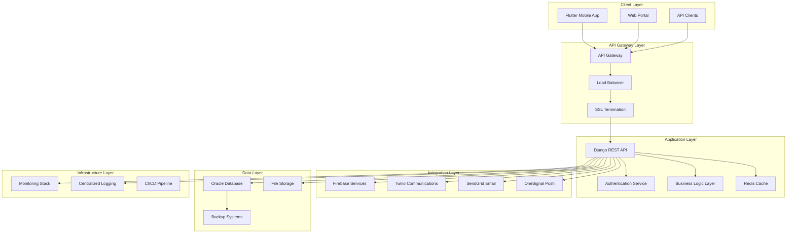
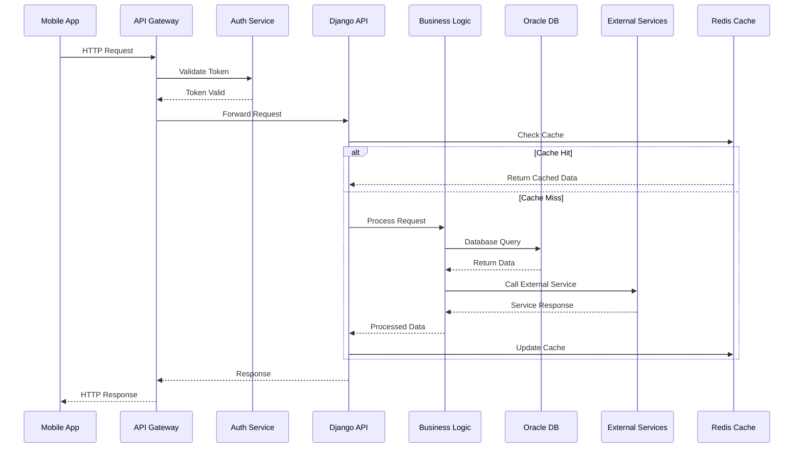
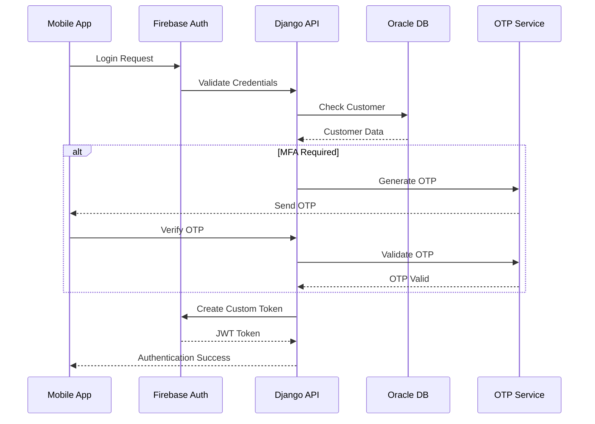
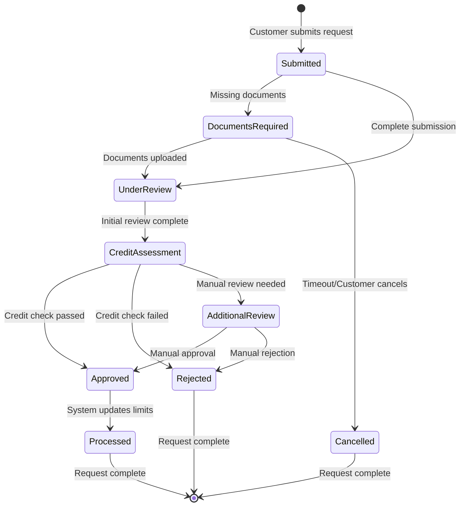
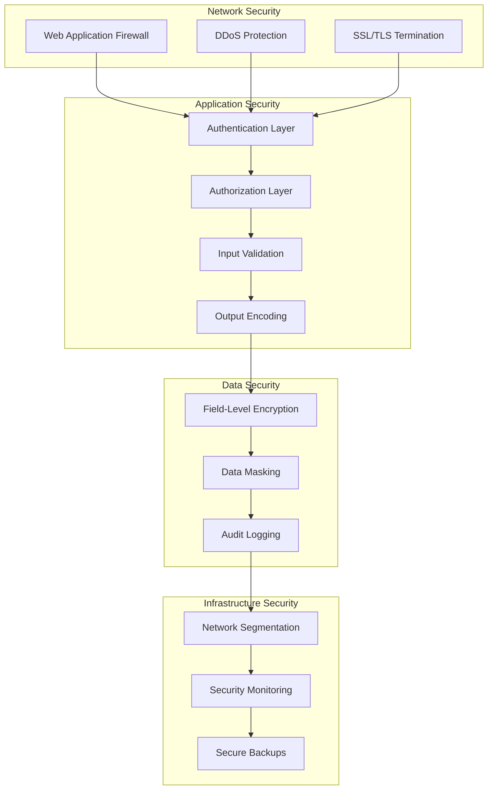

# System Architecture Documentation
# HDFC Card Limit Increase System

## Overview

This document provides comprehensive documentation of the HDFC Card Limit Increase System architecture, covering system design, component interactions, data flow, scalability considerations, and deployment architecture.

## Table of Contents

1. [System Overview](#system-overview)
2. [Architecture Principles](#architecture-principles)
3. [System Components](#system-components)
4. [Data Flow Architecture](#data-flow-architecture)
5. [Service Architecture](#service-architecture)
6. [Security Architecture](#security-architecture)
7. [Integration Architecture](#integration-architecture)
8. [Scalability & Performance](#scalability--performance)
9. [Deployment Architecture](#deployment-architecture)
10. [Monitoring & Observability](#monitoring--observability)

---

## System Overview

### Business Context

The HDFC Card Limit Increase System is a comprehensive mobile banking solution that enables HDFC Bank customers to request credit card and netbanking limit increases through a secure, user-friendly mobile application.

### System Objectives

- **Customer Experience**: Streamlined, intuitive limit increase request process
- **Security**: Banking-grade security with PCI DSS Level 1 compliance
- **Scalability**: Support for millions of HDFC customers
- **Reliability**: 99.9% uptime with fault tolerance
- **Compliance**: RBI regulations and banking compliance requirements
- **Integration**: Seamless integration with existing HDFC systems

### High-Level Architecture



---

## Architecture Principles

### 1. Microservices-Ready Design

The system is designed with modular Django apps that can be easily separated into microservices:

```python
# App Structure
card_limit_system/
├── accounts/          # Customer management microservice
├── cards/            # Card information microservice  
├── requests/         # Limit request workflow microservice
├── notifications/    # Multi-channel notification microservice
├── analytics/        # Analytics and reporting microservice
└── core/            # Shared utilities and common functionality
```

### 2. Domain-Driven Design (DDD)

Each Django app represents a bounded context with clear domain boundaries:

- **Accounts Domain**: Customer identity, authentication, profile management
- **Cards Domain**: Card information, account details, banking relationships
- **Requests Domain**: Limit increase workflows, approval processes, business rules
- **Notifications Domain**: Multi-channel communication, delivery tracking
- **Analytics Domain**: Business intelligence, performance metrics, reporting

### 3. Event-Driven Architecture

The system implements event-driven patterns for loose coupling:

```python
# Event System Example
class LimitRequestEvents:
    REQUEST_SUBMITTED = 'limit_request.submitted'
    REQUEST_APPROVED = 'limit_request.approved'
    REQUEST_REJECTED = 'limit_request.rejected'
    DOCUMENTS_REQUIRED = 'limit_request.documents_required'

# Event Handlers
@receiver(signal=limit_request_submitted)
def handle_request_submission(sender, request_data, **kwargs):
    # Send confirmation notification
    # Trigger credit assessment
    # Log audit event
```

### 4. API-First Design

RESTful API design with OpenAPI 3.0 specification:

- **Resource-Based URLs**: `/api/v1/customers/{id}/limit-requests/`
- **HTTP Methods**: GET, POST, PUT, DELETE with semantic meaning
- **Status Codes**: Appropriate HTTP status codes for all responses
- **Content Negotiation**: JSON-first with optional XML support
- **Versioning**: URL-based versioning for backward compatibility

### 5. Security by Design

Security integrated at every architectural layer:

- **Authentication**: Firebase JWT with custom claims
- **Authorization**: Role-based access control (RBAC)
- **Data Protection**: Field-level encryption for sensitive data
- **Network Security**: HTTPS/TLS 1.3 enforcement
- **Input Validation**: Comprehensive request validation
- **Audit Logging**: Complete audit trail for all actions

---

## System Components

### 1. Application Tier

#### Django REST Framework Core

```python
# settings/production.py
DJANGO_APPS = [
    'django.contrib.admin',
    'django.contrib.auth',
    'django.contrib.contenttypes',
    'django.contrib.sessions',
    'django.contrib.messages',
    'django.contrib.staticfiles',
]

THIRD_PARTY_APPS = [
    'rest_framework',
    'corsheaders',
    'drf_spectacular',
    'django_filters',
    'django_extensions',
]

LOCAL_APPS = [
    'core',
    'accounts',
    'cards',
    'requests',
    'notifications',
    'analytics',
]

INSTALLED_APPS = DJANGO_APPS + THIRD_PARTY_APPS + LOCAL_APPS
```

#### API Layer Architecture

```python
# API Layer Structure
api/
├── v1/
│   ├── accounts/
│   │   ├── views.py      # Customer management endpoints
│   │   ├── serializers.py # Data validation and transformation
│   │   └── permissions.py # Access control
│   ├── cards/
│   │   ├── views.py      # Card information endpoints
│   │   └── business.py   # Business logic layer
│   ├── requests/
│   │   ├── views.py      # Limit request endpoints
│   │   ├── workflows.py  # Request workflow engine
│   │   └── approval.py   # Approval process logic
│   └── notifications/
│       ├── views.py      # Notification endpoints
│       └── channels.py   # Multi-channel delivery
```

### 2. Authentication & Authorization

#### Firebase Integration Architecture

```python
class FirebaseAuthenticationBackend:
    """
    Custom authentication backend for Firebase integration
    """
    
    def authenticate(self, request, token=None):
        if not token:
            return None
            
        try:
            # Verify Firebase token
            decoded_token = auth.verify_id_token(token)
            
            # Get or create user
            user = self.get_or_create_user(decoded_token)
            
            # Set user context
            request.firebase_user = decoded_token
            
            return user
            
        except Exception as e:
            logger.error(f"Firebase authentication failed: {e}")
            return None
    
    def get_or_create_user(self, decoded_token):
        """
        Get or create Django user from Firebase token
        """
        try:
            customer = Customer.objects.get(
                firebase_uid=decoded_token['uid']
            )
            return customer.user
        except Customer.DoesNotExist:
            # Create new user if doesn't exist
            return self.create_user_from_token(decoded_token)
```

#### Permission System

```python
class CustomerPermissions(BasePermission):
    """
    Custom permissions for customer operations
    """
    
    def has_permission(self, request, view):
        # Check if user is authenticated
        if not request.user.is_authenticated:
            return False
        
        # Check customer status
        customer = getattr(request.user, 'customer', None)
        if not customer:
            return False
        
        # Check KYC status for sensitive operations
        if view.action in ['create_limit_request', 'update_profile']:
            return customer.kyc_status == 'verified'
        
        return True
    
    def has_object_permission(self, request, view, obj):
        # Ensure customers can only access their own data
        if hasattr(obj, 'customer'):
            return obj.customer == request.user.customer
        
        return super().has_object_permission(request, view, obj)
```

### 3. Business Logic Layer

#### Service Layer Pattern

```python
class LimitRequestService:
    """
    Business logic service for limit increase requests
    """
    
    def __init__(self):
        self.credit_engine = CreditAssessmentEngine()
        self.workflow_engine = WorkflowEngine()
        self.notification_service = NotificationService()
    
    def create_limit_request(self, customer, request_data):
        """
        Create new limit increase request with business validation
        """
        # Business validation
        self.validate_request_eligibility(customer, request_data)
        
        # Create request
        limit_request = LimitRequest.objects.create(
            customer=customer,
            requested_limit=request_data['requested_limit'],
            reason=request_data['reason'],
            status='submitted'
        )
        
        # Trigger credit assessment
        assessment = self.credit_engine.assess_customer(customer, request_data)
        
        # Process through workflow
        self.workflow_engine.process_request(limit_request, assessment)
        
        # Send notifications
        self.notification_service.send_submission_confirmation(
            customer, limit_request
        )
        
        return limit_request
    
    def validate_request_eligibility(self, customer, request_data):
        """
        Validate customer eligibility for limit increase
        """
        # Check recent requests
        recent_requests = LimitRequest.objects.filter(
            customer=customer,
            created_at__gte=timezone.now() - timedelta(days=90)
        ).exclude(status__in=['rejected', 'cancelled'])
        
        if recent_requests.exists():
            raise ValidationError(
                "Cannot submit new request. Recent request pending."
            )
        
        # Validate requested amount
        current_limit = customer.get_current_limit()
        max_increase = current_limit * 2  # Max 100% increase
        
        if request_data['requested_limit'] > max_increase:
            raise ValidationError(
                f"Requested limit exceeds maximum allowed increase of ₹{max_increase:,}"
            )
        
        # Check customer status
        if customer.kyc_status != 'verified':
            raise ValidationError("KYC verification required")
        
        if customer.account_status != 'active':
            raise ValidationError("Account must be active")
```

### 4. Data Access Layer

#### Repository Pattern Implementation

```python
class CustomerRepository:
    """
    Data access layer for customer operations
    """
    
    def get_customer_with_cards(self, customer_id):
        """
        Get customer with all associated cards
        """
        return Customer.objects.select_related(
            'user'
        ).prefetch_related(
            'cards',
            'netbanking_accounts'
        ).get(id=customer_id)
    
    def get_customers_for_risk_assessment(self):
        """
        Get customers requiring risk assessment
        """
        return Customer.objects.filter(
            last_risk_assessment__lt=timezone.now() - timedelta(days=30)
        ).select_related('user').prefetch_related('limit_requests')
    
    def update_customer_limits(self, customer_id, new_limits):
        """
        Update customer limits with audit trail
        """
        with transaction.atomic():
            customer = Customer.objects.select_for_update().get(id=customer_id)
            
            # Create audit record
            LimitChangeAudit.objects.create(
                customer=customer,
                old_limit=customer.current_limit,
                new_limit=new_limits['credit_limit'],
                changed_by='system',
                reason='automated_approval'
            )
            
            # Update limits
            customer.current_limit = new_limits['credit_limit']
            customer.available_limit = new_limits['available_limit']
            customer.save()
            
            return customer
```

---

## Data Flow Architecture

### 1. Request Processing Flow



### 2. Authentication Flow



### 3. Limit Request Processing Flow



---

## Service Architecture

### 1. Core Services

#### Customer Management Service

```python
class CustomerManagementService:
    """
    Core service for customer lifecycle management
    """
    
    def __init__(self):
        self.repository = CustomerRepository()
        self.encryption_service = EncryptionService()
        self.audit_service = AuditService()
    
    def create_customer_profile(self, registration_data):
        """
        Create new customer profile with encryption
        """
        with transaction.atomic():
            # Encrypt sensitive data
            encrypted_data = self.encryption_service.encrypt_customer_data(
                registration_data
            )
            
            # Create customer
            customer = Customer.objects.create(**encrypted_data)
            
            # Create audit trail
            self.audit_service.log_customer_creation(customer)
            
            # Initialize default settings
            self.initialize_customer_settings(customer)
            
            return customer
    
    def update_customer_profile(self, customer_id, update_data):
        """
        Update customer profile with validation and audit
        """
        customer = self.repository.get_customer_with_cards(customer_id)
        
        # Validate update permissions
        self.validate_update_permissions(customer, update_data)
        
        # Apply updates
        for field, value in update_data.items():
            if field in ['phone_number', 'email']:
                # Trigger verification for sensitive fields
                self.trigger_field_verification(customer, field, value)
            else:
                setattr(customer, field, value)
        
        customer.save()
        
        # Log audit trail
        self.audit_service.log_profile_update(customer, update_data)
        
        return customer
```

#### Limit Request Service

```python
class LimitRequestWorkflowService:
    """
    Service for managing limit request workflows
    """
    
    def __init__(self):
        self.credit_engine = CreditAssessmentEngine()
        self.document_service = DocumentService()
        self.notification_service = NotificationService()
    
    def process_request_workflow(self, limit_request):
        """
        Process limit request through workflow stages
        """
        workflow_map = {
            'submitted': self.handle_submission,
            'documents_required': self.handle_document_collection,
            'under_review': self.handle_review_process,
            'credit_assessment': self.handle_credit_assessment,
            'additional_review': self.handle_manual_review,
            'approved': self.handle_approval,
            'rejected': self.handle_rejection
        }
        
        handler = workflow_map.get(limit_request.status)
        if handler:
            return handler(limit_request)
        
        raise ValueError(f"Unknown workflow status: {limit_request.status}")
    
    def handle_submission(self, limit_request):
        """
        Handle initial request submission
        """
        # Validate submission
        validation_result = self.validate_request_submission(limit_request)
        
        if validation_result['requires_documents']:
            limit_request.status = 'documents_required'
            limit_request.required_documents = validation_result['required_documents']
            
            # Send document request notification
            self.notification_service.send_document_request(
                limit_request.customer,
                validation_result['required_documents']
            )
        else:
            limit_request.status = 'under_review'
            
            # Send confirmation notification
            self.notification_service.send_submission_confirmation(
                limit_request.customer,
                limit_request
            )
        
        limit_request.save()
        return limit_request
```

### 2. Integration Services

#### Notification Service Architecture

```python
class NotificationService:
    """
    Multi-channel notification service
    """
    
    def __init__(self):
        self.channels = {
            'sms': TwilioSMSService(),
            'email': SendGridEmailService(),
            'push': OneSignalPushService(),
            'whatsapp': TwilioWhatsAppService(),
            'voice': TwilioVoiceService()
        }
        self.template_engine = NotificationTemplateEngine()
    
    async def send_notification(self, notification_request):
        """
        Send notification through multiple channels with fallback
        """
        primary_channel = notification_request.primary_channel
        fallback_channels = notification_request.fallback_channels
        
        # Try primary channel first
        try:
            result = await self.send_via_channel(
                primary_channel, 
                notification_request
            )
            if result.success:
                return result
        except Exception as e:
            logger.error(f"Primary channel {primary_channel} failed: {e}")
        
        # Try fallback channels
        for channel in fallback_channels:
            try:
                result = await self.send_via_channel(channel, notification_request)
                if result.success:
                    return result
            except Exception as e:
                logger.error(f"Fallback channel {channel} failed: {e}")
        
        # All channels failed
        raise NotificationDeliveryError("All notification channels failed")
    
    async def send_via_channel(self, channel_name, request):
        """
        Send notification via specific channel
        """
        channel_service = self.channels.get(channel_name)
        if not channel_service:
            raise ValueError(f"Unknown channel: {channel_name}")
        
        # Render template for channel
        content = self.template_engine.render_template(
            request.template_id,
            request.context,
            channel_name
        )
        
        # Send through channel
        return await channel_service.send(
            recipient=request.recipient,
            content=content,
            metadata=request.metadata
        )
```

---

## Security Architecture

### 1. Defense in Depth Strategy



### 2. Authentication Architecture

```python
class SecurityMiddleware:
    """
    Comprehensive security middleware for request processing
    """
    
    def __init__(self, get_response):
        self.get_response = get_response
        self.security_services = {
            'auth': AuthenticationService(),
            'authz': AuthorizationService(),
            'rate_limit': RateLimitingService(),
            'audit': AuditLoggingService(),
            'threat': ThreatDetectionService()
        }
    
    def __call__(self, request):
        # Pre-request security checks
        security_context = self.perform_security_checks(request)
        
        if not security_context['allowed']:
            return self.security_violation_response(security_context)
        
        # Attach security context to request
        request.security_context = security_context
        
        # Process request
        response = self.get_response(request)
        
        # Post-request security logging
        self.log_request_completion(request, response)
        
        return response
    
    def perform_security_checks(self, request):
        """
        Perform comprehensive security validation
        """
        checks = {
            'authentication': self.security_services['auth'].validate_request(request),
            'authorization': self.security_services['authz'].check_permissions(request),
            'rate_limiting': self.security_services['rate_limit'].check_limits(request),
            'threat_detection': self.security_services['threat'].analyze_request(request)
        }
        
        # Determine overall security status
        allowed = all(check['allowed'] for check in checks.values())
        
        return {
            'allowed': allowed,
            'checks': checks,
            'risk_score': self.calculate_risk_score(checks),
            'timestamp': timezone.now()
        }
```

### 3. Data Protection Architecture

```python
class DataProtectionService:
    """
    Service for data encryption and protection
    """
    
    def __init__(self):
        self.encryption_key = self.get_encryption_key()
        self.cipher_suite = Fernet(self.encryption_key)
    
    def encrypt_sensitive_field(self, data, field_name):
        """
        Encrypt sensitive field data
        """
        if field_name in SENSITIVE_FIELDS:
            encrypted_data = self.cipher_suite.encrypt(str(data).encode())
            return base64.urlsafe_b64encode(encrypted_data).decode()
        return data
    
    def decrypt_sensitive_field(self, encrypted_data, field_name):
        """
        Decrypt sensitive field data
        """
        if field_name in SENSITIVE_FIELDS:
            decoded_data = base64.urlsafe_b64decode(encrypted_data.encode())
            decrypted_data = self.cipher_suite.decrypt(decoded_data)
            return decrypted_data.decode()
        return encrypted_data
    
    def mask_sensitive_data(self, data, field_name):
        """
        Mask sensitive data for display
        """
        masking_rules = {
            'card_number': lambda x: f"****-****-****-{x[-4:]}",
            'phone_number': lambda x: f"{x[:3]}****{x[-2:]}",
            'email': lambda x: f"{x[:2]}***@{x.split('@')[1]}",
            'account_number': lambda x: f"****{x[-4:]}"
        }
        
        masking_func = masking_rules.get(field_name)
        if masking_func:
            return masking_func(data)
        return data
```

---

## Integration Architecture

### 1. External Service Integration Patterns

```python
class ExternalServiceIntegration:
    """
    Base class for external service integrations
    """
    
    def __init__(self, service_config):
        self.config = service_config
        self.client = self.create_client()
        self.circuit_breaker = CircuitBreaker(
            failure_threshold=5,
            recovery_timeout=30,
            expected_exception=ServiceUnavailableError
        )
    
    @circuit_breaker
    async def call_service(self, method, endpoint, data=None):
        """
        Make external service call with circuit breaker pattern
        """
        try:
            response = await self.client.request(
                method=method,
                url=f"{self.config.base_url}{endpoint}",
                json=data,
                headers=self.get_auth_headers(),
                timeout=self.config.timeout
            )
            
            if response.status_code >= 400:
                raise ServiceError(f"Service error: {response.status_code}")
            
            return response.json()
            
        except aiohttp.ClientTimeout:
            raise ServiceTimeoutError("Service call timed out")
        except Exception as e:
            logger.error(f"External service call failed: {e}")
            raise ServiceUnavailableError(f"Service unavailable: {e}")
    
    def get_auth_headers(self):
        """
        Get authentication headers for service
        """
        return {
            'Authorization': f"Bearer {self.config.api_key}",
            'Content-Type': 'application/json',
            'User-Agent': 'HDFC-CardLimit-System/1.0'
        }
```

### 2. Service Health Monitoring

```python
class ServiceHealthMonitor:
    """
    Monitor health of all external services
    """
    
    def __init__(self):
        self.services = {
            'firebase': FirebaseHealthCheck(),
            'twilio': TwilioHealthCheck(),
            'sendgrid': SendGridHealthCheck(),
            'onesignal': OneSignalHealthCheck(),
            'oracle': OracleHealthCheck()
        }
        self.health_cache = {}
    
    async def check_all_services(self):
        """
        Check health of all external services
        """
        health_results = {}
        
        for service_name, health_checker in self.services.items():
            try:
                health_status = await health_checker.check_health()
                health_results[service_name] = {
                    'status': 'healthy' if health_status.is_healthy else 'unhealthy',
                    'response_time': health_status.response_time,
                    'last_check': timezone.now().isoformat(),
                    'details': health_status.details
                }
            except Exception as e:
                health_results[service_name] = {
                    'status': 'error',
                    'error': str(e),
                    'last_check': timezone.now().isoformat()
                }
        
        # Cache results
        self.health_cache = health_results
        
        # Trigger alerts for unhealthy services
        self.check_and_alert_unhealthy_services(health_results)
        
        return health_results
    
    def get_service_health(self, service_name):
        """
        Get cached health status for specific service
        """
        return self.health_cache.get(service_name, {
            'status': 'unknown',
            'message': 'Health check not performed'
        })
```

---

## Scalability & Performance

### 1. Horizontal Scaling Strategy

```python
class ScalabilityConfiguration:
    """
    Configuration for horizontal scaling
    """
    
    # Application Server Scaling
    APPLICATION_SERVERS = {
        'min_instances': 3,
        'max_instances': 50,
        'scaling_threshold': {
            'cpu_utilization': 70,
            'memory_utilization': 80,
            'request_latency': 500,  # milliseconds
            'queue_depth': 100
        },
        'auto_scaling_policy': {
            'scale_up_cooldown': 300,  # 5 minutes
            'scale_down_cooldown': 900,  # 15 minutes
            'scale_up_increment': 2,
            'scale_down_increment': 1
        }
    }
    
    # Database Scaling
    DATABASE_SCALING = {
        'read_replicas': {
            'min_replicas': 2,
            'max_replicas': 10,
            'read_write_split_ratio': 80  # 80% reads, 20% writes
        },
        'connection_pooling': {
            'max_connections': 100,
            'min_connections': 10,
            'connection_timeout': 30,
            'idle_timeout': 300
        },
        'query_optimization': {
            'enable_query_cache': True,
            'cache_ttl': 600,  # 10 minutes
            'slow_query_threshold': 1000  # 1 second
        }
    }
    
    # Cache Scaling
    CACHE_SCALING = {
        'redis_cluster': {
            'nodes': 6,
            'shards': 3,
            'replicas_per_shard': 1,
            'memory_per_node': '4GB'
        },
        'cache_policies': {
            'user_sessions': {'ttl': 3600, 'max_memory': '1GB'},
            'api_responses': {'ttl': 300, 'max_memory': '2GB'},
            'static_data': {'ttl': 86400, 'max_memory': '500MB'}
        }
    }
```

### 2. Performance Optimization

```python
class PerformanceOptimizationService:
    """
    Service for performance monitoring and optimization
    """
    
    def __init__(self):
        self.metrics_collector = MetricsCollector()
        self.cache_manager = CacheManager()
        self.query_optimizer = QueryOptimizer()
    
    def optimize_database_queries(self):
        """
        Optimize database queries based on performance metrics
        """
        # Identify slow queries
        slow_queries = self.metrics_collector.get_slow_queries(
            threshold_ms=1000,
            time_range='1h'
        )
        
        for query in slow_queries:
            # Analyze query execution plan
            execution_plan = self.query_optimizer.analyze_query(query.sql)
            
            # Suggest optimizations
            optimizations = self.query_optimizer.suggest_optimizations(
                execution_plan
            )
            
            # Apply automatic optimizations
            if optimizations['auto_applicable']:
                self.apply_query_optimizations(query, optimizations)
            
            # Log manual optimization suggestions
            if optimizations['manual_review_required']:
                self.log_manual_optimization_suggestions(query, optimizations)
    
    def implement_caching_strategy(self):
        """
        Implement intelligent caching based on access patterns
        """
        # Analyze access patterns
        access_patterns = self.metrics_collector.analyze_access_patterns(
            time_range='24h'
        )
        
        # Identify cacheable endpoints
        cacheable_endpoints = [
            endpoint for endpoint in access_patterns
            if endpoint['read_ratio'] > 0.8 and endpoint['response_size'] < 1024  # KB
        ]
        
        # Implement caching for identified endpoints
        for endpoint in cacheable_endpoints:
            cache_key_pattern = self.generate_cache_key_pattern(endpoint)
            cache_ttl = self.calculate_optimal_ttl(endpoint)
            
            self.cache_manager.configure_endpoint_cache(
                endpoint['path'],
                cache_key_pattern,
                cache_ttl
            )
    
    def monitor_performance_metrics(self):
        """
        Monitor and alert on performance metrics
        """
        metrics = {
            'response_times': self.metrics_collector.get_response_times(),
            'throughput': self.metrics_collector.get_request_throughput(),
            'error_rates': self.metrics_collector.get_error_rates(),
            'resource_utilization': self.metrics_collector.get_resource_utilization()
        }
        
        # Check SLA compliance
        sla_violations = self.check_sla_compliance(metrics)
        
        if sla_violations:
            self.trigger_performance_alerts(sla_violations)
        
        return metrics
```

### 3. Load Balancing Strategy

```python
class LoadBalancerConfiguration:
    """
    Load balancer configuration for optimal traffic distribution
    """
    
    LOAD_BALANCING_ALGORITHMS = {
        'api_endpoints': {
            'algorithm': 'weighted_round_robin',
            'health_check': {
                'path': '/api/v1/health/',
                'interval': 30,
                'timeout': 5,
                'healthy_threshold': 2,
                'unhealthy_threshold': 3
            },
            'sticky_sessions': False  # Stateless API
        },
        'file_uploads': {
            'algorithm': 'least_connections',
            'health_check': {
                'path': '/health/',
                'interval': 15,
                'timeout': 3
            },
            'sticky_sessions': True  # For upload progress
        }
    }
    
    CIRCUIT_BREAKER_CONFIG = {
        'failure_threshold': 5,
        'recovery_timeout': 30,
        'success_threshold': 3,
        'timeout': 10
    }
```

---

## Deployment Architecture

### 1. Infrastructure as Code

```yaml
# infrastructure/terraform/main.tf
resource "aws_application_load_balancer" "hdfc_api_lb" {
  name               = "hdfc-card-limit-api-lb"
  internal           = false
  load_balancer_type = "application"
  security_groups    = [aws_security_group.lb_sg.id]
  subnets           = [aws_subnet.public_1.id, aws_subnet.public_2.id]

  enable_deletion_protection = true

  tags = {
    Environment = var.environment
    Project     = "hdfc-card-limit"
  }
}

resource "aws_ecs_cluster" "hdfc_api_cluster" {
  name = "hdfc-card-limit-api"

  capacity_providers = ["EC2", "FARGATE"]

  default_capacity_provider_strategy {
    capacity_provider = "FARGATE"
    weight           = 100
  }

  setting {
    name  = "containerInsights"
    value = "enabled"
  }
}

resource "aws_ecs_service" "hdfc_api_service" {
  name            = "hdfc-card-limit-api"
  cluster         = aws_ecs_cluster.hdfc_api_cluster.id
  task_definition = aws_ecs_task_definition.hdfc_api_task.arn
  desired_count   = var.min_capacity

  capacity_provider_strategy {
    capacity_provider = "FARGATE"
    weight           = 100
  }

  deployment_configuration {
    maximum_percent         = 200
    minimum_healthy_percent = 100
  }

  load_balancer {
    target_group_arn = aws_lb_target_group.hdfc_api_tg.arn
    container_name   = "hdfc-api"
    container_port   = 8000
  }

  depends_on = [aws_lb_listener.hdfc_api_listener]
}
```

### 2. Container Configuration

```dockerfile
# Dockerfile.production
FROM python:3.9-slim-bullseye

# Set environment variables
ENV PYTHONDONTWRITEBYTECODE=1 \
    PYTHONUNBUFFERED=1 \
    PIP_NO_CACHE_DIR=1 \
    PIP_DISABLE_PIP_VERSION_CHECK=1

# Install system dependencies
RUN apt-get update && apt-get install -y \
    gcc \
    libaio1 \
    wget \
    unzip \
    && rm -rf /var/lib/apt/lists/*

# Install Oracle Instant Client
RUN wget https://download.oracle.com/otn_software/linux/instantclient/216000/instantclient-basic-linux.x64-21.6.0.0.0dbru.zip \
    && unzip instantclient-basic-linux.x64-21.6.0.0.0dbru.zip \
    && mv instantclient_21_6 /opt/oracle \
    && rm instantclient-basic-linux.x64-21.6.0.0.0dbru.zip

# Set Oracle environment
ENV LD_LIBRARY_PATH=/opt/oracle:$LD_LIBRARY_PATH

# Create app user
RUN useradd --create-home --shell /bin/bash hdfc && \
    mkdir -p /home/hdfc/app && \
    chown -R hdfc:hdfc /home/hdfc

# Set work directory
WORKDIR /home/hdfc/app

# Copy requirements and install Python dependencies
COPY requirements/production.txt .
RUN pip install --no-cache-dir -r production.txt

# Copy application code
COPY --chown=hdfc:hdfc . .

# Switch to app user
USER hdfc

# Collect static files
RUN python manage.py collectstatic --noinput --settings=config.settings.production

# Health check
HEALTHCHECK --interval=30s --timeout=10s --start-period=60s --retries=3 \
    CMD python manage.py health_check --settings=config.settings.production

# Expose port
EXPOSE 8000

# Run application
CMD ["gunicorn", "--config", "config/gunicorn.conf.py", "config.wsgi:application"]
```

### 3. Kubernetes Deployment

```yaml
# k8s/production/deployment.yaml
apiVersion: apps/v1
kind: Deployment
metadata:
  name: hdfc-card-limit-api
  namespace: hdfc-production
  labels:
    app: hdfc-card-limit-api
    version: v1
spec:
  replicas: 5
  strategy:
    type: RollingUpdate
    rollingUpdate:
      maxSurge: 2
      maxUnavailable: 1
  selector:
    matchLabels:
      app: hdfc-card-limit-api
  template:
    metadata:
      labels:
        app: hdfc-card-limit-api
        version: v1
    spec:
      serviceAccountName: hdfc-api-service-account
      securityContext:
        runAsNonRoot: true
        runAsUser: 1000
        fsGroup: 1000
      containers:
      - name: hdfc-api
        image: hdfc/card-limit-api:latest
        imagePullPolicy: Always
        ports:
        - containerPort: 8000
          protocol: TCP
        env:
        - name: DJANGO_SETTINGS_MODULE
          value: "config.settings.production"
        - name: DATABASE_URL
          valueFrom:
            secretKeyRef:
              name: hdfc-api-secrets
              key: database-url
        - name: REDIS_URL
          valueFrom:
            secretKeyRef:
              name: hdfc-api-secrets
              key: redis-url
        resources:
          requests:
            memory: "512Mi"
            cpu: "500m"
          limits:
            memory: "1Gi"
            cpu: "1000m"
        livenessProbe:
          httpGet:
            path: /api/v1/health/
            port: 8000
          initialDelaySeconds: 60
          periodSeconds: 30
          timeoutSeconds: 10
          failureThreshold: 3
        readinessProbe:
          httpGet:
            path: /api/v1/health/ready/
            port: 8000
          initialDelaySeconds: 30
          periodSeconds: 10
          timeoutSeconds: 5
          failureThreshold: 3
        volumeMounts:
        - name: app-logs
          mountPath: /home/hdfc/app/logs
      volumes:
      - name: app-logs
        emptyDir: {}
      imagePullSecrets:
      - name: hdfc-registry-secret
```

### 4. CI/CD Pipeline

```yaml
# .github/workflows/production-deploy.yml
name: Production Deployment

on:
  push:
    branches: [main]
    tags: ['v*']

env:
  REGISTRY: ghcr.io
  IMAGE_NAME: hdfc/card-limit-api

jobs:
  security-scan:
    runs-on: ubuntu-latest
    steps:
    - uses: actions/checkout@v3
    
    - name: Run Security Scan
      uses: securecodewarrior/github-action-add-sarif@v1
      with:
        sarif-file: security-scan-results.sarif
    
    - name: Upload Security Scan Results
      uses: github/codeql-action/upload-sarif@v2
      with:
        sarif_file: security-scan-results.sarif

  test:
    runs-on: ubuntu-latest
    services:
      oracle:
        image: oracle/database:19.3.0-ee
        env:
          ORACLE_PWD: OraclePassword123
        options: >-
          --health-cmd="sqlplus -s / as sysdba <<< 'SELECT 1 FROM DUAL;'"
          --health-interval=10s
          --health-timeout=5s
          --health-retries=5
      redis:
        image: redis:7-alpine
        options: >-
          --health-cmd "redis-cli ping"
          --health-interval 10s
          --health-timeout 5s
          --health-retries 5

    steps:
    - uses: actions/checkout@v3
    
    - name: Set up Python
      uses: actions/setup-python@v4
      with:
        python-version: '3.9'
    
    - name: Install dependencies
      run: |
        pip install -r requirements/test.txt
    
    - name: Run tests
      run: |
        python manage.py test --settings=config.settings.test
        coverage report --fail-under=90

  build-and-push:
    needs: [security-scan, test]
    runs-on: ubuntu-latest
    outputs:
      image-digest: ${{ steps.build.outputs.digest }}
    steps:
    - uses: actions/checkout@v3
    
    - name: Log in to Container Registry
      uses: docker/login-action@v2
      with:
        registry: ${{ env.REGISTRY }}
        username: ${{ github.actor }}
        password: ${{ secrets.GITHUB_TOKEN }}
    
    - name: Build and push Docker image
      id: build
      uses: docker/build-push-action@v4
      with:
        context: .
        file: ./Dockerfile.production
        push: true
        tags: |
          ${{ env.REGISTRY }}/${{ env.IMAGE_NAME }}:latest
          ${{ env.REGISTRY }}/${{ env.IMAGE_NAME }}:${{ github.sha }}
        cache-from: type=gha
        cache-to: type=gha,mode=max

  deploy-production:
    needs: [build-and-push]
    runs-on: ubuntu-latest
    environment: production
    steps:
    - uses: actions/checkout@v3
    
    - name: Configure AWS credentials
      uses: aws-actions/configure-aws-credentials@v2
      with:
        aws-access-key-id: ${{ secrets.AWS_ACCESS_KEY_ID }}
        aws-secret-access-key: ${{ secrets.AWS_SECRET_ACCESS_KEY }}
        aws-region: ap-south-1
    
    - name: Deploy to ECS
      run: |
        aws ecs update-service \
          --cluster hdfc-card-limit-api \
          --service hdfc-card-limit-api \
          --force-new-deployment \
          --task-definition hdfc-api-task:latest
    
    - name: Wait for deployment
      run: |
        aws ecs wait services-stable \
          --cluster hdfc-card-limit-api \
          --services hdfc-card-limit-api
    
    - name: Run smoke tests
      run: |
        python scripts/smoke_tests.py --env=production
```

---

## Monitoring & Observability

### 1. Application Performance Monitoring

```python
class APMIntegration:
    """
    Application Performance Monitoring integration
    """
    
    def __init__(self):
        self.metrics_backends = {
            'prometheus': PrometheusMetrics(),
            'datadog': DatadogMetrics(),
            'newrelic': NewRelicMetrics()
        }
        self.tracing_backend = JaegerTracing()
        self.logging_backend = ELKLogging()
    
    def track_request_metrics(self, request, response, duration):
        """
        Track request metrics across all monitoring backends
        """
        metrics_data = {
            'endpoint': request.path,
            'method': request.method,
            'status_code': response.status_code,
            'duration_ms': duration * 1000,
            'user_id': getattr(request, 'user_id', None),
            'timestamp': timezone.now()
        }
        
        # Send to all metrics backends
        for backend in self.metrics_backends.values():
            backend.record_request_metric(metrics_data)
    
    def trace_database_queries(self, query, duration):
        """
        Trace database query performance
        """
        trace_data = {
            'query_type': self.get_query_type(query),
            'table': self.extract_table_name(query),
            'duration_ms': duration * 1000,
            'query_hash': self.hash_query(query)
        }
        
        self.tracing_backend.record_database_trace(trace_data)
    
    def track_business_metrics(self, event_type, data):
        """
        Track business-specific metrics
        """
        business_metrics = {
            'limit_request_submitted': self.track_limit_request_submission,
            'limit_request_approved': self.track_limit_request_approval,
            'limit_request_rejected': self.track_limit_request_rejection,
            'customer_registration': self.track_customer_registration,
            'authentication_success': self.track_authentication_success,
            'authentication_failure': self.track_authentication_failure
        }
        
        handler = business_metrics.get(event_type)
        if handler:
            handler(data)
```

### 2. Distributed Tracing

```python
class DistributedTracingService:
    """
    Distributed tracing for microservices architecture
    """
    
    def __init__(self):
        self.tracer = opentracing.tracer
        self.span_context_manager = SpanContextManager()
    
    def trace_request_flow(self, request):
        """
        Create distributed trace for request flow
        """
        # Extract trace context from headers
        span_context = self.tracer.extract(
            opentracing.Format.HTTP_HEADERS,
            request.META
        )
        
        # Start new span
        with self.tracer.start_span(
            'api_request',
            child_of=span_context,
            tags={
                'http.method': request.method,
                'http.url': request.get_full_path(),
                'user.id': getattr(request, 'user_id', None)
            }
        ) as span:
            # Store span in request context
            request.trace_span = span
            
            # Add request-specific tags
            self.add_request_tags(span, request)
            
            return span
    
    def trace_external_service_call(self, service_name, operation, parent_span):
        """
        Trace external service calls
        """
        with self.tracer.start_span(
            f'{service_name}.{operation}',
            child_of=parent_span,
            tags={
                'component': 'external_service',
                'service.name': service_name,
                'operation': operation
            }
        ) as span:
            # Inject trace context for downstream services
            headers = {}
            self.tracer.inject(
                span.context,
                opentracing.Format.HTTP_HEADERS,
                headers
            )
            
            return span, headers
    
    def trace_database_operation(self, operation, table, parent_span):
        """
        Trace database operations
        """
        with self.tracer.start_span(
            f'db.{operation}',
            child_of=parent_span,
            tags={
                'component': 'database',
                'db.type': 'oracle',
                'db.table': table,
                'db.operation': operation
            }
        ) as span:
            return span
```

### 3. Alerting and Incident Management

```python
class AlertingService:
    """
    Alerting service for system monitoring
    """
    
    def __init__(self):
        self.alert_channels = {
            'email': EmailAlerting(),
            'slack': SlackAlerting(),
            'pagerduty': PagerDutyAlerting(),
            'sms': SMSAlerting()
        }
        self.alert_rules = self.load_alert_rules()
    
    def evaluate_alert_conditions(self, metrics):
        """
        Evaluate metrics against alert conditions
        """
        triggered_alerts = []
        
        for rule in self.alert_rules:
            if self.evaluate_rule(rule, metrics):
                alert = self.create_alert(rule, metrics)
                triggered_alerts.append(alert)
        
        # Process triggered alerts
        for alert in triggered_alerts:
            self.process_alert(alert)
        
        return triggered_alerts
    
    def create_alert(self, rule, metrics):
        """
        Create alert from rule and metrics
        """
        return {
            'id': self.generate_alert_id(),
            'rule_name': rule['name'],
            'severity': rule['severity'],
            'title': rule['title'],
            'description': self.format_alert_description(rule, metrics),
            'timestamp': timezone.now(),
            'metrics': metrics,
            'runbook_url': rule.get('runbook_url'),
            'tags': rule.get('tags', [])
        }
    
    def process_alert(self, alert):
        """
        Process and route alert to appropriate channels
        """
        # Determine alert channels based on severity
        channels = self.get_alert_channels(alert['severity'])
        
        # Send alert to each channel
        for channel_name in channels:
            channel = self.alert_channels.get(channel_name)
            if channel:
                try:
                    channel.send_alert(alert)
                except Exception as e:
                    logger.error(f"Failed to send alert to {channel_name}: {e}")
        
        # Create incident if critical
        if alert['severity'] == 'critical':
            self.create_incident(alert)
    
    ALERT_RULES = [
        {
            'name': 'high_error_rate',
            'condition': 'error_rate > 5',  # 5% error rate
            'severity': 'warning',
            'title': 'High Error Rate Detected',
            'channels': ['email', 'slack']
        },
        {
            'name': 'critical_error_rate',
            'condition': 'error_rate > 10',  # 10% error rate
            'severity': 'critical',
            'title': 'Critical Error Rate Detected',
            'channels': ['email', 'slack', 'pagerduty', 'sms']
        },
        {
            'name': 'high_response_time',
            'condition': 'avg_response_time > 2000',  # 2 seconds
            'severity': 'warning',
            'title': 'High Response Time Detected',
            'channels': ['email', 'slack']
        },
        {
            'name': 'database_connection_failure',
            'condition': 'db_connection_errors > 0',
            'severity': 'critical',
            'title': 'Database Connection Failures',
            'channels': ['email', 'slack', 'pagerduty']
        }
    ]
```

This comprehensive system architecture documentation provides detailed insights into the HDFC Card Limit Increase System's design, covering scalability, deployment, and monitoring aspects essential for a production banking system.

This comprehensive system architecture documentation provides detailed insights into the HDFC Card Limit Increase System's design, covering scalability, deployment, and monitoring aspects essential for a production banking system.